```{r setup, include=FALSE}
require(reticulate)
knitr::opts_chunk$set(echo = FALSE)
glossary="https://github.com/morinlab/MBB243/blob/main/Glossary.md#"
#NOTE: to run this on the lab server you will need the same data files and a symbolic link to the data directory but with the name "data".

```

# Welcome to the course

:::::::::::::: {.columns}
::: {.column}
- Instructor: Ryan Morin
- Associate Professor (MBB)
- Senior Scientist (BC Cancer)
- Bioinformatics & Cancer Genomics lab
- Office hour (zoom or in person): 4:30 – 5:30 PM Wednesdays (after class)
:::
::: {.column}

:::
::::::::::::::

# Welcome to the course

- T.A. Casey Engstrom
- Graduate student, Quarmby Lab
- Office hour: TBD
- Office:

# Schedule

- Lectures (Wednesday): 
  - Introduce the nature of molecular biology data, molecular biology data analysis, and molecular biology data analysis result presentation
  - General programming and data analysis concepts
- Labs (Friday): Apply the fundamentals of three “languages” commonly used for analysis of scientific data
  - Command-line interpreter (Bash)
  - A popular scripting language (Python)
  - A popular statistical programming language (R )
  
# Grading

* 20% In each lab, there is a list of tasks that should be accomplished in class and submitted by the end of each lab. 
* 35% Lab assignments: For some labs, short assignments will be made available and due at the start of your lab one week later. 
* 10% In-class midterm exam
* 25% cumulative final exam mixture of multiple choice, short answer and written questions
* 10% Attendance and participation in both lecture and lab 

# How to get a good grade

- Come to class and ask questions if you're lost
- Come to lab and ask more questions
- Come to office hours to ask more questions, if necessary
- Post questions to Slack using channels such as [lab-discussion](https://mbb243.slack.com/archives/C02U4MU6NUQ) 
- *Practice* the things you are learning in class and not just within the context of lab assignments
  - This is the only effective way to learn programming/data analysis concepts!

# Reading

- NO REQUIRED TEXTBOOX
- Reading material will be provided throughout the course as linked content
- As we sink into R, [this free book](https://r4ds.had.co.nz/) is an excellent resource

# Other resources

- All source code shown in lectures is in the accosicated R markdown file
- Individual code chunks should run on your lab server
  - Play with it, tweak it, break it, remix it, repurpose it!
- 

# Important links

- [Lab landing page](https://github.com/morinlab/MBB243), with all this information
- [Zoom for class](https://us02web.zoom.us/j/85725104049)
- [TA office hours](https://sfu.zoom.us/j/8109061879) Thursdays 4-5 PM
- [Link for remote lab workstation connections](https://gateway.its.sfu.ca/guacamole/#/) This is only needed to connect to the lab server from *off campus*

# Learning goals for the course

- Molecular biology generates large volumes of data
  - Text-based (DNA/RNA/Protein Sequences)
  - Numeric/quantitative (measurements, observations)
- Manipulate files and run individual tools interactively in a command-line environment 
- The basics of the Python language to perform some analyses and file manipulations
- Become familiar with the statistical programming language R
  - Analyze numerical data of various types
  - Produce visualizations (plots) **NOT using Excel**

# General data flavours in biology

- Molecular biology experiments primarily lead to two major data types
  - Sequence (essentially text)
  - Numeric (quantitative or categorical)
- Genome sequence carries your genetic information and identity
- mRNA sequence is the portion of the genome that can be made into proteins
- How many times a given mRNA is observed can inform on the expression of that gene

# Types of sequences

- DNA molecules are sequences in an alphabet of four nucleotides
  - A, C, T, G
  - Double-stranded, always complementary
- RNA molecules are sequences of four nucleotides and are generally single-stranded
  - A, C, U, G
- Protein molecules comprise 20 different amino acids that you have all studied and probably memorized (right?)

# All DNA sequences have a partner

:::::::::::::: {.columns}
::: {.column}
- A DNA sequence is a succession of letters indicating the order of nucleotides on one of the complementary strands
- For us it is redundant to represent both strands because the other can always be inferred using base pairing rules
:::
::: {.column}
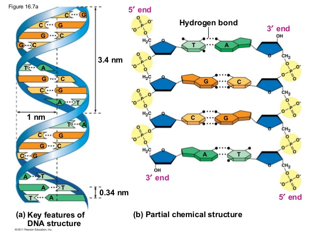
:::
::::::::::::::

# DNA sequence as data

- The minimal unit of data in computers is a [bit](`r glossary`bit), which has two states (0 or 1)
- There are eight bits per [byte](`r glossary`byte)
  - One byte can be used to encode any ASCII character in a plain text file
- In programming, text-based information is represented as either [character](Glossary.html# character) (length of 1) or [string](`r glossary`string) (arbitrary length) but can also be represented in other ways for efficiency
  - e.g. two bits are sufficient to represent each of the four nucleotide characters

# (Alpha)Bits

:::::::::::::: {.columns}
::: {.column}
- Imagine the 4 nucleotides mapped to a 2D grid
- The answer to two true/false questions can disambiguate any of these
  - Is it a purine? 
:::
::: {.column}
|purine|pyrimidine||
|-|-|-|
|A|C|A-or-C|
|G|T|not-A-or-C|
:::
::::::::::::::

# (Alpha)Bits

:::::::::::::: {.columns}
::: {.column}
- Imagine the 4 nucleotides mapped to a 2D grid
- The answer to two true/false questions can disambiguate any of these
  - Is it a purine? 
    - TRUE
:::
::: {.column}
|purine|pyrimidine||
|-|-|-|
|A|X|A-or-C|
|G|X|not-A-or-C|
:::
::::::::::::::

# (Alpha)Bits

:::::::::::::: {.columns}
::: {.column}
- Imagine the 4 nucleotides mapped to a 2D grid
- The answer to two true/false questions can disambiguate any of these
  - Is it a purine? 
    - TRUE
  - Is it one of A or C? 
    - FALSE
  - It must be G
:::
::: {.column}
|purine|pyrimidine||
|-|-|-|
|X|X|A-or-C|
|G|X|not-A-or-C|
:::
::::::::::::::

# Sequence as a variable

- Storing a sequence as a variable uses a similar syntax in the three programming languages we will be using
```{bash, echo=TRUE, eval=FALSE}
DNA_seq="ACCTGACCT" # <- that is bash code.
#This part is a comment

```
  - No spaces allowed when setting a variable!

```{python, echo=TRUE, eval=FALSE}
DNA_seq = "ACCTGACCT" # Python code
```
  - White space here is OK but Python has its annoying formatting quirks
\textcolor{red}{red}
```{r, echo=TRUE, eval=FALSE}
DNA_seq <- "ACCTGACCT" # R code

```
  - White space is unimportant in this case
  
# The human genome as data

:::::::::::::: {.columns}
::: {.column}
- The longest DNA molecule (chromosome) in the human genome is chromosome 1
  - 249,250,621 base pairs (bp)
  - What size (in bytes) is a plain text file containing
the sequence of human chromosome 1?
:::
::: {.column}
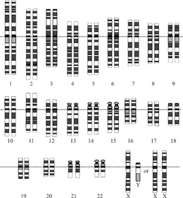
:::
::::::::::::::

# The human genome as data

:::::::::::::: {.columns}
::: {.column}
- The longest DNA molecule (chromosome) in the human genome is chromosome 1
  - 249,250,621 base pairs (bp)
  - What size (in bytes) is a plain text file containing
the sequence of human chromosome 1?
  - 249,250,621 bytes!
:::
::: {.column}

:::
::::::::::::::

# Size of the human genome in plain text

- Let's jump right in: the size of the human reference genome on disk can be determined with a simple bash command (`ls -l`)
```{bash, eval=T,echo=T}
ls -l data/hg38.fa
```
- Using `ls -lh` gives the same output but with the size in a more human readable format
```{bash, eval=T,echo=T}
ls -lh data/hg38.fa
```

# DNA sequence as plain text files
:::::::::::::: {.columns}
::: {.column}
- Most common way to store DNA sequences is [FASTA](`r glossary`FASTA) format
- Two components:
  - header lines begin with `>`
  - sequence lines are just sequence
- Many other formats available, most with much more detailed information about the sequence
- More complex formats are harder to work with but more useful, depending on the needs of your analysis
:::
::: {.column}
```
>NC_002516.2 
TTTAAAGAGACCGGCGATTCTAGTGAAATCGAACGG
GCAGGTCAATTTCCAACCAGCGATGACGTAATAGAT
AGATACAAGGAAG
```
:::
::::::::::::::

# DNA sequence as plain text files

Example FASTA
```
>NC_002516.2 <-----This is the header line
TTTAAAGAGACCGGCGATTCTAGTGAAATC <- sequence
GCAGGTCAATTTCCAACCAGCGATGACGTA <- more sequence
AGATACAAGGAAG <- end of this sequence
>NCC1701-D <------- Header for the next sequence
AAAAAAAAAAAAAAAAAAAAAAAAAA <- the next sequence
AAAAAAAAAAAAAAAAAAAAAAAAAA <- and so on
```

# Genes and Chromosomes

:::::::::::::: {.columns}
::: {.column}
- A gene is a functional region that consists of one or more exon sequences
  - usually separated by introns
- Exons and introns of a gene are all on the same strand
  - Genes can exist on the + or the - strand
- Broad variability in gene size
  - e.g. CNTNAP2 is 2.3 Mb long. 
:::
::: {.column}
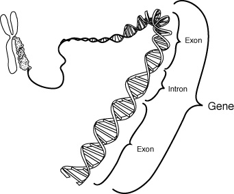
:::
::::::::::::::

# Central Dogma

:::::::::::::: {.columns}
::: {.column}
- DNA is copied to complementary DNA during replication
- DNA is copied to complementary RNA during transcription
- Genetic code is used to produce protein from mRNA through translation
:::
::: {.column}
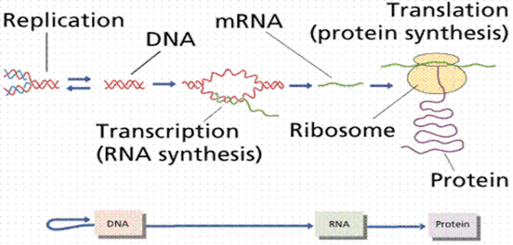
:::
::::::::::::::

# Genes and Transcripts

:::::::::::::: {.columns}
::: {.column}
- All genes have unique names
  - some have more than one name for historical reasons but can only have one official symbol
- Exons and introns are transcribed but introns are spliced out
- Terminal exons contain untranslated regions (UTR)
:::
::: {.column}
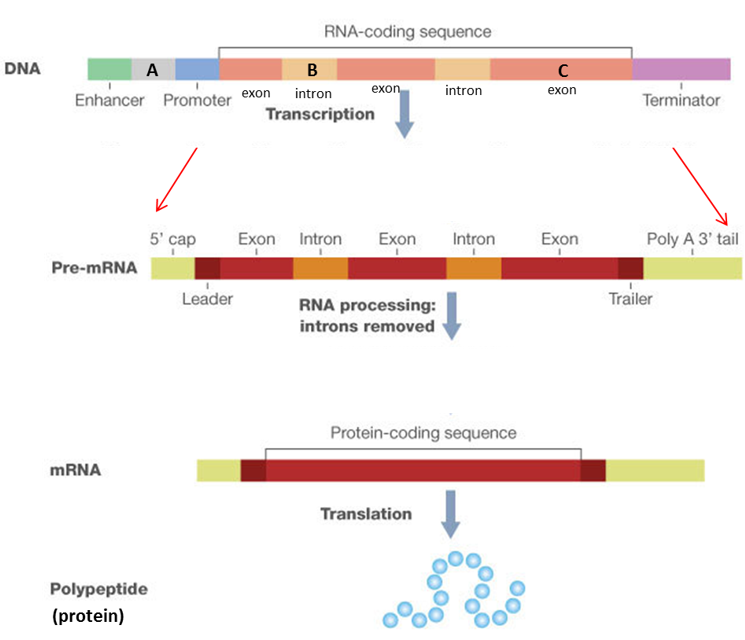
:::
::::::::::::::


# Genomic features as data

- Every location in a genome can be referred to by a coordinate
- The combination of chromosome name,  position and strand (where relevant)
- The transcription start site of the TTN gene is at `chr2:178807423` on the `-` strand
- The location of genes and their elements within the genome is one type of [annotation](`r glossary`annotation)
- Most annotations have two positions (i.e. start and end)

# What is the first number?

- When storing multiple variables in a variable (e.g. an array or list), the first one is referred to by its index
- Programming languages almost universally use 0 as the first index (including Python)
R is an exception
- Genomic coordinate systems have a similar inconsistency
  - [Zero-based vs 1-based systems](https://www.biostars.org/p/84686/)
  - To be discussed in more detail later in the course

# Genomic Features as Plain Text

:::::::::::::: {.columns}
::: {.column}
- Various formats exist for representing genomic annotations
most are delimited plain text
- Delimiters such as tab, comma or semicolon are treated as special characters to separate columns
- Standardized formats dictate what data each column contains
  - e.g. [BED format](`r glossary`BED)
)
:::
::: {.column}

Example BED file:

chr7 7471196 7472363
chr7 7472363 7473530
chr7 7473530 7474697

- columns must be separated by a tab (not space)
- no column-defining header line

:::
::::::::::::::

# From Features to Sequence

- Extracting DNA sequence from a region of interest at the command line

```{bash, engine.opts='-l', echo=TRUE, eval=TRUE}
# samtools is the program we are using
# faidx tells it we want to extract sequence
# data/hg38.fa is the file we will extract from
# chr2:178807210-178807423 is our region
samtools faidx data/hg38.fa chr2:178807210-178807423
#output is in fasta format and the header is auto-generated: 
```

# Thought experiment

- Assume you were given a BED file with the exonic coordinates and strand information for a single gene
- How could you reconstruct the mRNA (or cDNA) sequence for that gene?
- Could you also determine the protein sequence (why/why not)?
- Step 1: 
- Step 2:
- ...

# Thought experiment

- Assume you were given a BED file with the exonic coordinates and strand information for a single gene
- How could you reconstruct the mRNA (or cDNA) sequence for that gene?
- Could you also determine the protein sequence (why/why not)?
- Step 1: 
- Step 2:
- ...

# Thought experiment

- Assume you were given a BED file with the exonic coordinates and strand information for a single gene
- How could you reconstruct the mRNA (or cDNA) sequence for that gene?
- Could you also determine the protein sequence (why/why not)?
- Step 1: 
- Step 2:
- ...

# Genetic variation

:::::::::::::: {.columns}
::: {.column}
- Genomes continuously change due to mutations
  - Can be neutral, detrimental or beneficial
- The driving force in evolution
- Mutations fixed in the population are called single nucleotide polymorphisms (SNPs)
- Any two unrelated genomes differ by >3 million SNPs
:::
::: {.column}
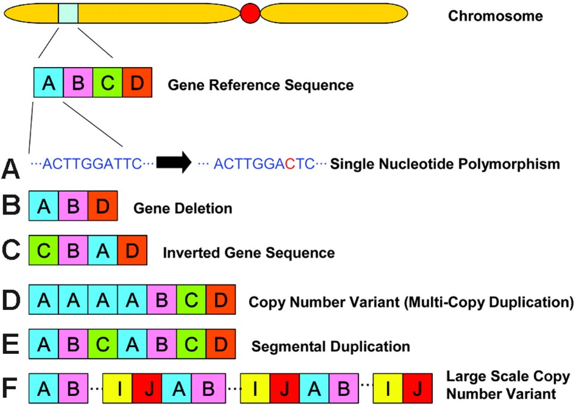
:::
::::::::::::::

# SNPs: the foundation of population genetics

:::::::::::::: {.columns}
::: {.column}
- High-throughput approaches allow genotyping at > 1 million positions
- SNPs are commonly referred to by allele
  - A and B
  - AA, BB, AB (heterozygous)
- Each corresponds to one of two nucleotide sequences at the corresponding position in the reference genome
:::
::: {.column}
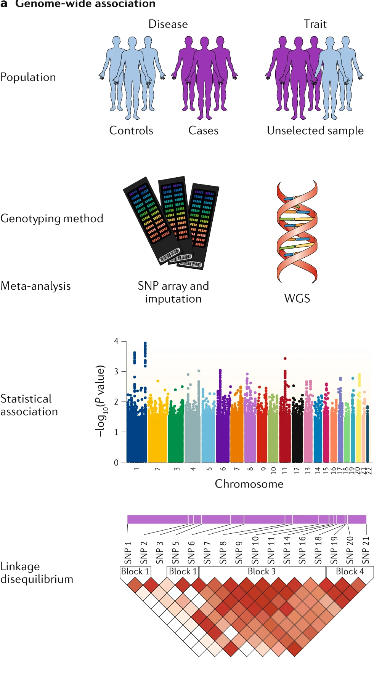
:::
::::::::::::::

# SNP database

:::::::::::::: {.columns}
::: {.column}
- Common SNPs all have unique identifiers in the SNP database (dbSNP)
- Each allele is associated with one or more population frequencies
- Lower minor allele frequency implies lower rate of heterozygotes (according to Hardy-Weinberg)
:::
::: {.column}
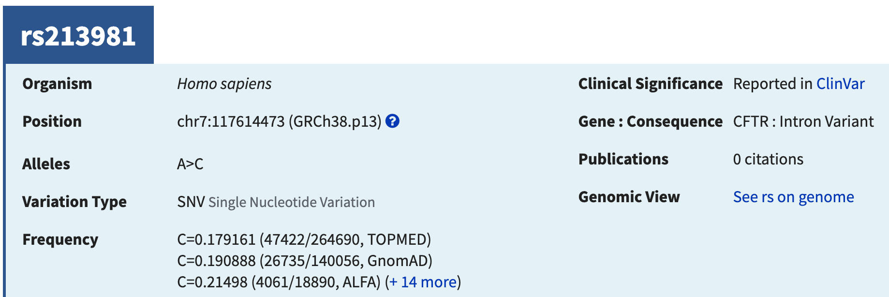

:::
::::::::::::::

# Example Biallelic SNP

:::::::::::::: {.columns}
::: {.column}

- In the reference genome this position is an A:T pair
- The other allele is a C:G pair
- The GnomAD population frequency of the C is 0.190888
:::
::: {.column}


:::
::::::::::::::

# Genotypes as data

- Genotypes can be represented in a basic plain text, delimited format
- 23andMe result for Dr. Morin is below (about 960,000 rows)
```
#rsid	chromosome	position	genotype
rs4477212	1	82154	--
rs3094315	1	752566	AA
rs3131972	1	752721	GG
rs12124819	1	776546	--
rs11240777	1	798959	GG
rs6681049	1	800007	CC
rs4970383	1	838555	AC
rs4475691	1	846808	CC
rs7537756	1	854250	AA
rs13302982	1	861808	GG
```

# Genotypes as data

- Genotypes can be represented in a basic plain text, delimited format
- 23andMe result for Dr. Morin is below (about 960,000 rows)
```
#rsid	chromosome	position	genotype
rs4477212	1	82154	--
rs3094315	1	752566	AA <--- homozygous A
rs3131972	1	752721	GG
rs12124819	1	776546	--
rs11240777	1	798959	GG <--- homozygous G
rs6681049	1	800007	CC
rs4970383	1	838555	AC  <--- heterozygous
rs4475691	1	846808	CC
```

# Standard format for variants

:::::::::::::: {.columns}
::: {.column}
- Bioinformatics community loves creating data standards
- Bioinformaticians seem to be bad at adhering to them
- Variant Call Format (VCF) is one such widely adopted and broadly despised standard
- We will revisit this in a future lab and MBB 342, if you can wait that long
:::
::: {.column}

:::
::::::::::::::

# "Fun" exercise

- What is the breakdown of heterozygous and homozygous positions in Dr. Morin's genome?
- Let's solve this with the command line (bash)
 
```{bash,eval=FALSE, echo=TRUE}
tail -n +2 data/Morin_genotypes.txt | 
egrep -v "MT|X|Y|--" | 
cut -f 4 | 
sort | 
uniq -c | 
perl -pe 's/^\s+//' > data/genotype_counts.txt
# get non-header lines from the file with tail
# drop non-autosome rows using egrep
# keep only the fourth column (the genotype)
# Sort the rows so we can count them
# Count the occurrences of each genotype
# and redirect output to new file
```

# Bash solution, continued

- Math is awful in the command line because variables are all strings by default
- Math is also annoying because the bc tool needs its input on one line and we usually don't have things in this format
```{bash,eval=TRUE, echo=TRUE}
# crunch the numbers from the file we just created 
# egrep can keep or drop homozygous lines
# the -v switches the behaviour
# paste is a tool to combine rows into one line
egrep "AA|CC|DD|GG|TT|II" data/genotype_counts.txt | 
cut -d " " -f 1 | paste -sd+ - | bc

```

# Bash solution, continued

- Math is awful in the command line because variables are all strings by default
- Math is also annoying because the bc tool needs its input on one line and we usually don't have things in this format
```{bash,eval=FALSE, echo=TRUE}
# crunch the numbers from the file we just created 
# egrep can keep or drop homozygous lines
# the -v switches the behaviour
# paste is a tool to combine rows into one line
egrep -v "AA|CC|DD|GG|TT|II" data/genotype_counts.txt | 
cut -d " " -f 1 | paste -sd+ - | bc

```

# What did I just watch?

- the command line is a powerful way to manipulate data in text files 
- Simple commands are often combined together with a [pipe](`r glossary`pipe) `|`, which allows the output of one command to be the input for another command
- Output can also be "redirected" into a file with `>`
- `cut` extracts a single column for subsequent steps
- `paste` combines lines into one row
- `egrep` and `grep` are searching plain text for exact or partial matches

# Command-line arguments

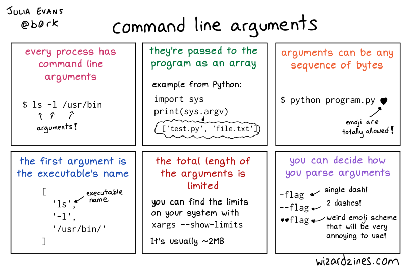

# Wildcards and globbing

- There are some characters that have special meaning and function in bash and thus, cannot be part of real file names or paths
  - These include `?`, `*`, various forms of brackets, and `/`
- The `*` is extremely useful because it acts as a shortcut to allow multiple files to be specified shorthand (this is called "globbing")
  - `*.txt` matches all files *ending* with `.txt` in the working directory
  - `/home/*/fasta*` matches all files in any users home directory *starting* with "fasta" 

# Input, Output and pipes

:::::::::::::: {.columns}
::: {.column}
- Data flows from the terminal or a file as STDIN (standard input)
- STDOUT is the output and by default is printed to the terminal but can flow to other programs or redirected to a file
- STDERR is a special output for error messages
:::
::: {.column}

:::
::::::::::::::

# Putting it all together 

- To store the result of a bash command as a new variable the syntax is `NEW_VARIABLE=$(your bash commands)`
```{bash,eval=TRUE, echo=TRUE}
#store the number of homozygous positions
N_HOMO=$(egrep "AA|CC|DD|GG|TT|II" data/genotype_counts.txt | 
cut -d " " -f 1 | paste -sd+ - | bc)
#store the number of heterozygous positions
N_HETERO=$(egrep -v "AA|CC|DD|GG|TT|II" data/genotype_counts.txt | 
cut -d " " -f 1 | paste -sd+ - | bc)
echo "100*$N_HOMO/($N_HOMO+$N_HETERO)" 
echo "100*$N_HOMO/($N_HOMO+$N_HETERO)" | bc

```

# Variables don't always vary

- As you will explore in the lab, many variables will be set at the start of your bash session and never change
  - Environment variables store useful information about your session that allows things to work the way you want
- Example: PATH environment variable tells Linux where to find all the executables you may want to run
- When you type a command such as `python` the exact program that is run will depend on the contents of PATH


# Variables don't always vary
- The `which` program tells the user the path to the program that gets run when you enter a given command without the full path

```{bash, eval=TRUE, echo=TRUE}
echo $PATH
```
```{bash, eval=TRUE, echo=TRUE}
which python
```
```{bash, eval=TRUE, echo=TRUE}
which R
```


# From interactive sessions to scripts

- any series of bash commands can be automated by putting the same commands into a plain text file that has a special line at the top to tell the computer what interpreter to use
- More generally, the commands for any interpreted/scripting language work this way (bash, Python, R, Perl, Awk, etc)
- The first line is our "shebang" line. This is the only time a line starting with # isn't a comment!

```{bash, eval=F,echo=T}
#!/bin/bash
echo "Hello World"

```

# From interactive sessions to scripts

- To run this, you simply have to save those lines in a plain text file of any name
- Though not required, by convention you should end it with .sh to indicate it's a shell script
- One more thing: the file permissions must be set to "executable"

```{bash, eval=F,echo=T,size="\tiny"}
-rw-r--r--@ 1 me staff 31B 8 Jan 14:52 a.sh
#won't run for anyone
-rwxr--r--@ 1 me staff 31B 8 Jan 14:52 b.sh 
#only runs for the owner of the file (me)
-rwxr-xr--@ 1 me staff 31B 8 Jan 14:52 c.sh 
#runs for the file owner and any member of the staff group
```

# Permissions in UNIX/Linux

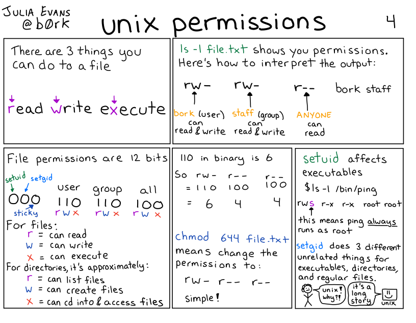

```{bash,eval=T,echo=F}
chmod 400 hello_world.sh
```

# Changing file permissions with `chmod`

```{bash,eval=T,echo=T}
# a = all, u=owner, g=group, o=others
# use +x to give -x to revoke executable permissions
# other permissions: r=read, w=write/delete
ls -l hello_world.sh

```
```{bash,eval=T,echo=T}
chmod u+x hello_world.sh
ls -l hello_world.sh

```
```{bash,eval=T,echo=T}
chmod o+x hello_world.sh
ls -l hello_world.sh
```

# What command would we need to 

- Allow any user to run the script `a.sh`?

`-rw-r--r--@ 1 big_nerd1 scientists 31B 8 Jan 14:52 a.sh`

- Prevent people outside the students group from reading the contents of filez.gz?

`-rw-r--r--@ 1 big_nerd2 students 31B 8 Jan 14:52 filez.gz`

# What command would we need to 

- Allow any user to run the script `a.sh`?

`-rw-r--r--@ 1 big_nerd1 scientists 31B 8 Jan 14:52 a.sh`

`chmod a+x a.sh`

`-rwxr-xr-x@ 1 big_nerd1 scientists 31B 8 Jan 14:52 a.sh`


- Prevent people outside the students group from reading the contents of filez.gz?

`-rw-r--r--@ 1 big_nerd2 students 31B 8 Jan 14:52 filez.gz`

`chmod o-r filez.gz`

`-rw-r-----@ 1 big_nerd2 students 31B 8 Jan 14:52 filez.gz`

# Closing thoughts before your lab

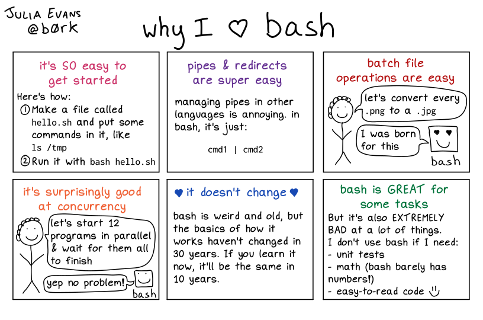
