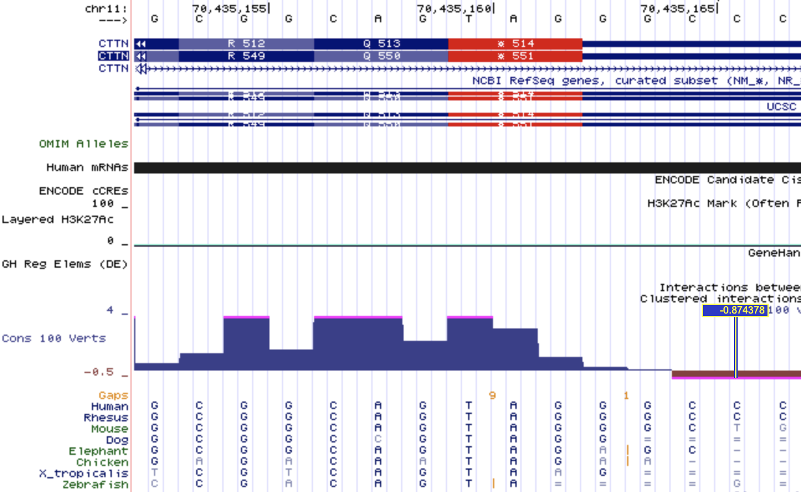
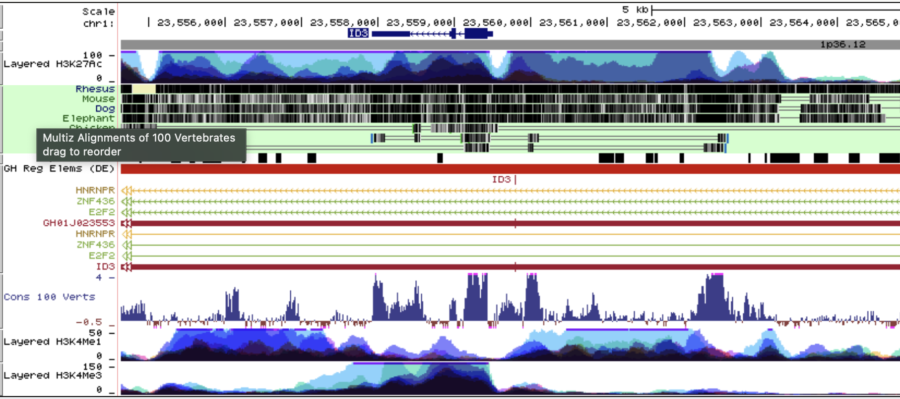
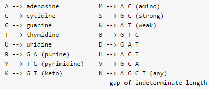
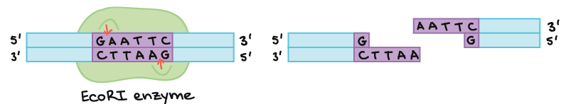
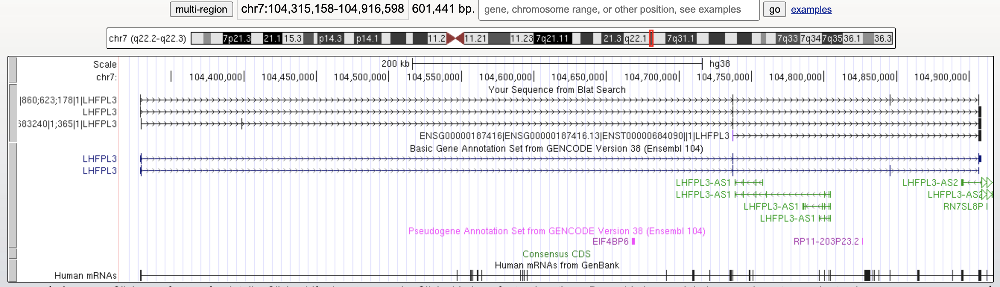
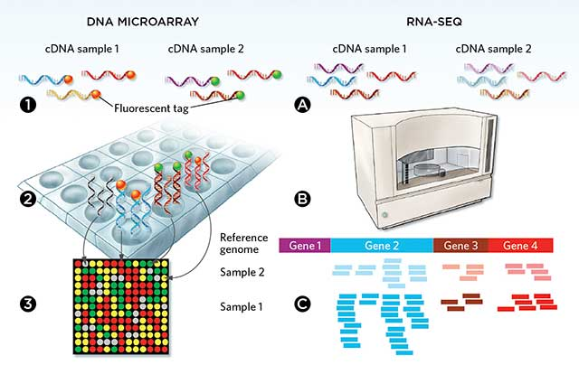
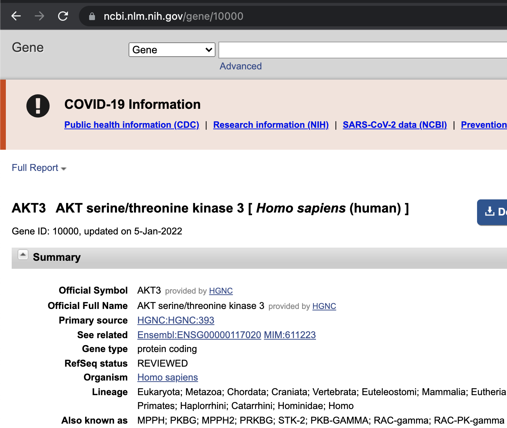

```{r setup, include=FALSE}
require(reticulate)
knitr::opts_chunk$set(echo = FALSE)
# if necessary, use this command to install required non-standard command-line tools:
# conda install -c bioconda samtools seqtk

```

# Recap

- Molecular biology data comes in various flavours
- Numeric or textual data is very common (reference genome sequence, genotype)
- Genomes have layers of information that contextualize the sequence
- The command line is a useful tool for interacting with some of these
- RStudio is the interface we will use this semester for learning to code in three different programming languages (Why?!?)
  - Each language has strengths and weaknesses


# Learning goals for the week

- Build on/expand Unix fundamentals
- Become familiar with additional data types we encounter in molecular biology research
- Understand what types of numerical data, including estimates of error, are associated with different data types
- Get more familiar with some common applications of the command line for manipulating sequence and delimited text files

# `man`: your best friend

:::::::::::::: {.columns}
::: {.column}
```
$man which
WHICH(1)                  BSD General Commands Manual                 WHICH(1)

NAME
     which -- locate a program file in the user's path

SYNOPSIS
     which [-as] program ...
```
:::
::: {.column}

:::
::::::::::::::

# Example `man` page

```
GREP(1)                   BSD General Commands Manual                  GREP(1)

NAME
     grep, egrep, fgrep, zgrep, zegrep, zfgrep -- file pattern searcher

SYNOPSIS
     grep [-abcdDEFGHhIiJLlmnOopqRSsUVvwxZ] [-A num] [-B num] [-C[num]] [-e pattern] [-f file] [--binary-files=value] [--color[=when]] [--colour[=when]] [--context[=num]]
          [--label] [--line-buffered] [--null] [pattern] [file ...]

DESCRIPTION
     The grep utility searches any given input files, selecting lines that match one or more patterns.  By default, a pattern matches an input line if the regular expression
     (RE) in the pattern matches the input line without its trailing newline.  An empty expression matches every line.  Each input line that matches at least one of the pat-
     terns is written to the standard output.

     grep is used for simple patterns and basic regular expressions (BREs); egrep can handle extended regular expressions (EREs).  See re_format(7) for more information on reg-
     ular expressions.  fgrep is quicker than both grep and egrep, but can only handle fixed patterns (i.e. it does not interpret regular expressions).  Patterns may consist of
     one or more lines, allowing any of the pattern lines to match a portion of the input.
```

# Lab logistics

- Starting this Friday (Jan 22), we will have the lab in person on campus
  - Masks are required
  - Zoom will still be available for anyone who cannot attend due to illness
- If you are still not done with the lab 1 activites please stay for office hours!

# Lessons learned from the lab

- Any file with "." at the start of its name is hidden from display by default (e.g. `~/.bash_profile`)
  - `ls -a` will show hidden files
- The reticulate package has some oddities in how it finds python
- Useful things to check when deciding if something was properly installed
  - To test if a tool named PROGRAM is available in your terminal and to check which one is being used, run `which PROGRAM` 

# Variables don't always vary
- The `which` program tells the user the path to the program that gets run when you enter a given command without the full path

```{bash, eval=TRUE, echo=TRUE}
echo $PATH
```
```{bash, eval=TRUE, echo=TRUE}
which python
```
```{bash, eval=TRUE, echo=TRUE}
which R
```

# Variables don't always vary

- As you have already seen in the lab, many variables will be set at the start of your bash session and never change (e.g. via your .bashrc and .bash_profile files)
  - Environment variables store information about your session that allows things to work the way you want
- Example: PATH environment variable tells Linux where to find all the executables you have available
- When you type a command such as `python` the exact program that is run will depend on the contents of PATH


# From interactive sessions to scripts

- any series of bash commands can be automated by putting the same commands into a plain text file that has a special line at the top to tell the computer what interpreter to use
- More generally, the commands for any interpreted/scripting language work this way (bash, Python, R, Perl, Awk, etc)
- The first line is our "shebang" line. This is the only time a line starting with # isn't a comment!

```{bash, eval=F,echo=T}
#!/bin/bash
echo "Hello World"

```

# From interactive sessions to scripts

- To run this, you simply have to save those lines in a plain text file of any name
- Though not required, by convention you should end it with .sh to indicate it's a shell script
- One more thing: the file permissions must be set to "executable"

```{bash, eval=F,echo=T,size="\tiny"}
-rw-r--r--@ 1 me staff 31B 8 Jan 14:52 a.sh
#won't run for anyone
-rwxr--r--@ 1 me staff 31B 8 Jan 14:52 b.sh 
#only runs for the owner of the file (me)
-rwxr-xr--@ 1 me staff 31B 8 Jan 14:52 c.sh 
#runs for the file owner and any member of the staff group
```

# Permissions in UNIX/Linux


```{bash,eval=T,echo=F}
chmod 400 scripts/hello_world.sh
```

# Changing file permissions with `chmod`

```{bash,eval=T,echo=T}
# a = all, u=owner, g=group, o=others
# use +x to give -x to revoke executable permissions
# other permissions: r=read, w=write/delete
ls -l scripts/hello_world.sh

```
```{bash,eval=T,echo=T}
chmod u+x scripts/hello_world.sh
ls -l scripts/hello_world.sh

```
```{bash,eval=T,echo=T}
chmod o+x scripts/hello_world.sh
ls -l scripts/hello_world.sh
```

# What command would we need to 

- Allow any user to run the script `a.sh`?

`-rw-r--r--@ 1 big_nerd1 scientists 31B 8 Jan 14:52 a.sh`

- Prevent people outside the students group from reading the contents of filez.gz?

`-rw-r--r--@ 1 big_nerd2 students 31B 8 Jan 14:52 filez.gz`

# What command would we need to 

- Allow any user to run the script `a.sh`?

`-rw-r--r--@ 1 big_nerd1 scientists 31B 8 Jan 14:52 a.sh`

`chmod a+x a.sh`

`-rwxr-xr-x@ 1 big_nerd1 scientists 31B 8 Jan 14:52 a.sh`


- Prevent people outside the students group from reading the contents of filez.gz?

`-rw-r--r--@ 1 big_nerd2 students 31B 8 Jan 14:52 filez.gz`

`chmod o-r filez.gz`

`-rw-r-----@ 1 big_nerd2 students 31B 8 Jan 14:52 filez.gz`

# Self-explanatory


# Many numeric genome annotations exist



# Many numeric genome annotations exist



# Annotations in the context of transcripts

:::::::::::::: {.columns}
::: {.column}
- Annotations relative to the genome are often more relevant in other contexts
- e.g. Mutations and SNPs can be interpreted relative to their effect on the transcript (and coding DNA seqment)  [of the affected gene](https://uswest.ensembl.org/Homo_sapiens/Transcript/Sequence_cDNA?db=core;g=ENSG00000006453;r=7:98291650-98401090;t=ENST00000005260)
- Note the many effects a SNP or indel can have on coding sequence in this example!
:::
::: {.column}

:::
::::::::::::::


# some "gotchas" in working with sequence files

:::::::::::::: {.columns}
::: {.column}
- Restriction enzymes cleave DNA at very specific sequences
- Suppose you wanted to find all examples of a restriction enzyme cut site in a region of interest
- What caveats do you need to worry about when writing a simple program to search for that sequence?
:::
::: {.column}

:::
::::::::::::::

# Searching for enzyme cut sites

- Starting point:
  - reference genome sequence in fasta format
  - Can you find all the EcoRI sites (GAATTC)?

```
  >chr1 
  AACATTAAGGATCCATTATCCGATACCATTGAA 
  TTCCTGACTTGAATTCCCAATATCCATTCAGTA 
  CCTCTTAAGCCTTCGTAGTTCAATTCGGATCCT 
```

# Searching for enzyme cut sites

- Starting point:
  - reference genome sequence in fasta format
  - Can you find all the EcoRI sites (GAATTC)?
  - Do we need to worry about CTTAAG? Why/why not?
```
  >chr1 
  AACATTAAGGATCCATTATCCGATACCATTGAA 
  TTCCTGACTT*GAATTC*CCAATATCCATTCAGTA 
  CCTCTTAAGCCTTCGTAGTTCAATTCGGATCCT 
```

# Searching for enzyme cut sites

- Starting point:
  - reference genome sequence in fasta format
  - Can you find all the EcoRI sites (GAATTC)?
  - Do we need to worry about CTTAAG? Why/why not?
  - What about newlines/white space?
```
  >chr1 
  AACATTAAGGATCCATTATCCGATACCATT*GAA 
  TTC*CTGACTT*GAATTC*CCAATATCCATTCAGTA 
  CCTCTTAAGCCTTCGTAGTTCAATTCGGATCCT 
```

# Doing it in Bash

```{bash, echo=TRUE}
# load everything but the header line using grep
grep -v \> data/cutsite_ref.fa
# problem: our sequence is broken by new lines
# and this breaks potential matches of GAATTC
```

# Doing it in Bash

```{bash, echo=TRUE}
# load everything but the header line using grep
grep -v \> data/cutsite_ref.fa |
perl -pe 's/\n//'
# paste -sd '\0' - #this line could be used in place of the perl code
# Now we have all the sequence on one line
# we can pass that with a pipe for pattern matching 
```

# Doing it in Bash

```{bash, echo=TRUE}
# load everything but the header line using grep
grep -v \> data/cutsite_ref.fa |
perl -pe 's/\n//' |
perl -pe 's/GAATTC/*GAATTC*/g'
# both perl and sed use this syntax to find/replace strings: 
# /MATCH_PATTERN/REPLACEMENT_STRING/
```

# Predicting restriction fragments
- How would you modify this code to generate the sequence of all predicted restriction fragments after EcoRI digestion?
```{bash, echo=TRUE}
# load everything but the header line using grep
grep -v \> data/cutsite_ref.fa |
perl -pe 's/\n//' |
perl -pe 's/GAATTC/*GAATTC*/g'
```

# Predicting restriction fragments

- How would you modify this code to generate the sequence of all predicted restriction fragments after EcoRI digestion?
```{bash, echo=TRUE}
grep -v \> data/cutsite_ref.fa | paste -sd '\0' - |
perl -pe 's/GAATTC/GAA\nTTC/g'
# Remember \n is how we specify a newline in most programming contexts

```

# (im)practicality of this approach

- There are way better ways to do this
- How well would this scale to other applications?
- Much longer sequences (e.g. genome/chromosome)?
- A fasta file containing many individual sequences?

# Don't reinvent the wheel

- If you're encountering an annoying quirk of a common file format, you are never the first person
- Search online for how to solve common problems (often you'll end up in StackOverflow)
  - e.g. "remove newlines fasta" brings you to [this post](https://stackoverflow.com/questions/15857088/remove-line-breaks-in-a-fasta-file), which contains an easier way that allows you to skip some of these steps
  - [seqtk](https://github.com/lh3/seqtk) has a lot of handy functions you may want to try
```{bash,engine.opts="-l", echo=TRUE, eval=TRUE}
seqtk seq -l 0 data/cutsite_ref.fa
```

# (im)practicality of this approach

- There are still way better ways to do this
- How well would this scale to other applications?
- Much longer sequences (e.g. genome/chromosome)?
  - The entire sequence is being processed at once by `sed`, which requires it to be stored as a variable, which consumes RAM
- A fasta file containing many individual sequences?
  - Implementation above stripped the sequence header so we lost positional information and the name/context of all sequences

# Additional considerations

- Starting point Sanger sequencing data from a cDNA clone
  - Assume we know this cDNA is cut multiple times by the enzyme and we want to know why
  - How would you find the places most likely being cut by EcoRI (GAATTC)?
  - Imperfect/partial matches in sequence are more difficult to identify
  - Requires "fuzzy" matching or regular expressions (to be covered later in the course)


# Searching for sequences of interest

- What if you had a FASTA with sequences of many transcripts and you just wanted the records pertaining to certain genes? 

```{bash, echo=TRUE,eval=TRUE}
grep -c \> data/human_genes_chr7.fa
# how many sequence records are in this file? 
# count them with grep -c
```
# Searching within the headers

```{bash, echo=TRUE,eval=TRUE, engine.opts="-l"}
# Simpler to use this file after dropping line breaks
seqtk seq -l 0 data/human_genes_chr7.fa | 
# Here we're using the -c option with head to limit the number of bytes printed!
head -c 220 

```

# Searching within the headers

```{bash, echo=TRUE,eval=TRUE, engine.opts="-l"}
seqtk seq -l 0 data/human_genes_chr7.fa | 
grep -w "LHFPL3"
# Why so many hits for this one gene name?
# Something is going wrong with our search. Why? 
```

# Searching within the headers

```{bash, echo=TRUE,eval=TRUE, engine.opts="-l"}
seqtk seq -l 0 data/human_genes_chr7.fa | 
grep -w "LHFPL3$"
# Even though we're asking grep to stop searching between "words" with -w, certain characters such as - are considered allowed components of words. Since we know there should be whitespace after the gene name we "anchor" our pattern with $.
```

# See you in 5 minutes

1[](images/intermission.jpeg)


# Most genes have multiple isoforms due to alternative splicing


# What do you expect?

- The example shown previously results in four separate sequences for the same gene
  - In what ways might you expect those three to differ?
  - How might they be similar?
- Do you think all alternative transcripts encode different protein sequences?

# How do we actually get the sequences?

```{bash, echo=TRUE,eval=FALSE, engine.opts="-l"}
# grep -A 1 tells the search to return the matching line along with one line AFTER it. 

# Unfortunately it also prints "--" after that (for some reason) but this can be dealt with by piping it to another grep to drop those lines

seqtk seq -l 0 data/human_genes_chr7.fa | 
grep -A 1 -w "LHFPL3$" |  
grep -v "\-\-" > LHFPL3.fa
```
- Think about how you might extend this to extract the sequence of a few different genes instead of just one. What would you need to change and how?

# Success!

```{bash,eval=TRUE,echo=TRUE}

echo "file has $(wc -l LHFPL3.fa) lines"
echo "file has $(grep -c \> LHFPL3.fa) headers"
head -c 150 LHFPL3.fa

```

# How do they compare? 



# Synopsis

- It's possible to subset a large multi-record FASTA file with a combination of a few commands
- This example used a file containing the predicted cDNA for many genes
- `grep` and some of these other tools have numerous surprises that can lead to new problems
- Building your commands up one step at a time and sanity checking each allows you to ensure you get the result you want in the appropriate format


# Quantitative annotations

- Numeric values for every position in a sequence
  - You can think of this as a "wide" format representation
- Each genomic position is a column (or string index) and each value is a row

```
              1 <-genomic coordinate ->N
Seq:       AAAGCGCCGGGATTTTCCGTTTAAACCTCCCTC
Value:     012345543210101234543211122334455
e.g. %GC                                  
----5----       ..           .            .. 
----4----      ....         ...         ....
----3----     ......       .....      ......
----2----    ........     .......   ........
----1----   .......... . ...................
----0----  .................................
```

# Has benefits and drawbacks

- May be super convenient for smaller sequences
  - Sequence and numeric values can easily be "split" into a list/array/vector
- Inflexible for non-integer values (or larger than 9)
- What if you wanted to order or filter based on some numeric threshold?

```{python,eval=T,echo=T}
my_seq="AAAGCGCCGGGATTTTCCGTTTAAACCTCCCTC"
scores="012345543210101234543211122334455"
# What's the base and score/value at position 2?
my_seq[2]
scores[2]
```

# Let's rotate it


# Quantitative annotations
:::::::::::::: {.columns}
::: {.column}
- Sequence positions converted to rows and row numbers are relative to the coordinate
- Each column can contain different information about the sequence
:::
::: {.column}
```
pos   Nt    value
1   A   0
2   A   1
3   A   2
4   G   3
5   C   4
6   G   5
7   C   5
8   C   4
9   G   3
10  G   2
11    G   1
12    A   0
13    T   1
14    T   0
15    T   2
16    T   3
```
:::
::::::::::::::


# Quantitative annotations

- Sequence positions converted to rows and row numbers are relative to the coordinate
- Each column can contain different information about the sequence
- Easy to perform operations per-row based on certain criteria
- Think of this as the "tall" equivalent of the "wide" format shown previously
  - How many rows would this file contain if we had an annotation represented this way for the human genome?

# Quantitative annotations

- Sequence positions converted to rows and row numbers are relative to the coordinate
- Each column can contain different information about the sequence
- Easy to perform operations per-row based on certain criteria
- How many rows would this file contain if we had an annotation represented this way for the human genome?
  - About 3 billion lines! 

# Lowering resolution and handling sparseness

- Most annotations don't span the entire genome and are usually much more sparse
- Regions of the genome with values of zero don't need to be explicitly represented
- Single base resolution is rarely relevant and bins or windows (e.g. 1kb) are often used 
```
start end value
1 1000 50
1001 2000 20
2001 3000 10
9001 10000 30
10001 11000 100
```
# Lowering resolution and handling sparseness

- Most annotations don't span the entire genome and are usually much more sparse
- Regions of the genome with values of zero don't need to be explicitly represented
- Single base resolution is rarely relevant and bins or windows (e.g. 1kb) are often used
  - Example is UCSC's [wiggle](https://genome.ucsc.edu/goldenPath/help/wiggle.html) (.wig) format
```
start end value
1 1000 50
1001 2000 20
2001 3000 10 <-- implies 3001 to 9000 are zero
9001 10000 30 <--
10001 11000 100
```

# Sample-specific measurements: gene expression

:::::::::::::: {.columns}
::: {.column}
- Multiple methods are used to quantify the expression of many genes in a sample
  - digital approaches such as RNA-seq, NanoString
  - analog methods such as microarrays
:::
::: {.column}

:::
::::::::::::::

# Sample-specific measurements: gene expression

:::::::::::::: {.columns}
::: {.column}
- Although the underlying gene expression is a continuous variable, digital methods measure discrete values (integers), which represent how many times that mRNA was "observed"
- Millions of measurments across many thousands of genes
:::
::: {.column}

:::
::::::::::::::

# Types of gene expression data

- Raw data is either the signal per probe (microarray) or sequencing reads (RNA-seq)
- Array data is not all comparable due to different microarray designs/versions
  - Various "probe sets" measure different combinations of genes
  - [Example microarray data set in GEO. Platform: HG-U133_Plus_2](https://www.ncbi.nlm.nih.gov/geo/query/acc.cgi?acc=GSE10846)
  - [Example RNA-seq data set in GEO](https://www.ncbi.nlm.nih.gov/geo/query/acc.cgi?acc=GSE125966)

# Peeking at RNA-seq data

- Typically you will encounter post-processed data in the form of per-gene counts
- This example from GEO (GSE125966) is a comma-separated file with quoted values

```{bash}
# not shown: download with curl, decompress with gunzip
 cut -d "," -f 1-3 data/GSE125966.csv | head -n 3
```

# Peeking at RNA-seq data
- Using `cut` (specifying a `,` delimiter) and `head` we can peek at the contents
- This format is hard on the eyes but easy to convert to something useful in R
```{bash, echo=TRUE}
wc -l data/GSE125966.csv #Number of rows (genes)
cut -d "," -f 1-3 data/GSE125966.csv | head -n 3
```

# Comma-separated values

```{bash}

echo Meaning of columns:
echo GENE,SAMPLE1_count,SAMPLE2_count, etc.
echo
 cut -d "," -f 1-3 data/GSE125966.csv | head -n 6
```

# Sorting numeric columns

- Even with comma-delimited data the command line can be used to explore some features of the data
  - What are the top 10 most highly expressed genes in the first sample?
```{bash, echo=TRUE,eval=FALSE}
sort -t "," -k 2 -n -r data/GSE125966.csv | 
# tell the sort command we have an unusual delimiter with -t ","
# Sort on column 2 with -k 2
# Peform numeric, instead of alphabetical sort using -n 
# Reverse the sort order to put the highest first using -r 
cut -d "," -f 1-4 |  head
# tell cut to use a comma delimiter and take columns 1-4 and view the top 10 lines
```

# Sorting numeric columns

- Even with comma-delimited data the command line can be used to explore some features of the data
  - What are the top 10 most highly expressed genes in the first sample?
```{bash, echo=FALSE,eval=TRUE}
sort -t "," -k 2 -n -r data/GSE125966.csv | cut -d "," -f 1-4 |  head
```


# Layering on information with `join`

- If we have another similarly structured file containing a shared column (e.g. gene ID) we can link them together using `join`
- Here's a simple file that contains the Entrez Gene ID and HGNC symbol of every human gene. It's already been sorted on column 1 using `sort`.
```{bash, eval=TRUE}
head -n 4 data/gene_id.sorted.txt 
```


# Layering on information with `join`

- If we have another similarly structured file containing a shared column (e.g. gene ID) we can link them together using `join`

```{bash, eval=TRUE, echo=T}
cut -f 1,2 -d "," data/GSE125966.csv | sort -k 1 -t "," - | join -t "," - data/gene_id.sorted.txt > data/GSE125966_annotated.csv
head -n 3 data/GSE125966_annotated.csv
```
- This output contains the first two columns from our gene expression file attached to the first two columns of our gene ID file

# How does this work?

:::::::::::::: {.columns}
::: {.column}
- Combining data sets with shared properties is a common need
- Here we performed what is called an "inner join" on these two files
- Columns from any row in both tables that share an ID (or "key") are brought together
- Rows in either table that don't share a key are dropped (lost)
:::
::: {.column}

:::
::::::::::::::

# Caveats with joining data

- Inner joins will remove rows that don't match (data loss!)
- Other types of joins can be more conservative
  - e.g. left joins will be covered later in the course

```{bash,echo=T,eval=T}
# the original file has more lines than the new file. Why?
wc -l data/GSE125966.csv

```


```{bash,echo=T,eval=T}
wc -l data/GSE125966_annotated.csv

```

# Manipulating annotations with bedtools
:::::::::::::: {.columns}
::: {.column}
- Joining is just one common operation we may want to apply to data with shared features or IDs
- A similar concept can be applied to regional data using `bedtools`
  - overlap regions
  - intersect regions
:::
::: {.column}

:::
::::::::::::::

# Grep responsibly!

- A naive attempt to use grep to search for the row for a gene of interest
- returns many results we were probably not interested in. Only the first 10 are shown.
```{bash, echo=TRUE}

grep "GeneID:1000" data/GSE125966.csv | cut -d "," -f 1-3 | head -n 6
```

# Grep responsibly!

- Searching with `grep` using the `-w` option specifies the grep treats your search pattern as a word
- This often works to remove accidental nested matches, but it doesn't always work exactly as expected
- More sophisticated searching methods will be explored later in the course

```{bash, echo=TRUE}
grep -w "GeneID:1000" data/GSE125966.csv | cut -d "," -f 1-3 | head
```


# From GeneID to biology

:::::::::::::: {.columns}
::: {.column}
- This data set used Entrez Gene annotations
- AKT3 has at least 8 other names!
- Unique IDs such as Entrez, HGNC symbols (AKT3) and Ensembl IDs are unambiguous
- Later in the course we will look at ways to connect IDs to useful information about the gene
:::
::: {.column}

:::
::::::::::::::

# Delimited files and pipelines

- tab, space or comma-delimited files are by far the easiest to work with programmatically
- Many workflows involve extracting the same column(s) or applying the same manipulation on every row
  - e.g. find matching rows and pass along to another step or alter the data in some consistent way before passing along
- flowing data from one program to another this way (using pipes) is referred to as a "pipeline"


# Summary and outlook

- Bash is a useful environment to efficiently perform quick analyses on various delimited/tabular text formats
  - Anything we want to do once per line of a file is usually doable
- Can also be useful for the manipulation of non-tabular data into a more convenient format
  - This can be useful as an intermediate step before further processing, e.g. within R or Python
    - Knowledge: how to use the command-line
    - Wisdom: when you should/shouldn't use it 
    
# Bonus study material


# Revisiting genome size

- How would you calculate the number of nucleotides in the human genome?

```{bash, eval=T,echo=T}
ls -l data/hg38.fa
```
- Why is this number not equal to the number of nucleotides? 
  - *Hint: what else is in a FASTA file?*

# Revisiting genome size

- Why is this number not equal to the number of nucleotides? 

```{bash,echo=T,eval=T}

head -n 3 data/hg38.fa
```

# Revisiting genome size

- What characters should we count/not count? 
  - For simplicity, let's count all A/C/T/G/N characters

# Revisiting genome size

- What characters should we count/not count? 
  - For simplicity, let's count all A/C/T/G/N characters
  - There are newline characters at the end of every line and `wc` and other programs consider them characters (because they are)!

# Revisiting genome size

```{bash, eval=F, echo=T}
# The number of non-header lines in the file 
line_num=$(grep -v \> data/hg38.fa | wc -l)

# The total number of characters in those lines
character_num=$(grep -v \> data/hg38.fa | wc -m)

```

# Revisiting genome size

```{bash, eval=F, echo=T}
# The number of non-header lines in the file 
line_num=$(grep -v \> data/hg38.fa | wc -l)

# The total number of characters in those lines
character_num=$(grep -v \> data/hg38.fa | wc -m)

# subtract the line number from the full character number 
# Why? 
echo Genome has $(($character_num - $line_num)) nucleotides!

## Genome has 3099922541 nucleotides!
```


