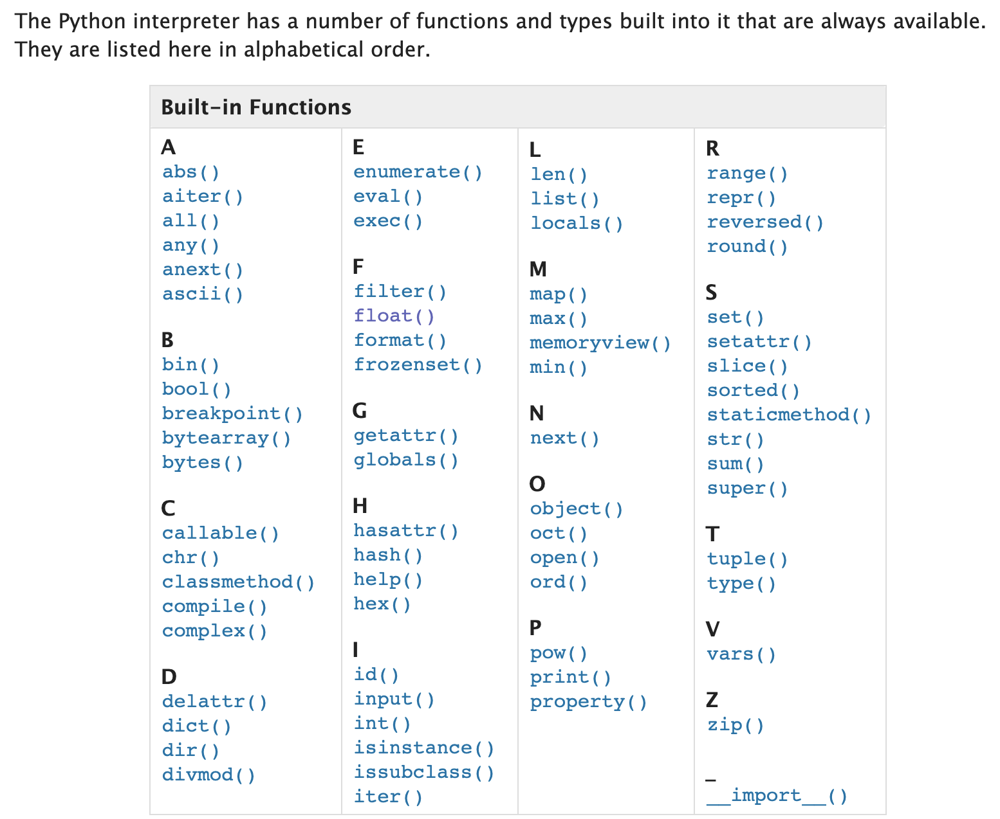
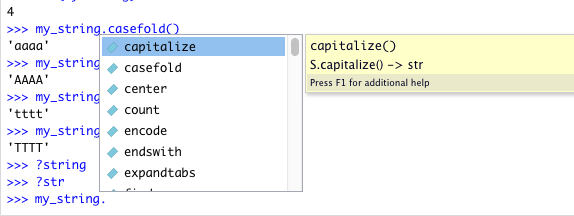
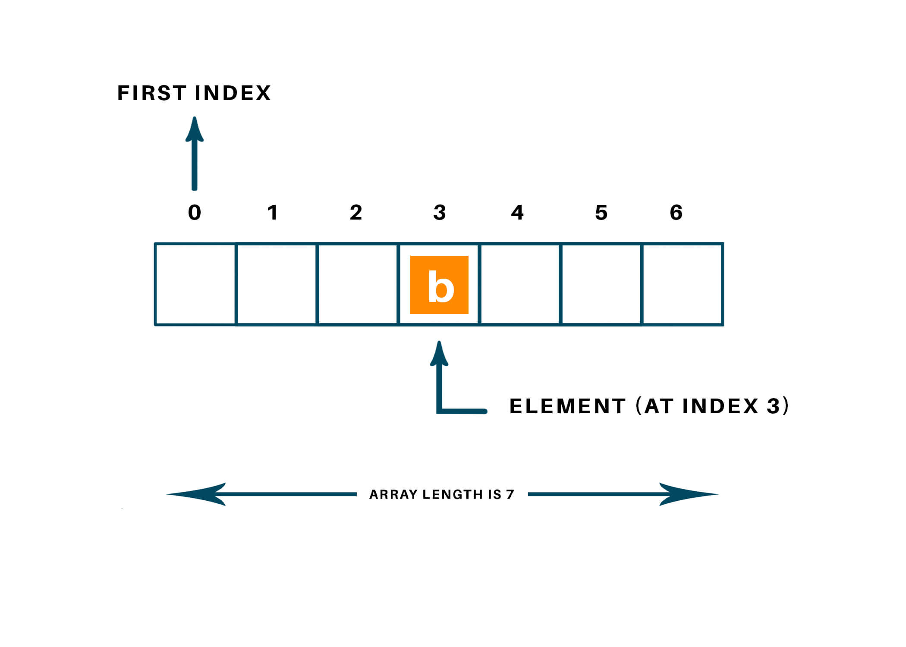
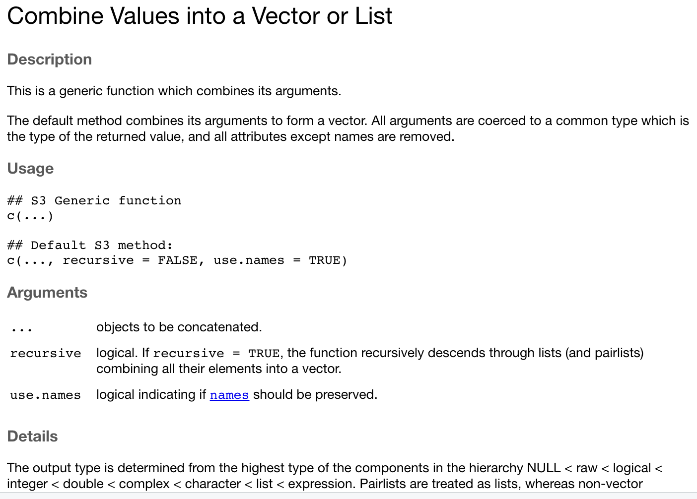

```{r setup, include=FALSE}
require(reticulate)
knitr::opts_chunk$set(echo = FALSE)
# if necessary, use this command to install required non-standard command-line tools:
# conda install -c bioconda samtools seqtk

```

# When do you step away from interactive bash?

- Eventually you will encounter data formats that require more sophisticated programming than is readily possible with the command line
- Any process you want to apply to multiple individual files or only when certain conditions apply is not easily done interactively
  - e.g. if file contains X do Y
  - e.g. for every file do X, Y and then Z and make a new file with a different name
- All theoretically possible in bash but there really are better ways

# Programming in R and Python

- The next few lectures will cover introductory concepts with syntax examples in both R and Python
- *Syntax*: You will use each language in your labs so the syntax for both is important
- *Terminology*: Languages sometimes use different terms to describe related concepts and the differences may be subtle
- In situations when the concept is more easily illustrated in one language we will focus on a single language for consistency

# Learning goals for the week

- Learn the most common types of variables shared between R and Python
- Understand the limitations of different variable types
- Understand how to access object Methods and to call functions
- Gain familiarity with manipulating variables directly and with appropriate functions
- Learn how to find documentation for built-in functions and Methods in both languages

# Interactive sessions

- Most of your lab activities will be done in Rstudio
- Code chunks are surrounded with sets of three backticks
- The RStudio Console will automatically run an interactive R session
  - R variables you load/create are visible in the Environment pane
- Python code run in Rstudio can be run in code chunks after loading the **reticulate** library
- You can also launch an interactive Python session (REPL) 

# Interactive sessions

```{r,eval=FALSE,echo=TRUE}
library(reticulate)
repl_python()
## Python 3.6.13 (/Users/rmorin/miniconda3/envs/r-reticulate/bin/python)
## Reticulate 1.22 REPL -- A Python interpreter in R.
## Enter 'exit' or 'quit' to exit the REPL and return to R.
# Let's enter some Python code and see the result

## >>> print("HELLO\nWORLD!")
## HELLO
## WORLD!

```

# Variables

- String/character variables: require quotes
- Numbers in R are all represented by the numeric *class*
- Python has a more nuanced set of variable *types* for numbers
  - int - a signed integer (+/-)
  - float - floating point numbers
- The class of a R variable can always be determined with the `class` function
- The type of a Python variable can always be determined with the `type` function

# Functions/Methods

- A function is a block of reusable code that is used to perform a similar or related action using a specific input or set of inputs
- The code that defines what a function does when called is specified elsewhere in the program or can come with a built-in or user-installed module/library
- We will explore how functions are made later
- Consider them a convenient set of black-boxes for now, similar to how we use bash utilities `grep`, `cut`, `sort` without worrying about how they work

# Functions/Methods


# Syntax note: calling functions

- In bash, we run a program with command-line arguments with this syntax: 

```{bash, eval=FALSE, echo=T}
program_name arg1_value arg2_value arg3_value

```

- Within Python and R, we call a function with one or more variables as arguments using this syntax:

```{r,echo=T,eval=F}
function_name(arg1_value,arg2_value,arg3_value)

```

- In Python, this is true except when it involves a special type of function that belong to an object (to be revisited)

# Syntax note: calling functions

- Another common practice in both R and python is to explictly refer to the arguments you specify by their name:

```{r,eval=F,echo=T}
# arguments are shown on separate lines hear for ease of documentation but this isn't required
function_name(arg1_name=arg1_value, 
              arg2_name=arg2_value, 
              arg3_name=arg3_value)
# each argument can be passed as a key/value pair
# e.g. the first key is arg1_name and the first value is arg1_value
# each key (left of =) must refer to an available argument
# i.e. your function needs to be expecting the named arguments
```

# Example documentation of a function


# Actual example of function call

- Python's `print` function has additional options for how it handles its inputs
  - sep specifies the separator that goes between the strings provided
  - end is the character optionally added to the end of the string it generates (e.g. `\n`)
  
```{python,eval=T,echo=T}

print(
    "Hello", # First un-named argument
    "World", # Second un-named argument
    sep=" ", # First named argument
    end="!") # Second named argument
```

# Python built-in functions



# Syntax note: whitespace in Python

- Compared to Python, most programming languages feature a lot more types of brackets and many semicolon characters `;`
- The exlimination of these characters came at a cost: confusing people new to the language
- Whitespace in the wrong place is interpreted as having a specific meaning in the code

```{python,echo=T,eval=F}
a_variable = 10
    b_variable = 20 # throws Error: unexpected indent (<string>, line 2)
  c_variable = 30 # throws Error: unexpected indent (<string>, line 3)
# only line 1 is valid because the other lines don't have the same indentation "level"
```

# Exploring basic Python variables

- *IMPORTANT:* Python does not allow any decimal/dot (`.`) characters in variable names and yet R does allow this and it's commonly used

```{r,eval=T,echo=F}
require(reticulate)
```

```{python, eval=T,echo=T}
# initializing variables in Python
a_string = "Hey" # a new variable assigned quoted text will be initialized as a string and for numbers, it will automatically figure out if a variable should be a float
one_integer = 3 
one_float = 3.14 
type(a_string)
type(one_integer)
type(one_float)
```

# Exploring basic R variables

```{r, eval=T,echo=T}
# initializing variables in R 
a.string <- "Hey"
one.number <- 3.14

class(a.string)
class(one.number)

a.string=9999
class(a.string) #reassigning will change the variable type accordingly

```

# Variable types can change with assignment

```{r, eval=T,echo=T}
# initializing variables in R 
a.string <- "Hey"

class(a.string)
a.string=9999

class(a.string) #reassigning will change the variable type accordingly

```

# Variable types can change with assignment

```{python,eval=T,echo=T}
a_string="1"
type(a_string)
a_string=1
type(a_string) #because you set the value with a number it's now a numeric type

```

# Explicitly changing variable type

- It's common to need to change a variable's type to allow certain functionality that only works on that type and often throws an error if used on the wrong type
  - e.g. You have a numeric value but need to combine it with some strings to produce a printed output
- Converting a variable explicitly to a specific type is called "casting"
- The built-in functions for this are `int()`, `float()`, `str()`

# Explicitly changing the type

```{python,echo=T,eval=T}
pi = 3.1415
pi_int = int(pi) # NOTE: This isn't rounding the value the way you probably want
pi_int 
pi_string = str(pi)
pi_string
print(pi_string + " is pi")
print(pi_int + 1) 
print(pi + 1)
```

# There's a function for that! 

- Common manipulations are almost always problems other people have already solved (many times) 
- If not available as a built-in function it can probably be found in a Python library

```{python,echo=T,eval=T}
pi = 3.1415
# first argument is the number to be rounded
# second argument is the number of decimal places
pi_3_dp = round(pi,3) 
pi_2_dp = round(pi,2)
pi_3_dp
pi_2_dp
```

# Sending something to STDOUT

- In an interactive environment, R and Python REPL automatically returns the contents of a variable if you refer to it without assigning it to another variable
- In a script, you need to explicitly tell the code to send this to STDOUT

```{python, eval=TRUE,echo=TRUE}
some_string = "Are you still awake?"
print(some_string) # Python syntax
print("some_string") #why does this not do the same thing? 

```

# Variables have their own functions

- Python is an object oriented programming language
- Virtually every variable type is an "object" with at least some of their own functions
- Things called "classes" provide a blueprint for new objects
- The syntax for using an object's functions (known as methods) is different than for generic functions

# Object oriented programming concept


# Finding an Python object's methods

:::::::::::::: {.columns}
::: {.column}
- Strings have a lot of functions for manipulating text in convenient ways
- In the Python REPL you can view the documentation for a class by specifying `?class_name`
- Similar approach to view documentation for an R function in Rstudio, e.g. `?print`
:::
::: {.column}

:::
::::::::::::::

# Syntax comparison

- Function: `function_name(arguments)`
- Class method: `object_name.method_name(arguments)`
- Behind-the-scenes, the method receives the object as an argument too, thus has access to the object's attributes

```{python,eval=T,echo=T}
some_string = "ATTAGGA"
len(some_string) #generic function that returns the length of various variables and containers, not specific to strings
some_string.lower() #string object method
```

# Using a Python object's methods

```{python, eval=T,echo=T}
my_string="AAAA"
my_string.replace("A","T")
my_string #note that the variable itself is unchanged

my_string = my_string.replace("A","T") 
#We can assign the output to the same variable name or a new variable
my_string #now the variable has been irreversably changed
```

# Operators in Python

:::::::::::::: {.columns}
::: {.column}
- Perform operations on variables and values, depending on the type
- These are the Arithmetic operators but some have other effects in different contexts (e.g. strings)
  - e.g. `+` is not just for numeric addition
:::
::: {.column}
|Operator|Name|Example|
|-|-|-|
|+|Addition|x + y|	
|-|Subtraction|x - y|
|\*|Multiplication|x \* y|
|/|Division|x / y|
|%|Modulus|x % y|
|\*\*|Exponentiation|x ** y|
:::
::::::::::::::

# Doing some math

```{python,eval=T,echo=T}
num_1 = 4
num_2 = 2
num_1 + num_2
num_1 - num_2
num_1 * num_2
num_1 / num_2
num_1 % num_2 #modulus returns zero if the first number is perfectly divisible by the second
num_1 ** num_2
```

# Same code, different variable values

```{python,eval=T,echo=T}
num_1 = 1.1
num_2 = 0.3
num_1 + num_2 #why is this not exactly 1.4?
num_1 - num_2
num_1 * num_2
num_1 / num_2
num_1 % num_2 #modulus just returns the remainder
num_1 ** num_2
# notice how all the numbers are now floating point decimals automatically
```

# Same code, strings instead of numeric

```{python,eval=F,echo=T}
num_1 = "1.1"
num_2 = "0.3"
num_1 + num_2 # This line will work
num_1 - num_2 # This is the first line that throws an error
num_1 * num_2 # This code doesn't run because of the error above
# only the first operator works on strings and the rest will throw errors
## '1.10.3'
## TypeError: unsupported operand type(s) for -: 'str' and 'str'
## Detailed traceback:
##  File "<string>", line 1, in <module>
```

# Floating point arithmetic limitations 

- Internally Python represents a floating point number as a fraction of binary values
  - [Explained here](https://docs.python.org/3/tutorial/floatingpoint.html)
- Operations will return values that are exactly or near the correct answer, depending on how readily a number can be represented in binary fractions

```{python,eval=T,echo=T}
inexact_result = 1.1 + 0.3
close_enough = format(inexact_result, '.2f') #format the number keeping only the first two decimal places
close_enough
```


# What else can we do with strings?

- `print()` is just one of many functions that does something useful with a string
- Below are additional examples of functions that manipulate or summarize features a string
- Reminder: Methods specific to the string object class are called using a different syntax

```{python,eval=TRUE,echo=TRUE}
some_dna="AAGGTTCCGAATC"
len(some_dna) #returns the length
# lower(some_dna) #Doesn't work because this function belongs to the string class
some_dna.lower()
```

# Operators in R

:::::::::::::: {.columns}
::: {.column}
- Very similar set of arithmetic operators
- None of these will work on character variables
- This error is the telltale sign you used one in the wrong context:
  - `non-numeric argument to binary operator`
:::
::: {.column}
|Operator|Name|Example|
|-|-|-|
|+|Addition|x + y|	
|-|Subtraction|x - y|
|\*|Multiplication|x \* y|
|/|Division|x / y|
|^|Exponentiation|x ^ y|
:::
::::::::::::::


# Variable types are treated differently

- The type of a variable defines how it can be manipulated and what operators and functions will do with it
- Python allows strings to be concatenated using the `+` operator
- As you saw in Lab 1, R will complain if you try to do this because R doesn't consider the `+` operator as meaningful for strings

```{python,echo=T,eval=T}
dna1 = "TATA"
dna2 = "CGCG"
dna3 = dna1 + dna2
dna3
```

# See you in 5 minutes


# Vectors and Arrays

- R vectors and Python arrays are variables that can store one or more values at defined positions (indexes)
- Convenient for storing related values in a specific order
- Commonly used in conjunction with loops (to be covered soon)
  - The indexing of R vectors starts at 1
  - The indexing of Python arrays starts at 0


# Python array



# Arrays in Python

```{python, echo=T}
my_array = [1, 2, 4] #initialize array with all its elements
my_array[0] = 30 #our index, is 0, the first element in this array
my_array[1] = my_array[1] + 2 # our index is 1
i = 2
my_array[i] = 1/4 # our index is the value of the variable i, which is 2
my_array
type(my_array)

```

# Python arrays can contain mixed types

```{python, echo=T}
diverse_array = [-0.34, 1/3, "Doctor", "Zoidberg"] #initialize array with all its elements
diverse_array[1] + 1
#diverse_array[2] + 1 # running this line would throw: TypeError: must be str, not int
diverse_array[2] + diverse_array[3]

```

# Vectors in R

```{r, echo=T, eval=T,error=F}
#assign a vector using only numeric values
my.vec <- c(1, 2, 4) # NOTE: This is R
class(my.vec)
my.vec
#assigning a single non-numeric value makes it into a character vector
other.vec=c("1", 3, 7, 11)
class(other.vec)
other.vec
my.vec * 10
# If tried on other.vec: Error in other.vec * 10 : non-numeric argument to binary operator
```

# The c (combine) function




# The oddity of R vectors

- By default, R actually treats all variables as vectors with the simplest case being a length 1 vector
- Somewhat convenient when you want to combine multiple variables into a longer vector

```{r,echo=T,eval=T}
single_string = "D" # NOTE: This is R
string_vector = c("A","B","C")
is.vector(single_string)
is.vector(string_vector)
c(string_vector,single_string)
```


# Manipulating values by index

- The value stored at an index `i` can be assigned, manipluated, or accessed for another purpose

```{r, echo=T, eval=T,error=F}
my.vec <- c(1, 2, 4) # NOTE: This is R
my.vec[1] <- 30 #our index, i here is 1, the first element in this vector
my.vec[2] <- my.vec[2] + 2 # our index here is 2
i <- 3
my.vec[i] <- 1/4 # our index is the value of the variable i, which is 3
my.vec
typeof(my.vec)
```

# Appending to Python Arrays

- You can make an array longer while adding a new value at a new index using the `append` method
- Although rarely as useful, you can delete specific elements and shorten the array using the `pop` method and you can add an element at a specific place using `insert`, which affects the indexes.

```{python,eval=T,echo=T}
diverse_array = [-0.34, "Doctor", "Zoidberg"]
diverse_array.append("Good News!")
diverse_array
diverse_array.pop(0)
diverse_array
```

# Going out of bounds

- Arrays and vectors have a set length
- Referring to an index that is higher than the last available index is problematic
- In Python, you will get `IndexError: list index out of range`
- In R, you will get the value `NA`
- Avoid this by determining the length and iterating over all (or some) elements using the last index as a stopping point
- Add to the array using append (Python) or combine your vector with another vector (R)

# Recap and Quiz 1 of 2

- What is the last index in this_array?

```{python,echo=T,eval=T}
# NOTE: Python
this_thing = "XXXXX"
this_array = [9, 99, 1, "&", this_thing]
```

# Recap and Quiz 1 of 2

- What is the last index in this_array?
- What type of variable is stored at that position in this_array?
- Can we treat all elements of this_array as the same type? If so, what type? 

```{python,echo=T,eval=T}
# NOTE: Python
this_thing = "XXXXX"
this_array = [9, 99, 1, "&", this_thing]
len(this_array)
```

# Recap and Quiz 1 of 2

```{python,echo=T,eval=T}
# NOTE: Python
this_thing = "XXXXX"
this_array = [9, 99, 1, "&", this_thing]
len(this_array)

# Access the last element in the array using length - 1 (4)
this_array[4]

# Or do it all in one step
this_array[len(this_array)-1]
```

# Recap and Quiz 2 of 2

- What is the last index in this_vector?

```{r,echo=T,eval=T}
# NOTE: R
this_thing = "XXXXX"
this_vector <- c(this_thing, 99, 1, "&", 9)

```

# Recap and Quiz 2 of 2

- What is the last index in this_vector?
- What type of variable is stored at that position in this_array?
- Can we treat all elements of this_array as the same type? If so, what type? 

```{r,echo=T,eval=T}
this_thing = "XXXXX" # NOTE: R
this_vector <- c(this_thing, 99, 1, "&", 9)
this_vector[length(this_vector)]# access last element using length
typeof(this_vector[5])
#this_vector+1 # Error in this_vector + 1 : non-numeric argument to binary operator
```

# Broke: Arrays. Woke: Dictionaries

- Keeping variables/values in a specific order can be useful in certain scenarios
- It is often preferrable to have a way to store two related things together
- One acts as a means to "find" the associated value
- Example: What is the amino acid encoded by every possible codon?

# Broke: Arrays. Woke: Dictionaries

```{python,eval=T,echo=T}
# NOTE: Python
this_dict = {} #initialize empty, then populate
this_dict['ATG'] = 'start'
# or initialize and populate at the same time
this_dict = {'ATG':'start','TGA':'stop'} 
# retrieve by using an available key:
print("TGA codon means:",this_dict['TGA'])
# This sort of error will be thrown if you use a key that doesn't exist:
## KeyError: 'TAA'
```

# Genetic code as a Python Dictionary

```{python,eval=T,echo=T}
genetic_code = {
'ATA':'I', 'ATC':'I', 'ATT':'I', 'ATG':'M',
'ACA':'T', 'ACC':'T', 'ACG':'T', 'ACT':'T',
'AAC':'N', 'AAT':'N', 'AAA':'K', 'AAG':'K',
'AGC':'S', 'AGT':'S', 'AGA':'R', 'AGG':'R',                
'CTA':'L', 'CTC':'L', 'CTG':'L', 'CTT':'L',
'CCA':'P', 'CCC':'P', 'CCG':'P', 'CCT':'P',
'CAC':'H', 'CAT':'H', 'CAA':'Q', 'CAG':'Q',
'CGA':'R', 'CGC':'R', 'CGG':'R', 'CGT':'R',
'GTA':'V', 'GTC':'V', 'GTG':'V', 'GTT':'V',
'GCA':'A', 'GCC':'A', 'GCG':'A', 'GCT':'A',
'GAC':'D', 'GAT':'D', 'GAA':'E', 'GAG':'E',
'GGA':'G', 'GGC':'G', 'GGG':'G', 'GGT':'G',
'TCA':'S', 'TCC':'S', 'TCG':'S', 'TCT':'S',
'TTC':'F', 'TTT':'F', 'TTA':'L', 'TTG':'L',
'TAC':'Y', 'TAT':'Y', 'TAA':'_', 'TAG':'_',
'TGC':'C', 'TGT':'C', 'TGA':'_', 'TGG':'W',
}
```

# Using the genetic code dictionary

```{python,eval=T,echo=T}
# This is the DNA from our DNA to mRNA example in an earlier class
cdna_seq = "ATGAAGGCGCTGAGCCCGGTGCGCGGCTGCTACGAGGC"
cdna_codon1 = cdna_seq[0:3] 
#string slice to get the first three nucleotides
cdna_codon1

```

# Using the genetic code dictionary

```{python,eval=T,echo=T}
# This is the DNA from our DNA to mRNA example in an earlier class
cdna_seq = "ATGAAGGCGCTGAGCCCGGTGCGCGGCTGCTACGAGGC"
cdna_codon1 = cdna_seq[0:3] 
#string slice to get the first three nucleotides
cdna_codon1
cdna_codon2 = cdna_seq[3:6] 
#string slice to get the next three
cdna_codon2

```


# Using the genetic code dictionary

```{python,eval=T,echo=T}
cdna_seq = "ATGAAGGCGCTGAGCCCGGTGCGCGGCTGCTACGAGGC"
cdna_codon1 = cdna_seq[0:3]
cdna_codon2 = cdna_seq[3:6] 
print("codon 1",
  cdna_codon1,
  "encodes",
  genetic_code[cdna_codon1],
  sep=" ")
print("codon 2",
  cdna_codon2,
  "encodes",
  genetic_code[cdna_codon2],
  sep=" ")

```


# The versatility of R vectors 

- R vectors behave as dictionary-like variables
- Involves assigning a unique "name" to each element in the vector

```{r,echo=T,eval=T}
named_vec1 = c(a=12,b=33,c=21,d=0)
named_vec1[3] # Can use name OR index
named_vec1["c"]
named_vec1["z"]=1000 #assign using a unique name
named_vec1 

```


# Beware named vectors!

- R doesn't care if you use unique names
- R lazily resorts to the first value matching the name

```{r,echo=T,eval=T}
named_vec2 = c(a=12,c=-1,c=21,a=100)
named_vec2["a"] # Can use name OR index
named_vec2["c"]
named_vec2["c"]=20 #assign using an existing name
named_vec2
# Onus is on you to only use unique names!
```

# Outlook

- As usual, the examples above are not particularly useful in real-world applications
- Strings have a lot of additional manipulations we can put to work for text/sequence data
- Most code to perform a commonly-required manipulation or calculation has been written already by someone else
- In the coming labs you will see how to apply some more advanced methods and convenient functions (via BioPython) to work with sequence data in Python
