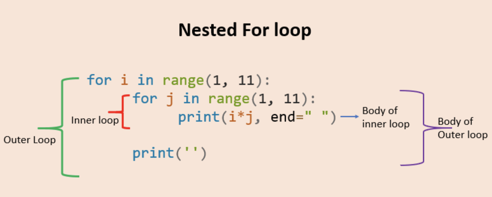
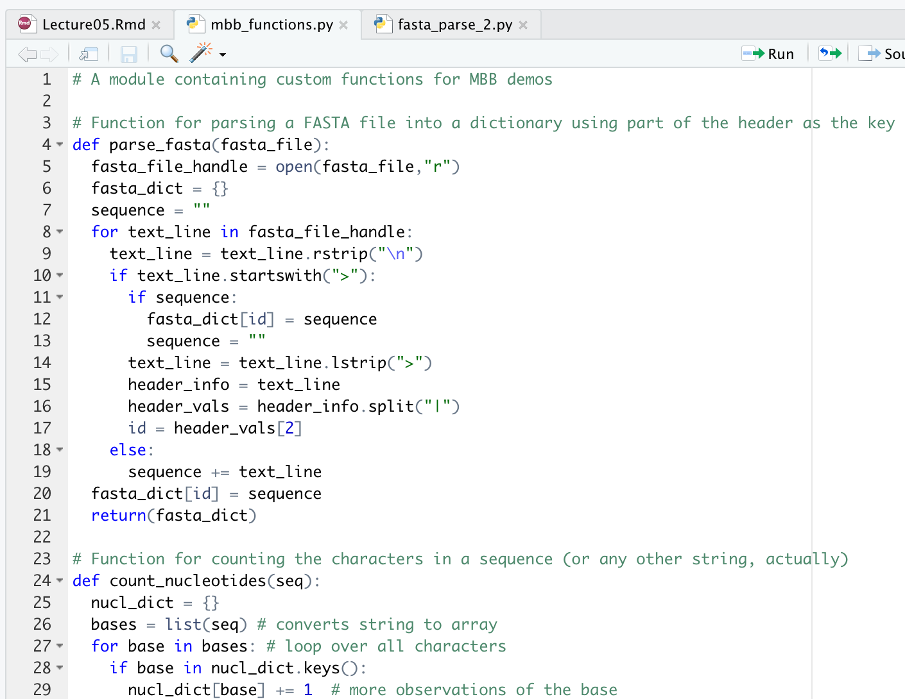
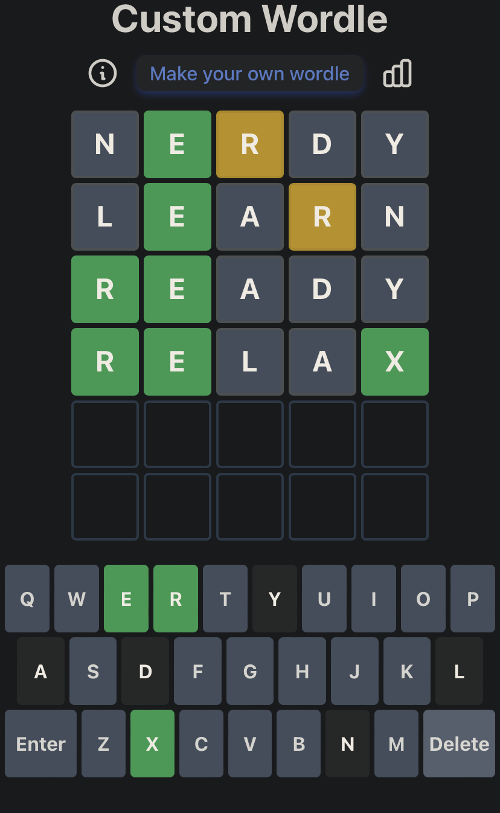

```{r setup, include=FALSE}
Sys.setenv(RETICULATE_PYTHON = "~/miniconda3/bin/python")
require(reticulate)
knitr::opts_chunk$set(echo = FALSE)
# if necessary, use this command to install required non-standard command-line tools:
# conda install -c bioconda samtools seqtk

```


# Learning goals for the week

- Implement and use custom functions
- Master using loops in different contexts
- Know how to import from Python libraries 
- Learn some useful Python functions for working with arrays and strings
- Become familiar with some BioPython features for manipulating sequences
- Become familiar with some advanced methods for pattern matching using command-line tools
- Understand how to apply regular expressions, specifically in Python

# Nesting loops

:::::::::::::: {.columns}
::: {.column}
- Common to have a loop within another loop
- The order of iterations may be important, so plan accordingly
- The inner-most loop will run to completion with each iteration of all loops that contain it
- If you use a counter, be sure to have a distinct counter per loop
:::
::: {.column}

:::
::::::::::::::

# Two nested loops

```{python,echo=T}
row_names = ["R1","R2","R3","R4"]
columns = ["C1","C2","C3","C4"]
r_i = 0 #counter for outer loop
c_i = 0 #counter for inner loop
for r in row_names:
  print(r_i,c_i,r)
  for c in columns:
    print(r_i,c_i,c)
    c_i += 1
  r_i += 1

```


# Also two nested loops

```{python,echo=T}
row_names = ["R1","R2","R3","R4"]
columns = ["C1","C2","C3","C4"]
for r in row_names:
  this_string = ""
  for c in columns:
    this_string = this_string + r + "," + c  + "\t"
  print(this_string)

```


# Bundling code into functions

- Last week we used and modified a script that read (parsed) a FASTA file to allow us to analyze the sequences
- Such useful, once implemented, should never have to be written again, ideally
- Let's rewrite our script and abstract all the reusable code into functions

# New and improved FASTA iterator

```{python,eval=F,echo=T}{
#!/usr/bin/env python
from mbb_functions import parse_fasta
from mbb_functions import count_nucleotides
fasta_file = "data/some_human_genes.fa"
# get a dictionary of sequences, 
# keyed by Ensembl transcript ID
sequences = parse_fasta(fasta_file)
for trans_id, trans_seq in sequences.items():
  #count nucleotides in the sequence
  nuc_count = count_nucleotides(trans_seq)
  print(trans_id,nuc_count)}
```

```{python,eval=TRUE}
#Functions we use below (also in scripts/mbb_functions.py)
# Function for counting the characters in a sequence (or any other string, actually)
def count_nucleotides(seq):
  nucl_dict = {}
  bases = list(seq) # converts string to array
  for base in bases: # loop over all characters
    if base in nucl_dict.keys():
      nucl_dict[base] += 1  # more observations of the base
    else:
      nucl_dict[base] = 1 # first observation of the base
  return(nucl_dict) # return the dictionary of counts


def parse_fasta(fasta_file):
  fasta_file_handle = open(fasta_file,"r")
  fasta_dict = {}
  sequence = ""
  for text_line in fasta_file_handle:
    text_line = text_line.rstrip("\n") 
    if text_line.startswith(">"):
      if sequence: 
        fasta_dict[id] = sequence
        sequence = ""
      text_line = text_line.lstrip(">")
      header_info = text_line
      header_vals = header_info.split("|")
      id = header_vals[2]
    else:
      sequence += text_line
  fasta_dict[id] = sequence
  return(fasta_dict)


```

# Deconstructing the new script 

```{python,eval=T,echo=T}
fasta_file = "data/some_human_genes.fa"
# get a dictionary of sequences, 
# keyed by Ensembl transcript ID
sequences = parse_fasta(fasta_file)
print(sequences)
```

# How did this happen? 

- The first few lines of the script import specific functions from a newly created module called "mbb_functions"
- A module is simply a Python script that isn't meant to be run but instead provides functions that can be used (imported) by other scripts
- Syntax is `from MODULENAME import FUNCTION_NAME`
- Two functions now do almost all the work for us

```{python,eval=F}
from mbb_functions import parse_fasta
from mbb_functions import count_nucleotides
```

# mbb_functions Module



# The guts of the script

```{python,echo=T,eval=T}
# load all sequences into a dictionary
sequences = parse_fasta(fasta_file)
# loop over each sequence in the dictionary
for trans_id, trans_seq in sequences.items():
  #count nucleotides in the sequence
  nuc_count = count_nucleotides(trans_seq)
  print("ID:",trans_id)
  print(nuc_count)

```

# Importing from packages

- Python has many standard [modules](https://docs.python.org/3/tutorial/modules.html) that are part of the language and thousands of packages that can be installed as extensions to the base language
- A module is a single file containing functions or class definitions
- A package is a collection of modules that share a namespace

# Where/how does `import` find packages?

- Using `import` in your script causes Python to search a series of locations for matching modules (the "module search path")
- This includes the directory that contains the script and the installation directory for the python you're running
- Users can add to this list by modifying a Bash environment variable (PYTHONPATH)

# Working with the filesystem

- You may want your code to process multiple files that are not explicitly defined (or defined during the running of your script)
  - e.g. perform some action individually on every file in a specific directory
- This is a perfect use case for loops but you first need a list of the files
- The `glob` package is your friend!

# Bash-like `glob`

- Reminder: * acts like a wildcard that will match any character

```{python,eval=TRUE,echo=TRUE}
from glob import glob
file_list = glob("scripts/*.py")
# equivalent to this in bash: ls scripts/*.py
print(file_list)
# this is just a list of all the files saved in 
# the scripts directory that match the pattern "*.py"
```

# Globbing a large data directory

```{python,eval=TRUE,echo=TRUE}

file_list = glob("data/human_genes_chr7/*.fa") 
file_list_2 = glob("data/human_genes_chr7/*00006*.fa") 
num_files = len(file_list)
num_files_2 = len(file_list_2)
print("there are",num_files,"files matching *.fa",sep=" ")
print("there are",num_files_2,"files matching *00006*.fa",sep=" ")

```

# Processing many files in a loop

- Getting a list of all files we might want to work with via `glob` is half the battle
- Modularized functions for the task we want to accomplish make short work of the rest!

```{python,eval=F,echo=T}
some_files = glob("some_directory/some_pattern*txt")
some_results
for a_file in some_files:
  one_result = do_a_thing(a_file) 
  # call a function we can put elsewhere or in this script
  some_results.append(one_result) # store the result or directly output it
```

# Using BioPython to load FASTA

- Much simpler to rely on existing parsers when they're available
  - e.g. [BioPython](https://biopython.org/wiki/SeqRecord)
- Require some familiarity with new objects and converting between object types

```{python,eval=T,echo=F}
from Bio import SeqIO
fasta_file  = "data/some_human_genes.fa"

first_record = next(SeqIO.parse(fasta_file, "fasta"))
print(first_record)
type(first_record)

```

# From BioPython objects to strings

- Sometimes it's convenient to just work with strings
- The object has a few attributes we use to get at the components (seq, id)

```{python,eval=T,echo=T}
from Bio import SeqIO
fasta_file  = "data/some_human_genes.fa"
for sr in SeqIO.parse(fasta_file, "fasta"):
  seq_obj = sr.seq # get the Sequence object
  id = sr.name[0:20] # get the header string
  some_string = str(seq_obj)[0:20]
  print(id,some_string)

```

# Let's summarize multiple sequences

```{python,eval=T,echo=T}
file_list = glob("data/human_genes_chr7/*0000631*.fa") 
num_files = len(file_list)
print(num_files) #a manageable size
for fa_file in file_list:
  for sr in SeqIO.parse(fa_file, "fasta"):
    so = sr.seq
    type(so)
    print(so)
 
```


# Searching for patterns in text

- Searching for exactly one thing in strings is easy(ish)
- Where and how many matches are there?
- Approximate matches that fit some specification?

```{python,echo=T}
sentence = "Wubba Lubba Dub Dub"
if "Dub" in sentence:
  print("match for Dub")
else:
  print("mwah mwah mwahhhhh") #sad trombone
if "dub" in sentence:
  print("match for dub")
else:
  print("mwah mwah mwahhhhh") #sad trombone
```

# Why are patterns important in biology?

- Identify potential transcription factor binding sites
- Predict off-target or degenerate primer binding sites 
- Find oligonucleotide repeats or more complex repeats

# Regular expressions (regex)

- Structured way to define a search pattern within text
- The most basic form is a simple substring (literal character matches)
  - e.g. Find in Microsoft Word or search pattern with grep
- Power comes from meta-characters 
  - Bash globs use * as a meta-character for "one or more of anything"
  - What if we want to be more specific for placement or character types?

# Regular expression for postal code

- What pattern is found in *every* Canadian postal code? 
- How can we summarize this pattern?

# Regular expression for postal code

- What pattern is found in *every* Canadian postal code? 
- How can we summarize this pattern?

```
H0H 0H0
V9N 8R9
V2X 8Z3
T5A 9A1
E5J 4N3
A1B 0C4
```

# Regular expression for postal code

- What pattern is found in *every* Canadian postal code? 
- How can we summarize this pattern?
- `Letter-Number-Letter-Space-Number-Letter-Number`
  - Note that all letters are uppercase.

```
H0H 0H0
V9N 8R9
V2X 8Z3
T5A 9A1
E5J 4N3
A1B 0C4

```


# Regular expression for postal code

- What pattern is found in *every* Canadian postal code? 
- How can we tell a computer to match text that fits that pattern?
- Let [A-Z] represent all letters of the alphabet and [0-9] represent all digits
- Let \\s represent a whitespace character
- Every postal code could be described as:

```
[A-Z][0-9][A-Z]\s[0-9][A-Z][0-9]
```

# Brackets and braces for classes and repetition

|Enclosure|Use|
|-|-|
|{m}|Defines number of matches must be m|
|[]|Defines a character class (match any character in the class)|
|$|End of string|
|*|zero or more repetitions|
|+|One or more repetitions|


# Using regular expressions in Python

```{python,echo=T}
import re
codes = ["H0H 0H0","V9N 8R9","V2X 8Z3","T5A 9A1"]
garbage = ["90210","CCCCCC","hoh oho","HOH OHO","....."]
pattern = re.compile("[A-Z][0-9][A-Z]\s[0-9][A-Z][0-9]")
for pc in codes:
  if pattern.match(pc):
    print(pc,"matches pattern",sep=" ")

```

# Using regular expressions in Python

```{python,echo=T}
import re
codes = ["H0H 0H0","V9N 8R9","V2X 8Z3","T5A 9A1"]
garbage = ["90210","CCCCCC","hoh oho","HOH OHO","....."]
pattern = re.compile("[A-Z][0-9][A-Z]\s[0-9][A-Z][0-9]")

for pc in garbage:
  if pattern.match(pc):
    print(pc,"matches pattern",sep=" ")
  else:
    print(pc,"doesn't match pattern",sep=" ")

```

# Special matching characters in Python regex

|Character|Use|
|-|-|
|.|Any character except newline|
|^|Start of string|
|$|End of string|
|*|zero or more repetitions|
|+|One or more repetitions|
|^|Invert the behaviour for this set of characters (i.e. non-matching)|


# Introduction to Wordle

:::::::::::::: {.columns}
::: {.column}
- Goal is to guess a 5 letter word using information gained from earlier guesses
- Grey letters don't exist in the word
- Green letters are in the correct place in the word
- Yellow letters belong elsewhere in the word
:::
::: {.column}

:::
::::::::::::::


# Regex for this mystery word

:::::::::::::: {.columns}
::: {.column}
- 1. R
- 2. E
- 3. not any of R, A, N, L, D, Y
- 4. not any of R, A, N, L, D, Y
- 5. X
:::
::: {.column}

:::
::::::::::::::

```{python,echo=F}
some_words = ["NERDY", "LEARN", "REDOX","RELAX","REGEX"]
```


# Regex for this mystery word

:::::::::::::: {.columns}
::: {.column}
`RE[^RANLDY][^RANLDY]X`
:::
::: {.column}

:::
::::::::::::::

# Cheating at Wordle

```{python,eval=T,echo=T}
some_words = ["NERDY", "LEARN", "REDOX","RELAX","REGEX"]
pattern = re.compile("RE[^RANLDY][^RANLDY]X")
for word in some_words:
  if pattern.match(word):
    print(word,"matches regex",sep=" ")
  else:
    print(word,"is wrong!",sep=" ")
```

```{python,echo=F,eval=T}
secret_word = "PARSE"

```

# See you in 5 minutes


# Step 0: load a word list

```{python,echo=T,eval=T}
all_words = []
h = open("data/words.txt","r")
for l in h:
  l = l.rstrip("\n")
  l = l.upper() # why? 
  all_words.append(l)
```

# Step 2: start guessing

- Custom puzzle is [here](https://mywordle.strivemath.com/?word=loivp)

```{python,eval=T,echo=T}
guess1 = "SNAKE"
pattern1 = re.compile("[^S][^N][^A][^K]E")
c = 0
for w in all_words:
  if pattern1.match(w):
    print(w,"matches regex",sep=" ")
    c+=1
    if c > 5:
      break


```

# Next guess

```{python,eval=T,echo=T}
guess2 = "TEASE"
pattern2 = re.compile("[^ST][^NE][^A]SE")
c=0
for w in all_words:
  if pattern2.match(w):
    print(w,"matches regex",sep=" ")
    c+=1
    if c > 5:
      break

```

# One more try

```{python,eval=T,echo=T}
guess3 = "LARGE"
pattern3 = re.compile("[^STL]ARSE")
c=0
for w in all_words:
  if pattern3.match(w):
    print(w,"matches regex",sep=" ")
    c+=1
    if c > 5:
      break

```


# What if our list included larger words?

- Regular expressions can be anchored to ensure your match is also anchored to one or both ends of a string
  - e.g. regex "MYC" matches all of: "MYC", "c-MYC" and "MYCBP"
- ^ anchors the match at the start of the string
- $ anchors it at the end of the string
  - e.g. "^MYC$" will only match "MYC" but not the others

# Egrep allows for some basic regex

- Limit first position to a set of characters [gp]

```{bash,echo=T}
egrep '[gp]ears' data/words.txt
```


# Egrep allows for some basic regex

```{bash,echo=T}
egrep 'ear' data/words.txt | head -10
```


# Egrep allows for some basic regex

- Anchor to start of word

```{bash,echo=T}
egrep '^ear' data/words.txt
```

# mRNAdle: Guess the coding DNA segment (CDS)

- Given a FASTA file that contains a full-length cDNA sequence, guess which strand encodes protein and find the most likely CDS start and end 
  - i.e. Find the start codons on both strands
  - Translate from each start codon
  - Compare the lengths of proteins
- Why is this likely to give you the right answer most of the time?

```{python,eval=T,echo=F}
cdna= "GCTCCTTCATCATGAACTGGCACATGATCATCTCTGGGCTTATTGTGGTAGTGCTTAAAGTTGTTGGAATGACCTTATTTCTACTTTATTTCCCACAGATTTTTAACAAAAGTAACGATGGTTTCACCACCACCAGGAGCTATGGAACAGTCTGCCCCAAAGACTGG"
cdna_minus = "CCAGTCTTTGGGGCAGACTGTTCCATAGCTCCTGGTGGTGGTGAAACCATCGTTACTTTTGTTAAAAATCTGTGGGAAATAAAGTAGAAATAAGGTCATTCCAACAACTTTAAGCACTACCACAATAAGCCCAGAGATGATCATGTGCCAGTTCATGATGAAGGAGC"
```

# mRNAdle example

- Problem 1: how do we reverse-translate sequence in Python?

```{python,echo=T,eval=T}
from Bio.Seq import Seq
cdna= "GCTCCTTCATCATGAACTGGCACATGATCATCTCTGGGCTTATTGTGGTAGTGCTTAAAGTTGTTGGAATGACCTTATTTCTACTTTATTTCCCACAGATTTTTAACAAAAGTAACGATGGTTTCACCACCACCAGGAGCTATGGAACAGTCTGCCCCAAAGACTGG"
cdna_seq = Seq(cdna)
comp_cdna = cdna_seq.reverse_complement()
print(comp_cdna)
```

# mRNAdle example

- Problem 2: how do we find every ATG in both strands?
- The string built-in "find" method is not sufficient

```{python,echo=T,eval=T}
cdna.find("ATG") #this is just the first and may not be the right reading frame!
cdna_minus.find("ATG") #this is just the first and may not be the right reading frame!
```

# mRNAdle example with regex

- Problem 2: how do we find every ATG in both strands?
- Regular expressions can be used here

```{python,echo=T,eval=T}
import re
print("start end seq")

for m in re.finditer("ATG", cdna):
  print(m.start(),m.end(),m.group(0))
# these are all the positions of an ATG on the plus strand
```

# Genetic code as a Python Dictionary

```{python,eval=T,echo=T}
genetic_code = {
'ATA':'I', 'ATC':'I', 'ATT':'I', 'ATG':'M',
'ACA':'T', 'ACC':'T', 'ACG':'T', 'ACT':'T',
'AAC':'N', 'AAT':'N', 'AAA':'K', 'AAG':'K',
'AGC':'S', 'AGT':'S', 'AGA':'R', 'AGG':'R',                
'CTA':'L', 'CTC':'L', 'CTG':'L', 'CTT':'L',
'CCA':'P', 'CCC':'P', 'CCG':'P', 'CCT':'P',
'CAC':'H', 'CAT':'H', 'CAA':'Q', 'CAG':'Q',
'CGA':'R', 'CGC':'R', 'CGG':'R', 'CGT':'R',
'GTA':'V', 'GTC':'V', 'GTG':'V', 'GTT':'V',
'GCA':'A', 'GCC':'A', 'GCG':'A', 'GCT':'A',
'GAC':'D', 'GAT':'D', 'GAA':'E', 'GAG':'E',
'GGA':'G', 'GGC':'G', 'GGG':'G', 'GGT':'G',
'TCA':'S', 'TCC':'S', 'TCG':'S', 'TCT':'S',
'TTC':'F', 'TTT':'F', 'TTA':'L', 'TTG':'L',
'TAC':'Y', 'TAT':'Y', 'TAA':'_', 'TAG':'_',
'TGC':'C', 'TGT':'C', 'TGA':'_', 'TGG':'W',
}
```

# mRNAdle example with loop

- Problem 3: how do we translate into protein?
- Use our original genetic_code dictionary and a fancy loop

```{python,echo=T,eval=T}
# for simplicity, we will only deal with one reading frame here (first match)
maybe_cds = cdna[11:]
print("maybe CDS:", maybe_cds[:15])
for i in range(0,len(maybe_cds),3):
  print(i,maybe_cds[i:i+3],genetic_code[maybe_cds[i:i+3]])
  
```

# mRNAdle example with loop

- Problem 4:Count amino acids before the first STOP (-) and retain the peptide sequence

```{python,echo=T,eval=T}
num_aa = 0
peptide = ""
for i in range(0,len(maybe_cds),3):
  aa = genetic_code[maybe_cds[i:i+3]]
  if aa != "-":
    num_aa+=1
    peptide = peptide + aa
  else:
    break #exit the loop
print(num_aa,"amino acids before first stop")
print(peptide)
  
```

# Bringing it all together

- In the lab you will take these ideas and apply them to real sequence and hopefully "solve" individual mRNAdles by finding the longest CDS
- You may not be surprised to learn that a similar implementation of "6-frame translation" is also available directly via BioPython
- You will also explore more applications of regular expression for molecular biology data in the lab

