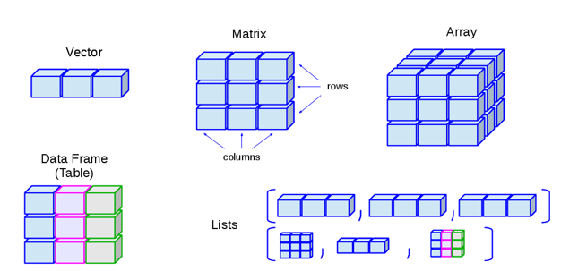
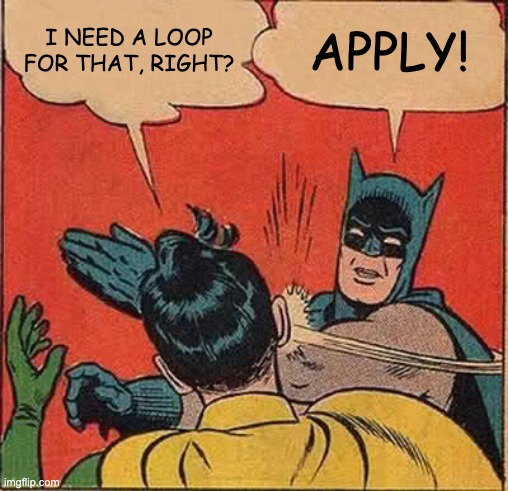

```{r,eval=T,echo=F,message=F}
library(tidyverse)
```

## Learning Objectives

- Understand some of the basic applications of regular expressions in R
- Create sequences of integers using `:`
- Understand relationship between higher-level data structures
- Provide example use cases for data frames versus matrices
- Subset vectors and data structures using the `[` and `$` operator
- Subset elements/rows/columns using logical operations or vectors and reorder vectors

## Some new R functions

|function name|What it does|
|-|-|
|mean|Calculate the mean (average) of numbers|
|min|Return the smallest number in a vector|
|max|Return the largest number in a vector|
|sum|Add together all numbers in a vector|
|table|Count and summarize unique occurrences of each value in a vector|
|unlist|Convert a list into a vector, collapsing nested data if necessary|
|order|Return the indexes of a vector in the order of the values
|apply/lapply/sapply|Run the same function separately on each element in a list (or each row/column of a matrix or data frame)|
|grep/grepl/gsub|Use regex to find and/or substitute sequences based on pattern matching|

## Data structures in R



## Review and level up: subsetting

- Accessing one element in a vector uses indexing or the names (for named vectors)
- Accessing/subsetting into a vector of any length (usually <= the original) can be done using a
  - numeric vector of desired indexes
  - character vector of desired names
- Can also use an equal length vector of logicals (TRUE and FALSE), where only indexes with TRUE in the corresponding position will be extracted

## Review and level up: subsetting

```{r,echo=T,eval=T}
things = c(c=333,d=4444,e=0,a=1,b=22)
names(things)
things[2]
# things["d"] #same as above
things[c(2,3)]
# things[c("d","e")] #same as above
some = c(FALSE,TRUE,FALSE,TRUE) 
things[some] #same as things[c(2,4)]
```

## Enforcing a specific order

- The order of the indexes as specified forces the ordering of the extracted vector
- `order` provides a convenient way to sort data when used used with subsetting

```{r,echo=T,eval=T}
alphabet = c("d","c","b","a")
order(alphabet) # indexes based on alphabetical order
order(things) # indexes for ordered values
ao = order(names(things)) # alphabetical order of names
things[ao] # vector reordered based on names
```

## "Subsetting" with a longer vector

- You can extract the same element multiple times by specifying more than once in your vector

```{r}
short_vec = c(0,1,2)
long_vec = short_vec[c(1,2,3,3,2,1)]
long_vec #contains the elements from short_vec once for each time specified in short_vec
```

## The List

- Vectors in R must only contain values of one type (logical, numeric, character)
- Lists don't have this limitation and can even allow you to store vectors or other objects

```{r}
list_example <- list(FALSE, TRUE, 3.0, "four")
list_example
```

## List with names

```{r}
a_list <- list(title = "Numbers", numbers = 1:6, data = c(TRUE,FALSE))
# Here the : operator is used to make a range interpolating from 1 to 6
a_list
```


## Lists: reference by name or indexes

- `$` is used to refer to list elements by name
- Similar to how dictionaries work in Python (i.e. name/key:value)
- Numeric index can also be used with `[[]]`

```{r}
a_list$numbers #reference by name using $
a_list["numbers"] #gives you a list, probably not what you want
a_list[["numbers"]] #gives you a vector
a_list[[2]] #gives you that same vector 
```


## From list to vector

- Sometimes you will need to convert a list or data frame row into a vector
- `unlist` facilitates this but use with caution because R will try to flatten lists and name nested elements for you

```{r}
a_vec = unlist(a_list)
a_vec[c(1:4)]
class(a_vec)
```

## From list to vector

- Sometimes you will need to convert a list or data frame row into a vector
- `unlist` facilitates this but use with caution because R will try to flatten lists and name nested elements for you

```{r}
a_vec = unlist(a_list)
a_vec

```

## Lists of numeric data

- Data "sets" may be structured conveniently in a list
- If everything is the same data type this can be a convenient way to represent data of variable sizes

```{r,echo=T,eval=T}
sample_1 = c(77,33,11)
sample_2 = c(1234,5,678,9)
sample_3 = c(11,1,0,3)
m = list("S1"=sample_1,
         "S2"=sample_2,
         "S3"=sample_3)
```

## For X do Y (but no looping!)

- What is the mean/sum/max value in every sample stored in our list?
- It's tempting to use a loop to perform mathematical or other operations on each nested data element
- R has better ways to do this
  - For lists, we should always try to use `lapply` or `sapply`
- Syntax is identical, respectively return a list or vector

## Applying a function to a list

```{r,echo=T,eval=T}
sapply(m,mean) # calculate means, return vector
l = lapply(m,min)  # calculate min, return list
l
unlist(l)
```

## How and why s/lapply?

- The sapply/lapply functions allow you to "apply" non-vectorized functions to data in lists or other structures
- They are vectorized, so automatically work on every element in your input and return an equal-length result
- Can be combined with your own custom functions

```{r,eval=F,echo=T}
# mean_vec = sapply(m,mean) is equivalent to this loop
mean_vec = c()
for(i in c(1:length(m))){ #annoying
  this_mean = mean(m[[i]]) #ugly
  mean_vec = c(mean_vec,this_mean) #inefficient
}
```

## Working with tabular data

- As you saw in the last few labs, you can use Python to work with tabular data stored in files
- Owing to vectorization and native data types for tabular data, R makes many common analysis tasks much more convenient
- Paradigm we will use for this course:
  - Python/Command-line to manipulate data into a tabular form
  - R to perform all subsequent analyses on tabular data

## The Matrix


## The actual matrix

```{r}
matrix_example <- matrix(1:24, ncol=6, nrow=4)
matrix_example
```

```{r}
class(matrix_example)
typeof(matrix_example)
```

## Matrix as a neatly folded vector

- Notice the order the matrix is created, as if the vector is chopped up and lined up starting from the left
- The order of the elements is maintained if you trace from top to bottom, starting in the first column

```{r,eval=T,echo=T}
matrix(c("A","B","C","D","E","F"),nrow=3)

```

## Assignment and operations

```{r}
matrix_example[] = 0 
# we can assign every position in a matrix to the same value!
matrix_example
```

## Assignment and operations

```{r}
matrix_example[,1] = 99
# or we can assign every position in a column 
matrix_example
```

## Assignment and operations

```{r}
matrix_example[1,] = 3
# or we can assign every position in a row 
matrix_example
```

## Assignment and operations

```{r}
matrix_example[] = matrix_example + 10
# or we can modify everything in a similar way
matrix_example
```

## Assignment and operations

```{r}
matrix_example[4,4] = 4
# or we can assign/reference individual positions
# using both row and column index
matrix_example
```

## Recycling in vector operations

- Reminder: vectorized operations treat operations involving vectors of unequal length vs two equal length vectors differently

```{r,echo=T,eval=T}
1 + c(1,1,1)

c(1,1,1) + c(1,1,1)

3 * c(1,2,3)

c(3,0,1) * c(1,2,3)

```

## Recycling in matrix operations

- Operations involving a matrix recycle along the first then second dimension

```{r,echo=T,eval=T}
tiny = matrix(c(0,0,0,0,0,0),nrow=3)
tiny
tiny + 2 #applied to every element in the matrix
```

## Recycling in matrix operations

```{r,echo=T,eval=T}
tiny + c(1,2) 
# vector is used in the operation in order along the first dimension of the matrix (columns)
# vector is then recycled until the operation has been applid to the entire matrix 

#Equivalent to
#tiny[1,1] + 1
#tiny[2,1] + 2
#tiny[3,1] + 1
#tiny[4,1] + 2
#etc
```

## Recycling in matrix operations

- Operations involving a matrix and a vector are tricky but somewhat sensible

```{r,echo=T,eval=T}
tiny

tiny + c(1,2,3)
```

## Broke: loops, Woke: apply

:::::::::::::: {.columns}
::: {.column}
- Common to process two-dimensional data structures such as matrices to produce one-dimensional results
  - e.g. Summary statistic on every row or column
- Another place loops may be tempting, but we must resist the temptation
:::
::: {.column}

:::
::::::::::::::

## Apply a function to either dimension


## Example: convert to percentages

- If each row is a group, what % of the total does each column represent in that row? 
  - e.g. 100 * 2 / (323 + 89 + 42)

```{r,eval=T,echo=T}
mini = matrix(c(98,2,0,323,89,42,2,1,6,1,1,1),
              nrow=4,ncol=3,byrow = T)
mini

```

## Step 1: denominator (row sums)

- Usage: `apply(X, MARGIN, FUN, ...)`
- Not intuitive, but "margin" is just the dimension
  - How I remember: `[dimension1,dimension2]`

```{r,eval=T,echo=T}
denominators = apply(mini,1,sum)
# equivalent shortcut: denominators = rowSums(mini)
# for columns, the other dimension, it would be: apply(mini,2,sum)
denominators
```

## Step 2: numerator

```{r,eval=T,echo=T}
mini
percents = 100 * mini/denominators
# the rest can be done on the whole matrix at once thanks to recycling

# What do you expect this to do?
# mini[c(1,2),]
# And this? 
# mini[order(denominators),]

```

## Subsetting rows or columns

```{r,eval=T,echo=T}
mini[c(1,2),] #regular subsetting using a vector

denominators
order(denominators)
# sepecify row index in the desired order
mini[order(denominators),]

```

## The data frame

:::::::::::::: {.columns}
::: {.column}
- A data frame is a two-dimensional array-like structure in which each column contains values of one variable and each row contains one set of values from each column
- A data frame can be envisioned as the equivalent of a spreadsheet
:::
::: {.column}

:::
::::::::::::::

## characteristics of a data frame

- Column names should be non-empty and R will assign (ugly) names when necessary
- Row names and column names _must_ be unique
- The data stored in a data frame can be of numeric, factor or character type
- Each column can have different data type
- Each column must contain same number of elements

## Loading tabular data

```{r load_df,echo=T,message=F}
myfile="data/GSE125966_GOYA_mini.csv"
gene_expression = read.csv(myfile,row.names = 1)
class(gene_expression)

#calling rownames/colnames will return a vector containing the current row/column names
# Calling these function in an assignment context
# will re-assign names to the rows/columns, replacing existing names
colnames(gene_expression) = c("sample1","sample2")
rownames(gene_expression)[c(1:5)] #first 5 names
```

## Rownames and Colnames

- A matrix can also have row names and column names, which can be set the same way as data frames
- Matrix row and column names do not have to be unique (potentially very problematic!)

```{r,echo=T,eval=T}
mat <- matrix(1:4, ncol=2)
rownames(mat)=c("ROW","ROW")
colnames(mat)=c("COL1","COL2")
mat["ROW",] #only first match is returned

```

## Exploring the Data Frame
 
- There are a number of functions that work well with data frames
- The `nrow()` and `ncol()` functions count the number of rows and columns in the object
  
```{r}
nrow(gene_expression)

ncol(gene_expression)
```

## Peeking with head and tail

- The `head()` and `tail()` functions are useful for extracting the first or last few rows in a data frame. These are especially useful for larger data frames.

```{r}
head(gene_expression, 2)

tail(gene_expression, 2)

some_expression = head(gene_expression)
```

## Another data frame to explore

```{r,echo=T,eval=T}
geno_file = "data/Morin_genotypes.txt"
genotype_df = read.csv(geno_file,sep="\t")
# read without specifying a column for row names
# default rows will be consecutive numbers represented as strings

rownames(genotype_df)[c(1:10)]

head(genotype_df,3)
```

## Extracting rows/columns

- Rows and columns are indexed numerically
  - The two dimensions are always row,column
- The most basic operation you can do is extracting/referencing a column
- Option 1: use the `$` operator and column name
- Option 2/3: use the column name/index:
`object_name[,column_index]`

## Extracting rows/columns

```{r}
some_expression$sample1 
#extract column using $ operator and column name

some_expression[,1] 
#extract the first column

some_expression[,"sample1"] 
#extract the column named sample1
```

## Rows vs Columns

- An extracted column from a data frame becomes a vector
  - Sadly, the same is NOT true of extracted rows
  - A single extracted row remains a data frame and must be converted

```{r}
some_expression[1,] #extract the first row
class(some_expression[1,])
row_vec = unlist(some_expression[1,])
class(row_vec)
```

## Summarizing the contents

Another useful function is called `summary()` which will display statistics for numeric columns and tabulate values in text columns.

```{r}
summary(gene_expression)
```


## Regex in R

- R was designed for doing mathematical and statistical analyses
- Working with text/character/string type data is much easier in Python and clunkier in R
- Three common use cases for string operations:
  - string replacement using pattern or literal matching
  - string splitting using pattern or literal matching
  - searching for the existence of a pattern

## Flavours of grep in R

|Original|Desired|Function|Comment|
|-|-|-|-|
|GeneID:1000|1000|sub/gsub|Replace or drop first/all matching portions of string|
|GeneID:1000|TRUE/FALSE|grepl|check for existence of a match|
|ACATGC|ACATGC|grep|Obtain all matching values|

## Gsub example

- What if we wanted to drop the redundant "GeneID:" part of our row names?

```{r,echo=T,eval=T}
head(some_expression,3)
original_rownames = rownames(some_expression)
new_rownames = gsub("GeneID:","",original_rownames)
rownames(some_expression) = new_rownames
head(some_expression,3)
```

## Grep example

- What if we wanted to find all rows that had a genotype that was homozygous A (i.e. AA)?
- The `table` function tabulates the unique values in the resulting vector

```{r,echo=T,eval=T}
table(grepl("AA",genotype_df$genotype))
# How many are homozygous of any of the four nucleotides?
table(grepl("AA|GG|CC|TT",genotype_df$genotype))
```

## Subsetting data frame with logicals

- Revisiting the previous example, we'll calculate the % of homozygous genotypes on autosomes
- To accomplish this we need to ignore chromosomes MT, X and Y, negating grepl using `!`

```{r}
tail(table(genotype_df$chromosome))
autosome_rows = ! grepl("X|Y|MT",genotype_df$chromosome)
head(autosome_rows)

```

## Final steps: % homozygous

```{r}
table(autosome_rows)
autosome_genotypes = genotype_df[autosome_rows,]

homozygous_total = sum(grepl("AA|GG|CC|TT",autosome_genotypes$genotype))
all = length(autosome_genotypes$genotype)
percent_homo = 100 * homozygous_total/all
percent_homo

```

## More Resources

- http://swcarpentry.github.io/r-novice-gapminder/04-data-structures-part1
- http://swcarpentry.github.io/r-novice-gapminder/06-data-subsetting
- http://swcarpentry.github.io/r-novice-gapminder/09-vectorization

