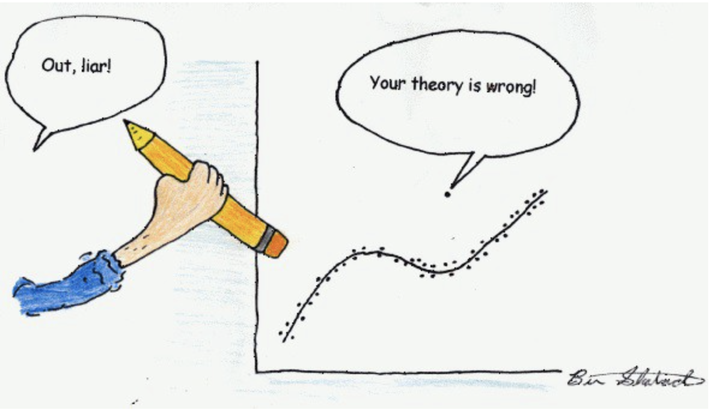
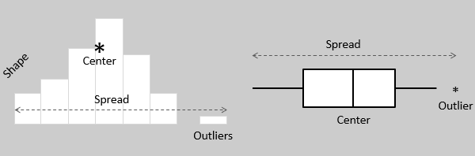
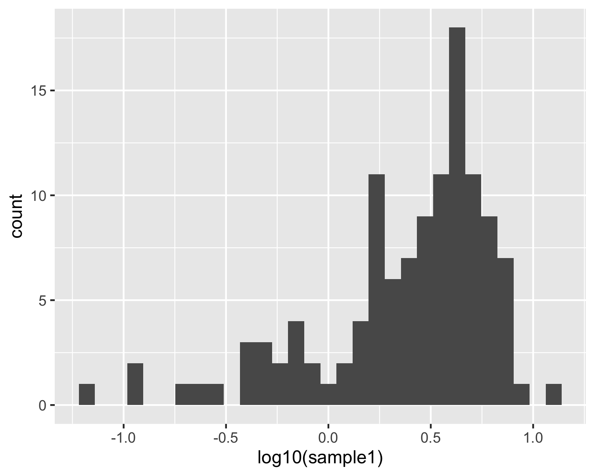
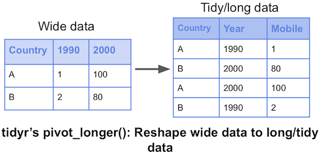

```{r setup, include=FALSE}
library(tidyverse)
Sys.setenv(RETICULATE_PYTHON = "~/miniconda3/bin/python")
require(reticulate)
knitr::opts_chunk$set(echo = FALSE)
# if necessary, use this command to install required non-standard command-line tools:
# conda install -c bioconda samtools seqtk

```


# Learning goals for the week

- Understand the goals and core concepts of exploratory data analysis
- Load data from tabular files (CSV, TSV) into R using the `readr` package
- Manipulate data frames in R using the `dplyr` package and ombine multiple functions using pipes
- Understand the basics of tidy data and appreciate how we can adopt a tidy format
- Sort rows by one or more columns using `arrange()`
- Create new columns from data using `mutate()`

# Exploratory data analysis (EDA)

- Numerical analysis and graphical presentations of data *without a particular model or hypothesis* with a goal of:
  - identifying underlying structure in the data and 
  - Defining/manipulating variables according to data structure
  - Detecting outliers and other anomalies (remove if necessary)
  - Observe possible trends (e.g. correlations)
- Important first step in any data analysis task
- Over-arching goal is to generate hypotheses

# Sanity checking

- You will often (but not always) have a general idea of how your data should and shold not look
- Sanity checking can allow you to identify problems early in an analysis
  - Are you missing values for some variables?
  - Are some measurements very different from the rest?
  - Do you have mathematically impossible values based on what the data should represent?
- Important: Don't manipulate your data just because it gives you a better result. It must be justifiable!

# Sanity checking




# Basic EDA tasks

- Manipulate/load data in a useable format
  - Did my data load the way I expected?
  - Note: auto-creation of column names leads to X1, X2 ...
```{r read,echo=T}
library(readr)
exp_mini = read_csv("data/GSE125966_GOYA_mini.csv")

```


# Basic EDA tasks

- Manipulate/load data in a useable format
  - Did my data load the way I expected?
```{r quartile,echo=T}
head(exp_mini)
```


# Tibbles vs Data Frames

- The readr package loads tabular data into a tibble 
- It also guesses the data type of each column and assigns it for you
- "Smart" recognition and handling of text data such as dates
- More convenient default with `print()`

```{r}
print(exp_mini[,c(1,2)])
```

# How to address `readr` parsing issues

```{r geno_err1,eval=T, echo=T}
geno <- "data/Morin_genotypes.txt" 
ryan <- read_tsv(geno)
```
- The code above will run with this warning:
```
31844 parsing failures.
   row        col expected actual                       file
931203 chromosome a double      X 'data/Morin_genotypes.txt'
931204 chromosome a double      X 'data/Morin_genotypes.txt'
931205 chromosome a double      X 'data/Morin_genotypes.txt
```
- Don't ignore warnings unless you know that they are benign

# Diagnosing the issue

```{r,eval=T,echo=T}
summary(ryan$chromosome)
table(ryan$chromosome)

```

# Forcing explicit column definition

- Our error (warning) was caused by readr assuming all chromosomes were numeric values because it used the early lines of the file to guess the data type
- Explicitly specifying the type for that column and the others resolves this issue

```{r geno_err,eval=T, echo=T}
ryan <- read_tsv(geno,col_types = "ccic") 
#here, "ccic" indicates the class of the columns in their order: char, char, int, char
```

# Basic EDA tasks

- Tabulate variables to observe distribution (mean, median, quartiles)

```{r}
summary(exp_mini[,2])
```

# Variables in statistics

- Variables are "any characteristic, number or quantity that can be measured or counted"
- Something that varies between individuals, populations or experimental groups such as:
  - phenotype (height, weight, hair colour)
  - age, sex, species, disease status
  - case vs control, mutation status
  - Gene expression (for a given gene), genotype (for a given SNP)

# Common types of variables in statistics

- Categorical: fits into one of N finite categories
  - e.g. genotypes: AA, AB, BB; disease status
- Ordinal: similar to category but with meaningful order
  - e.g. Pediatric, Adult, Senior
- Continuous: Numerical with a theoretically infinite number of possible values
  - e.g. Age, Weight, Gene expression


# Basic EDA tasks

- Observe distribution and identify outliers

# Visualizing distributions of continuous variables



# Histogram basics

- X axis: a range of equal-size numeric bins spanning the spread/range of values for a numeric variable
- Y axis: the frequency that your data contains numbers in each bin

# 10 observations

```{r,eval=T,echo=F, warning=F,message=F}
nums = data.frame(observations=rnorm(10,mean=10)) #random sample of 10 numbers from a normal distribution
ggplot(nums,aes(x=observations)) + geom_histogram() + xlim(c(7,13))
```


# 20 observations

```{r,eval=T,echo=F, warning=F,message=F}
nums = data.frame(observations=rnorm(20,mean = 10)) #random sample of 10 numbers from a normal distribution
ggplot(nums,aes(x=observations)) + geom_histogram() + xlim(c(7,13))
```


# 50 observations

```{r,eval=T,echo=F, warning=F,message=F}
nums = data.frame(observations=rnorm(50,mean=10)) #random sample of 10 numbers from a normal distribution
ggplot(nums,aes(x=observations)) + geom_histogram() + xlim(c(7,13))
```

# 500 observations

```{r,eval=T,echo=F, warning=F,message=F}
nums = data.frame(observations=rnorm(500,mean=10)) #random sample of 10 numbers from a normal distribution
ggplot(nums,aes(x=observations)) + geom_histogram() + xlim(c(7,13))
```

# 15000 observations plus outliers

```{r,eval=T,echo=F, warning=F,message=F}
nums = data.frame(observations=rnorm(15000,mean=10)) #random sample of 10 numbers from a normal distribution
outliers = rnorm(2900,mean=7,sd = 0.1)
nums[c(1:2900),"observations"]=outliers
ggplot(nums,aes(x=observations)) + geom_histogram() + xlim(c(7,13))
```

# Real gene expression data

```{r,eval=T,echo=F, warning=F,message=F}
filter(exp_mini, sample1 > -50) %>% ggplot(aes(x=log10(sample1))) + geom_histogram()
h1="images/histo1.png"
ggsave(filename=h1)
```

# Describe this distribution

:::::::::::::: {.columns}
::: {.column}

- What is the "average" (mean) gene expression value?
- What is the highest value shown? 
- How many genes look to be outliers?
- what cutoff would you use to define an outlier?

:::
::: {.column}

:::
::::::::::::::

# The dplyr package

- `dplyr` aims to provide a function for each basic verb of data manipulation.
- Three categories based on the component of the dataset that they work with
  - Rows: `filter`, `slice`, `arrange`
  - Columns: `rename`, `mutate`, `select`
  - Grouped rows: `summarise`

# Into the Tidyverse

- `dplyr` and `readr` functions are part of a larger "Tidyverse" grammar, which share common features and functionality
- Lets you work with elements of your data (columns) as if they were actual objects in your workspace
- The most obvious difference is the use of bare words (not quoted) when referring to column names!

# Basic EDA tasks

- Identify anomalies and, in some cases, remove outliers
- Common approach: consistently drop data points that don't fit with the distribution

# Subsetting data

- Common to need to subset tabular data using specific criteria
  - e.g. pattern matching, numeric thresholds
- dplyr package has convenient functions to allow subsetting without relying on column or row names or indexes
  - `filter` function will return the rows of your data frame that meet your criteria

```{r,echo=T,eval=F}
filter(exp_mini, sample1 > -0.5) 
# function: filter "Subset rows using column values"
# input: your data frame or tibble
# here, "sample1 > -0.5" is your criterion
# any rows not meeting this will be dropped from the output
```

# Dropping outliers

```{r,echo=T,eval=F}
exp_filt = filter(exp_mini, sample1 > -0.5) 
summary(exp_mini)
summary(exp_filt)
#note that sample2 is unaffected by this and will still have outliers!
```

# Pipes in R (`%>%`)

- Tidyverse collection of packages provides a way to combine manipulations of data with `%>%`
- Functions that support pipes will assume their first argument is passed via a pipe if not provided explicitly

```
#non-pipe way
data_frame2 <- first_funct(data_frame1,arg1,arg2)
data_frame3 <- second_funct(data_frame2,some_arg)
# piped version 
data_frame3 = data_frame1 %>% 
  first_funct(arg1,arg2) %>% 
  second_funct(some_arg)
```

# Why use pipes in R?

- Code can be more legible and easy to follow and maintain when pipes are used
- If you need to apply multiple functions to some data, each function call would normally require the creation of a new variable, which is avoided by a pipe

# A genotype pipe

- Let's use a series of pipes to filter Ryan's genotypes

```{r geno,eval=T, echo=T}
geno <- "data/Morin_genotypes.txt" 
ryan <- read_tsv(geno,col_types = "ccic") %>% 
#load the file without assigning to a variable
  filter(genotype != "--") %>% 
#drop rows with missing genotype, i.e. --
  filter(str_length(genotype)>1)
#drop rows with only one allele reported
```

# Introduction to categorical variables

```{r, eval=T,echo=T}
ryan$Homozygous = grepl("AA|GG|CC|TT|II",ryan$genotype)
# create logical column that is TRUE for all homozygous rows
homozyg_by_chrom = table(ryan$Homozygous,ryan$chromosome)
# tabulate TRUE/FALSE per chromosome
homozyg_by_chrom[,c(19:23)]
```
- What's wrong with this picture? 

# Introduction to categorical variables

```{r, eval=T,echo=T}
ryan$Homozygous = grepl("AA|GG|CC|TT|II",ryan$genotype)
# create logical column that is TRUE for all homozygous rows
homozyg_by_chrom = table(ryan$Homozygous,ryan$chromosome)
# tabulate TRUE/FALSE per chromosome
homozyg_by_chrom[,c(19:23)]
```
- What's wrong with this picture? 
- Why does it look like Ryan has two X chromosomes???

# Introduction to categorical variables

```{r, eval=T,echo=T}
ryan$Sex_chrom = grepl("X|Y",ryan$chromosome)
# assign autosomes and sex chromosomes to different categories

table(ryan$Homozygous,ryan$Sex_chrom)
# tabulate between autosomes and sex chromosomes
```

- New hypothesis from our data: _Ryan is female_
- How can we test this hypothesis using statistics? 
  - To be covered in the lab


# Working with data in _tidy_ format

- The Tidyverse set of packages are the most useful when data is in a _tidy_ format
- There are three interrelated rules which make a dataset tidy:
  - Each variable must have its own column
  - Each observation must have its own row
  - Each value must have its own cell

# Benefits of using a tidy data format

- Consistent data structure means the same tools/functions will work consistently across related/similar data sets
- Variables in columns takes advantage of R’s vectorised functions
- Works well with pipes and other features of the Tidyverse that we will explore later (e.g. plotting methods)

# Is this tidy?

```{r,eval=T}
head(exp_mini)
```

# How to make something tidy

:::::::::::::: {.columns}
::: {.column}

- We have to identify any columns representing observations of the same variable and convert to a categorical variable
- A wider matrix will become longer as columns become sets of duplicated rows
- Convert using the related functions [pivot_longer or pivot_wider](https://www.youtube.com/watch?v=gnUgSkKEW5c)

:::
::: {.column}

:::
::::::::::::::

# pivot_longer/wider syntax

```
long_df = pivot_longer(wide_df,
  cols=columns to bring together,
  names_to="name of new categorical column storing old column names",
  values_to"name of the column storing our values")
  
wide_df = pivot_wider(long_df,
  id_cols=columns you want to leave alone,
  names_from = name_of_column_to_pivot,
  values_from = column_with_measurement_values)
```

# Gene expression in a tidy format

```{r,echo=T,eval=T}
# let's give our gene column to a useful name using dplyr
exp_mini = exp_mini %>% rename("Gene_ID"="X1")
# use pivot_longer function to bring sample1 and sample2 columns into one column

exp_tidy = pivot_longer(exp_mini,-Gene_ID,names_to="sample",values_to="expression")
```

# Gene expression in a tidy format

```{r,echo=F,eval=T}

head(exp_tidy)
```


# Comparing distributions using box plots

:::::::::::::: {.columns}
::: {.column}

- Box plots graphically represent the spread, locality and skew of a distribution but are more
- More useful than histogram if we want to consider the distribution of a numeric variable as it relates to a categorical variable (i.e. compare the distribution between 2 or more categories)

:::
::: {.column}
```{r,eval=T,echo=F,message=F,warning=F}

ggplot(exp_tidy,aes(x=sample,y=log10(expression))) + geom_boxplot() 
```
:::
::::::::::::::


# Anatomy of a box plot


# Overlaying points on box plots

:::::::::::::: {.columns}
::: {.column}

- Cousins of the generic box plot can be used to show the full data more clearly
- This example overlays all points with a quasi-random X coordinate to force the density of points to be somewhat interpretable

:::
::: {.column}
```{r,eval=T,echo=F,message=F,warning=F}
library(ggbeeswarm)

ggplot(exp_tidy,aes(x=sample,y=log10(expression))) + geom_boxplot() + geom_quasirandom()
```
:::
::::::::::::::


# Subsetting by column

- In some scenarios you may need to selectively retain/drop only certain columns from a data frame
- This requires the `select` verb
  - Reminder: _you must refer to your columns using unquoted names, as if each was the name of an R variable in your environment_


# Example

```{r, echo=T,eval=T,message=F,warning=F}
covid <- read_csv("data/covid19_cases_worldwide_monthly.csv")
head(covid,5)

```

# Example

```{r, echo=T,eval=T,message=F,warning=F}
#explicitly retain these columns: month, territory, cases, deaths
covid_trim = covid %>% select(month,territory,cases,deaths)
head(covid_trim)
```

# Modifying a data frame with dplyr

- The dplyr verb `mutate` allows you to create new columns in a data frame based on the output of an operation or function
  - Can be numerical/logical/string operations
  - Can involve one or more columns
  - Function must work in a vectorized context
- Syntax: 

```df = mutate(df,new_colname = some_func(one_col))```

# Adding a column to our COVID data

```{r, echo=T,eval=T}

covid_trim = mutate(covid_trim,death_rate = deaths/cases)
head(covid_trim)
#Problem: dividing by zero gives us NaN, which can cause problems later
```

# More robust implementation

- We can combine the `if_else` function with `mutate` to conditionally modify the data frame with a different result depending on the data itself
- Syntax: `if_else(condition,do_if_true,do_if_false)`

```{r, echo=T,eval=T}
covid_trim = mutate(covid_trim,death_rate = if_else(cases>0,deaths/cases,0))
# equivalent to doing this for every row: 
# if(cases>0){
#   death_rate = deaths/cases
# }else{
#   death_rate = 0
# }
```

# Outliers? Concerns?

```{r, eval=T,echo=F,warning=F,message=F}
ggplot(covid_trim,aes(x=death_rate)) + geom_histogram()
```

# Outliers? Concerns?

```{r, eval=T,echo=T}
filter(covid_trim,death_rate>1) 
```


# Mutating our genotype data frame

```{r, eval=T,echo=T}
ryan = ryan %>% 
  mutate(Homozygous=grepl("AA|GG|CC|TT|II",genotype)) %>%
# create logical column that is TRUE for all homozygous rows
  mutate(Sex_chrom=grepl("X|Y",chromosome))
table(ryan$Homozygous,ryan$Sex_chrom)
```

# Should we be worried?

- Difficult to conclude why we're seeing heterozygous SNPs on the X chromosome without other examples of similar data
- A good comparator would be similar data from a female

# Ryan vs some rando named Ashley

```{r, echo=T,eval=T}
ash=read_tsv("data/genome_Ashley_Bodily.txt",col_types = "ccic")
ash = ash %>% 
  mutate(Homozygous=grepl("AA|GG|CC|TT|II",genotype)) %>%
# create logical column that is TRUE for all homozygous rows
  mutate(Sex_chrom=grepl("X|Y",chromosome))
table(ash$Homozygous,ash$Sex_chrom)
```
