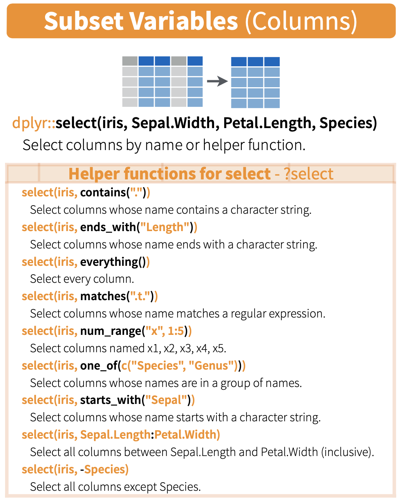
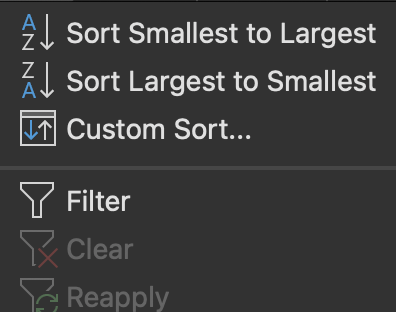
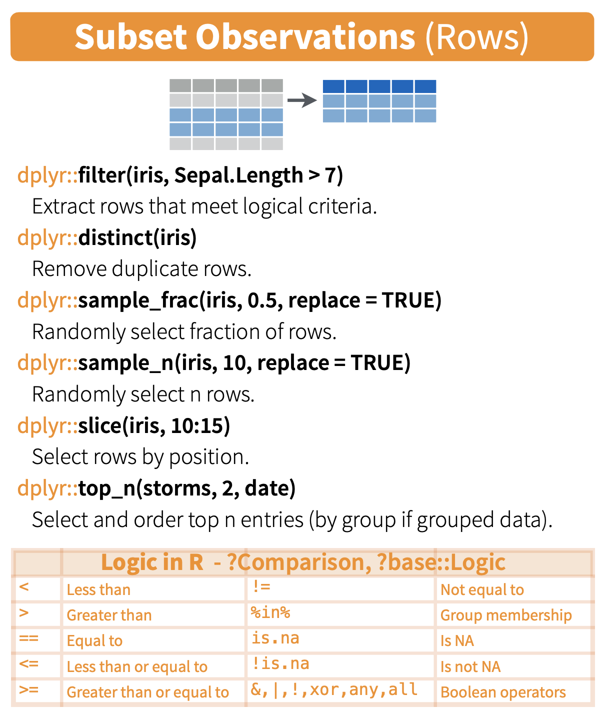
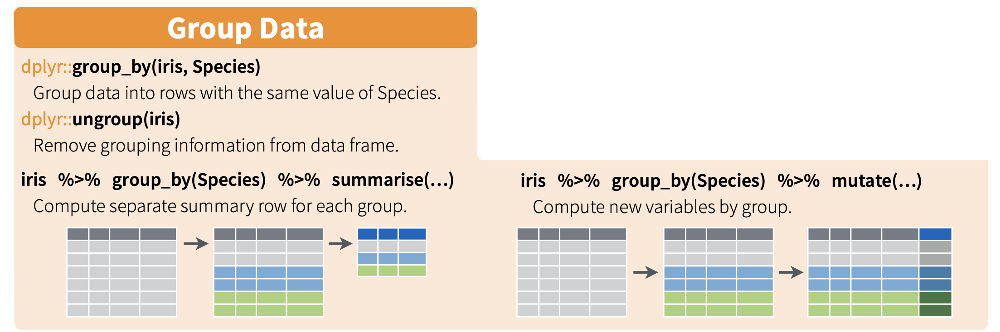
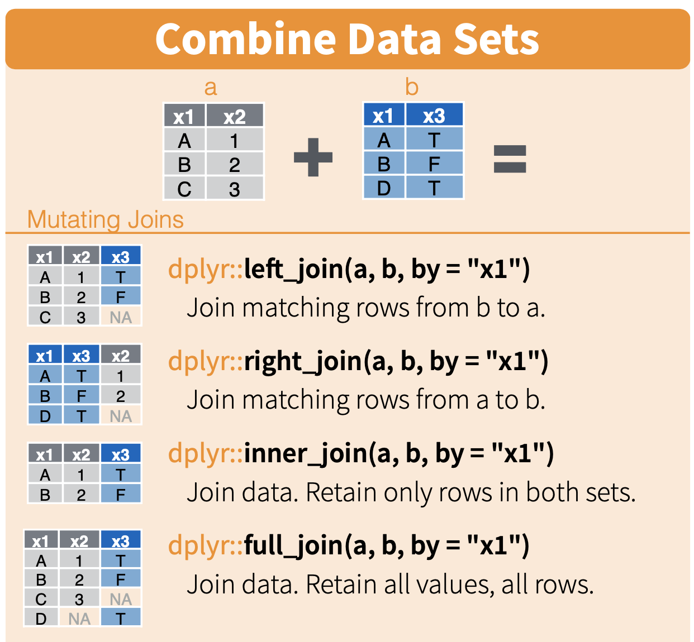

```{r setup, include=FALSE}
library(tidyverse)
Sys.setenv(RETICULATE_PYTHON = "~/miniconda3/bin/python")
covid <- read_csv("data/covid19_cases_worldwide_monthly.csv")

require(reticulate)
knitr::opts_chunk$set(echo = FALSE)
# if necessary, use this command to install required non-standard command-line tools:
# conda install -c bioconda samtools seqtk

```


# Learning goals for the week

- Manipulate data frames in R using the `dplyr` package
  - Group rows using `group_by()` and `nest_by()`
  - Compute aggregate statistics using `summarize()`
  - Differentiate the behaviour of `mutate()` and `summarize()`
- Understand how `join` functions can be used to combine data frames with shared variables
- Understand some common pitfalls of the different types of join and alternatives

# dplyr::select cheat sheet




# Ryan vs some rando named Ashley

```{r, echo=T,eval=T}
ash <- read_tsv("data/genome_Ashley_Bodily.txt",col_types = "ccic")
ash <- ash %>% 
  mutate(
    Homozygous = grepl("AA|GG|CC|TT|II",genotype)
    ) %>%
# create logical column that is TRUE for all homozygous rows
  mutate(
    Sex_chrom = grepl("X|Y",chromosome)
    )
table(ash$Homozygous,ash$Sex_chrom)
```


# Mutating more than one column at a time

```{r, echo=T,eval=T}
ash=read_tsv("data/genome_Ashley_Bodily.txt",
             col_types = "ccic")
ash = ash %>% 
  mutate(
    Homozygous = grepl("AA|GG|CC|TT|II",genotype),
    Sex_chrom = grepl("X|Y",chromosome)
    )

table(ash$Homozygous,ash$Sex_chrom)

```

# Excel works similarly but mutate is tied to the same row


# `arrange`: a better way to reorder rows

- In exploratory analysis situations and for visualizations you will commonly want your rows ordered a specific way
- Instead of the `order` function, we can use the more powerful Tidyverse equivalent: `arrange`
- Syntax: 

```
arrange(df,
  FirstColumn,
  columnTieBreaker,
  Another_column)
```

# Data to arrange

```{r,echo=F,eval=T}
dat <- data.frame(firstname=c("Matt","Aaron","Sarah-Jane","Sarit","Juanita","Sandeep"),
                  surname=c("Smith","Smith","Smith","Kim","Velculescu","Dave"),
                  birth_year=c(1982,2000,1973,1998,1986,1978))
head(dat)
```

# Data to arrange

- Let's order rows based on surname only

```{r,eval=T,echo=T}
arrange(dat,surname)
```

# Data to arrange

- Let's order rows based on surname _then_ use firstname to break ties

```{r,eval=T,echo=T}
arrange(dat,surname,firstname)
```

# Tidyverse vs "base R" equivalent

- All things we can accomplish using Tidyverse syntax are possible in base R
 - Just because we _can_ doesn't mean we _should_ use the other syntax
 - base R is generally, if not always, harder to read and debug

```{r,echo=T,eval=T}
dat[order(dat$surname,dat$firstname),]
```

# Sort(`arrange`) and Filter (`filter`)



# Subsetting cheat sheet




# Recap from last week

|Function|Goal| 
|-|-|
|filter|Keep only rows matching certain criteria|
|select|Keep only columns of specified name (or naming pattern)|
|mutate|Create one or more new columns based on the output of operations/functions|
|pivot_longer|Bring together columns to convert data to tidy format|
|pivot_wider|Separate column into multiple columns for readability|
|arrange|Reorder rows based on one or more columns|

# Some syntax options for pipes

```
function(arg1,arg2) # the usual
# equivalent to above because piped data
# is considered first positional argument
arg1 %>% function1(arg2) 

arg2 %>% function1(arg1,.) 
# ensures the pipe is treated as the second argument

arg2 %>% function1(argname1=arg1,argname2=.)
# you can use the . to represent the piped data both with named and positional arguments
```

# Grouping cheatsheet



# Getting a Grip on Grouping

```{r, echo=F,eval=T}
things=data.frame(
  Letters=c("A","a","eh","B","b","bee","beta","c","C","Z","z","zeta","Zeta"),
  Numbers=c(1,3,2,6,6,5,5,1,2,3,3,5,5),
  sound=c("ay","ay","ay","bee","bee","bee","bee","see","see","zed","zed","zed","zed"))
```

```{r,eval=T,echo=F}
print(things)
```

# Nesting - like grouping but not

```
nest_by() is closely related to group_by(). However, instead of storing the group structure in the metadata, it is made explicit in the data, giving each group key a single row along with a list-column of data frames that contain all the other data.

nest_by() returns a rowwise data frame, which makes operations on the grouped data particularly elegant. See vignette("rowwise") for more details.


```

# Nesting - like grouping but not

- In essence, nest_by puts a series of individual data frames into a list named `data` as a column in a new data frame

```{r,echo=T,eval=T}
nested_things <- nest_by(things, sound)
print(nested_things)
```
# A single nested group

```{r, eval=T,echo=T}
unnest(nested_things[4,],cols=c(data))
```


# working with nested data

- You can use functions that work on data frames to perform analyses per-group on your nested data
  - e.g. count how many members are in each group

```{r, echo=T,eval=T}
nested_things = mutate(nested_things, num_rows = nrow(data))
print(nested_things)
```


# What about columns of nested data frames?

- Functions that work with vectors can also be used but the syntax becomes unruly

```{r, echo=T,eval=T}
nested_things = mutate(nested_things, Average = mean(data$Numbers))
print(nested_things)
```

# Reversing with unnest_longer

- We can get (some of) our original data frame structure back with `unnest_longer`
- Any new columns we created will be duplicated across all rows per group
-  The nested columns remain nested in a tibble

```{r, echo=T,eval=T}
unnest_longer(nested_things,col="data")
```

# The better way: Grouping

- Although visually useful to understand how groups work, it's unnecessary to reformat your data frame using nesting
- Grouped data _looks_ identical to the data without grouping but behaves differently

```{r}
grouped_things <- 
  things %>% 
  group_by(sound)
grouped_things
```
# Putting grouping to work

- `summarize` is a one-stop shop to allow functions to be applied within individual groups
- Most tidyverse functions ignore grouping but if you don't need the grouping you should reverse it when you're done, just in case

```{r,echo=T,eval=T}
# Use the mean() function per group to create a new column named Average
summarize(grouped_things,Average=mean(Numbers))
```


# Summary of summarize

:::::::::::::: {.columns}
::: {.column}
- Summarize returns only your grouping column and one additional column for the output of each function you ran on the groups
- The number of rows in your result is equal to the number of groups
- As a result, you lose all columns that weren't used in the grouping
:::
::: {.column}

:::
::::::::::::::

# COVID data

```{r,eval=T}
print(head(covid))
```

# Pop quiz

```{r, echo=T,eval=F}
summarized_covid <- covid %>% 
    group_by(continent) %>% 
    summarize(people=sum(population) )
```

- How many rows will we have in summarized_covid?
- How many columns and what will they contain?


# Pop quiz

- How many rows will we have in summarized_covid?
- How many columns and what will they contain?

```{r, echo=F,eval=T}
summarized_covid <- covid %>% 
    group_by(continent) %>% 
    summarize(people=sum(population) )
print(summarized_covid)
```


# More examples

```{r,echo=T,eval=T}
# Use the mean() function per group to create a new column named Average
summarize(grouped_things,
          high=max(Numbers), #max value per group
          low=min(Numbers), #min value per group
          group_size=n(), # number of rows
          total=sum(Numbers), #sum the values
          )
```


# Groups can involve multiple variables

- This example groups by multiple variables 

```{r,echo=T,eval=F}
deaths_per_continent_per_month <- 
  covid %>% 
  group_by(continent, month) %>% 
  summarize(deaths = sum(deaths))
```


```{r,echo=F,eval=T}
deaths_per_continent_per_month <- 
  covid %>% 
  group_by(continent, month) %>% 
  summarize(deaths = sum(deaths))
```

# Groups can involve multiple variables

```{r,echo=T,eval=T}
deaths_per_continent_per_month
```

# Combining with mutate

- Reminder: `mutate` allows you to create new columns using data in rows
  - With grouped data, it can be used to add a new column that modifies each row based on its group

```{r,echo=T,eval=T}
deaths_per_continent_per_month %>% 
  mutate(total_deaths = sum(deaths))
```

# Combining with mutate

- Now we have the denominator for each group

```{r,echo=T,eval=T}
deaths_per_continent_per_month %>% 
  mutate(total_deaths = sum(deaths),
         pct_deaths = 100 * deaths / total_deaths) %>% 
  select(continent,month,pct_deaths)
```
# (How) are these different?

```
deaths_per_continent_per_month %>%
     mutate(total_deaths = sum(deaths))
```

- VS

```
deaths_per_continent_per_month %>% 
ungroup() %>%
     mutate(total_deaths = sum(deaths))
```

# Recap: summarize and mutate

- Both `mutate` and `summarize` can apply functions to variables in grouped data
- `summarize` returns one row per group and one new column for each summarized variable (plus your grouping columns)
- `mutate` manipulates the original data frame, duplicating the result for all rows in the same group

# Intermission


# Bringing related data together

- Commonly we will start with data in more than one file with common variables between those files 
- Simple scenarios are readily solved
  - Same number of rows, different observations in the columns
  - Same number of columns, different observations in the rows

# The `bind` functions

- Think of binding as stapling or stacking data frames together (bind rows = stack rows on rows)
- dplyr has a few functions that implement/replace the base R `cbind` and `rbind` so we'll jump right to the `dplyr` ones
- `bind_rows` is similar to the UNIX `cat` utility

```{r,echo=T,eval=T}
top3 <- head(covid,3)
last3 <- tail(covid,3)
#a new data frame with all the rows from the data frames we gave it
combined = bind_rows(top3,last3) 
```

# result

```{r,eval=T}
print(combined)
```

# Smart binding handles column differences

```{r,echo=T,eval=T}
top3 <- top3 %>% select(-population) # drop the population
last3 <- last3 %>% select(-year) #drop the year
#a new data frame with all unique columns and NA filling in missing data
bind_rows(top3,last3) %>% select(year,month,population)
```

# Gene expression example

- What is common between these two data frames? What is different? 
- How would `bind_rows` deal with this?

```{r, eval=T,echo=T,warning=F,message=F}
gexp1=read_csv(file="data/GSE125966_part1.csv")
gexp2=read_csv(file="data/GSE125966_part2.csv")
colnames(gexp1)
colnames(gexp2)
dim(gexp1)
dim(gexp2)
```

# Not what we wanted

```{r,eval=T,echo=T}
test_bind = bind_rows(gexp1,gexp2) 
test_bind %>% head(3)
test_bind %>% tail(3)
```


# One option: bind_cols

- Shared rows but different data in the columns is a job for `bind_cols`, in theory

```{r,eval=T,echo=T}
new_gexp = bind_cols(gexp1,gexp2)
head(new_gexp,2)

```

# Not the best option

- Though `bind_cols` can be used here, there are some major drawbacks
  - If the rows aren't in the same order, your data will not be comparable between the columns from the starting data!
  - You will also end up with a duplicated (and renamed) column for any shared column
  
```{r,eval=T,echo=T}
#let's rearrange gexp1 to see what happens
gexp1r = arrange(gexp1,sample12)
new_gexp = bind_cols(gexp1r,gexp2)
```

# Result

```{r,eval=T,echo=T}
head(new_gexp,5)
```

# The join functions are better



# Using join instead of bind_cols

- Notice that all join functions automatically decide which columns to use as keys to link the data frames
- You can specify the join column(s) to avoid unexpected behaviour

```{r,eval=T,echo=T}
#reminder: our data frames have gene in a different order!
join_gexp = full_join(gexp1r,gexp2)
# the explicit equivalent is shown below
# join_gexp = full_join(gexp1r,gexp2,by=c("gene"))
```

# Result with join

```{r,eval=T,echo=T}
colnames(join_gexp)
head(join_gexp)
```

# Gotchas and FYIs

- Joining on a column with non-unique values is almost always a mistake and should be avoided
- Notice that columns present in both but not used in the join will be renamed slightly (colname.x for the first, colname.y for the second set)

```{r,eval=T,echo=T}
left_join(things,head(things,3),by="sound")
#new data frame will have repetition of rows for any repetitions of values in the join column
```
# Gotchas and FYIs

- In a X_join, rows that can't be joined are retained in the file on X side (e.g. left = your first argument) so your output should have the same number of rows as that data frame unless something went wrong (e.g. duplication in the join columns)

```{r,eval=T,echo=T}
left_join(things,head(things,3),by="Letters")
#new data frame will have repetition of rows for any repetitions of values in the join column
```

# Other flavours of join

- More common applications involve other join types (e.g. left_join and right_join), which allow you to join data frames that don't share your joining key across every row
- Common use case for `left_join` is to add columns to your data frame using a second data frame that contains more rows
- Only the shared/joinable rows will be retained
- When in doubt, usually `left_join` is suitable

# Annotating our genes

- Let's revisit our gene ID data from week two
- We have four different gene IDs and we only want to add *Symbol*
- We can add these to our data frame using `left_join`

```{r,echo=T,eval=T,warning=F,message=F}
gene_info = read_tsv("data/gene_id.txt") 
colnames(gene_info)=c("Ensembl_ID","Symbol","HGNC","gene_id")  
```

# Annotating our genes

```{r,echo=T,eval=T,warning=F,message=F}
gene_info = gene_info %>% 
  select(Symbol,gene_id) %>%
  filter(!is.na(gene_id) & !is.na(Symbol)) %>%
  group_by(gene_id) %>% slice_head() 
# drop rows missing a gene_id to avoid issues later
# Be sure your data frame has unique rows for your join column!!!
head(gene_info)
```

# Annotating our genes

```{r,echo=T,eval=F}
left_join(join_gexp,gene_info)
# This fails with the following error:
# Error: `by` must be supplied when `x` and `y` have no common variables.
# use by = character()` to perform a cross-join.
```

# Annotating our genes

- What went wrong now? How do we fix this?

```{r,echo=T,eval=F}
left_join(join_gexp,gene_info,by=c("gene"="gene_id"))
# explicitly tell the join to consider gene and gene_id as equivalent
# you could have instead renamed one of the columns if you wanted
# This also fails with an even scarier error message

# Error: Can't join on `x$gene` x `y$gene` because of incompatible types. ℹ #`x$gene` is of type <character>>. ℹ `y$gene` is of type <double>>. Run #`rlang::last_error()` to see where the error occurred.
```

# Joining using a pipe

- We can manipulate one of our input data frames on-the-fly using a pipe to pass it to the join
- Here we'll use mutate to update the column type to be compatible with our other data
- Now what went wrong?

```{r,echo=T,eval=F}
filter(gene_info,!is.na(gene_id)) %>% 
mutate(gene_id=as.character(gene_id)) %>% 
  left_join(join_gexp,.,by=c("gene"="gene_id")) %>% 
  head() # The . represents the incoming data
```

# Almost there, I promise!

- Our ID format in the original data frame has "GeneID" before every numeric ID for some ungodly reason
- This is fixable in a slightly more convoluted pipe using a string operation
- Here I'll go ahead and use mutate to create a column with a new name

```{r,echo=T,eval=F}

mutate(gene_info,gene_id=as.character(gene_id)) %>% 
  mutate(gene = paste0("GeneID:",gene_id)) %>% 
  select(-gene_id) %>% #drop old column
  head()
```

# It works!

- Note that we no longer need to be explicit about which columns to use for the join

```{r,echo=T,eval=T}
annotated = mutate(gene_info,gene_id=as.character(gene_id)) %>% 
  mutate(gene = paste0("GeneID:",gene_id)) %>% 
  left_join(join_gexp,.)
head(annotated)
dim(annotated)
dim(join_gexp)
# This sanity check helps assure you that you didn't lose OR accidentally gain rows
```

# Now we have useful gene names

- Why might we have NA for some genes still?
- How could we deal with this, assuming we wanted only rows with actual gene names available?

```{r,eval=T,echo=T}
arrange(annotated,-sample12)
```


