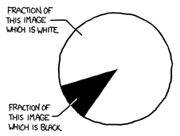

```{r setup, include=FALSE}
library(tidyverse)
library(ggbeeswarm)
library(ggthemes)
library(cowplot)
Sys.setenv(RETICULATE_PYTHON = "~/miniconda3/bin/python")
covid <- read_csv("data/covid19_cases_worldwide_monthly.csv")

require(reticulate)
#knitr::opts_chunk$set(echo = FALSE)
knitr::opts_chunk$set(
 fig.width = 6,
 fig.asp = 0.8,
 out.width = "80%"
)
# if necessary, use this command to install required non-standard command-line tools:
# conda install -c bioconda samtools seqtk

```


# Learning goals for the week

- Basic plotting types and aesthetics with ggplot
- Renounce pie charts for life
- Some common techniques for formatting and manipulating data for making usful plots
- Putting ggplot to work and learning to tame some of it's quirks

# Data viz: a key part of EDA

- As we discussed earlier, exploratory data analysis reqires visualization of your variables
- ggplot2 is an integral part of tidyverse and plays nicely with tidy data so is an excellent tool for interactive data visualization
- Mastering data visualization in R means you can generate publication-quality figures and finally abandon Excel, at least for data presentation purposes

# ggplot2 procedure

- We build a plot in layers in a series of steps, first by calling `ggplot()` and providing some data (directly as a data frame or via a pipe)
- In the call to `ggplot()` or in subsequent `geom` calls, we map some aesthetics to the variables
- Each geometry `geom` call adds a plot layer to represent your data
  - New layers will share the coordinate system
- Legends and axes are set up for you but you can provide a theme to the plot and/or adjust the layout with calls to `theme` functions

# Deconsructing a toy car example

```{r,eval=F,echo=T}
# tell ggplot we will be using the mpg data set that is bundled with this package
# this creates an empty graph that is useless without a plotting function
ggplot(data = mpg) + 
  # The + allows us to add on or more layers to our plot
  geom_point(mapping = aes(x = displ, y = hwy))
  # geom_point will create an x/y scatter plot
  # the mapping argument is always coupled with aesthetics aes()
  # and is used to set variables for the axes and additional mappings (e.g. colour)
```

# Data

- Fuel economy (mpg) of a large variety of consumer vehicles
```{r,eval=T,echo=T}
select(mpg,displ,hwy,class,manufacturer) %>% slice_sample(n = 6)
```

# Viz

```{r,eval=T,echo=F}
ggplot(data = mpg) + 
  geom_point(mapping = aes(x = displ, y = hwy))
```

# Tweaking the basic plot

- Map a colour to the points based on another variable

```{r,eval=T,echo=T,message=F,warning=F}
# note: we can drop mapping= as long as aes() is the first/only argument
ggplot(data = mpg) + 
  geom_point(mapping = aes(x = displ, y = hwy, colour = manufacturer))
```


# Common mistake

- You can globally control plot features instead of mapping them to variables
- Only works in the expected way if you specify _outside_ `aes()`

```{r,eval=T,echo=T,message=F,warning=F}
ggplot(data = mpg) + 
  geom_point(mapping = aes(x = displ, 
                           y = hwy, 
                           colour = "blue"))
```

# The correct approach

- You can globally control plot features instead of mapping them to variables
- Only works in the expected way if you specify _outside_ `aes()`

```{r,eval=T,echo=T,message=F,warning=F}
ggplot(data = mpg) + 
  geom_point(mapping = aes(x = displ, 
                           y = hwy), 
             colour = "blue")
```


# Tweaking the basic plot

- Map a colour to the points based on another variable
- Shape your points based on yet ANOTHER variable

```{r,eval=T,echo=T,message=F,warning=F}
# This code throws this warning at you:
#	The shape palette can deal with a maximum of 6 discrete values because more than 6 becomes difficult to discriminate; you have 7. Consider specifying shapes manually if you must have them.
# Removed 62 rows containing missing values*

ggplot(data = mpg) + 
  geom_point(aes(x = displ, y = hwy, colour = manufacturer, shape = class)) +
  theme(legend.position="bottom") 
```


# Tweaking the basic plot

- Map a colour to the points based on another variable
- Make the grey background go away by changing the theme

```{r,eval=T,echo=T,message=F}
# other nice options to try out:
# theme_classic() 
# theme_cowplot() #requires the cowplot library
ggplot(data = mpg) + 
   geom_point(aes(x = displ,
                  y = hwy,
                  colour = manufacturer)) +
  theme_minimal()
```


# Controlling how colours are mapped

- Map your colour to a continuous numeric value (rather than categorical) 
- Automatic behaviour if your variable is numeric, which may not actually be what you want
- Controlling the colour scale will be covered in the lab

```{r,eval=T,echo=T}
ggplot(data = mpg) + 
  geom_point(aes(x = displ,
                 y = hwy,
                 colour = cyl)) + 
  theme_cowplot() 
  
```

# Overriding default colouring

- You can prevent a continuous colour scale from being used by converting the type of your variable
  - Categorical variables should be factors
- Variable must have a sensible number of discrete values for this to work

```{r,eval=F,echo=T}
ggplot(data = mpg) + 
  geom_point(aes(x = displ, y = hwy, colour = factor(cyl))) + 
  theme_cowplot() 
  
```

# Does this imply another plot type?


```{r,eval=T,echo=F}
ggplot(data = mpg) + 
  geom_point(aes(x = displ, y = hwy, colour = factor(cyl))) + 
  theme_cowplot() 
  
```

# Notes about aesthetics

- Shape, size and colour and alpha (transparency) can all be associated with variables
  - Colour/shape are more useful for categorical variables
  - Size and colour gradiants are more useful for continuous variables
  - Scale range for size/color gradients are automatically determined
- Getting too ambitious with mapping more than one at a time usually results in a mess

```{r,eval=F,echo=T}
ggplot(data = mpg) + 
  geom_point(aes(x = displ, y = hwy, colour = factor(cyl),size=cty,shape=drv,alpha=year))
```

# Too much?

```{r,eval=T,echo=F}
ggplot(data = mpg) + 
  geom_point(aes(x = displ, y = hwy, colour = factor(cyl),size=cty,shape=drv,alpha=year)) + 
  theme_cowplot() 
```

# Fitting trend lines to your data

- In this example, we've shifted the aesthetic mapping to the call to ggplot, which causes them to be considered 'global' until they are changed
- `geom_smooth` is used here to fit a linear model to the data and add the linear representation for each group
  - groups are implicitly assigned based on your colour assignment

```{r,echo=T,eval=T,message=F,warning=F}
ggplot(data = mpg,mapping = aes(x = displ, y = hwy, colour = factor(cyl))) + 
  geom_point() + 
  geom_smooth(method = "lm", se = FALSE)
```

# Altering aesthetic mapping by layer

- Sometimes the aesthetics mapped in earlier layers cause a subsequent `geom` to misbehave
- Explicitly defining `aes()` with each geom is one option
- You can also use `inherit.aes=FALSE` if you only want to disable the global aesthetic in one layer

```{r,echo=T,eval=T,message=F,warning=F}
ggplot(data = mpg) + 
  geom_point(mapping = aes(x = displ,
                           y = hwy,
                           colour = factor(cyl))) + 
  geom_smooth(method = "lm", se = FALSE,
              mapping = aes(x = displ,
                            y = hwy))
```

# Choosing the right plot type

- Scatter plots are a good place to start but may not convey the information in the way you want
- Coloured scatterplots may help you recognize if a categorical variable is associated with one or more continuous variables
- With this information, you can switch to plots that group data and show the distribution such as box plots or histograms*

# Box plot of car fuel economy

```{r,eval=T,echo=T}
# Note: we're converting cyl to a factor representation on-the-fly
ggplot(data = mpg) + 
  geom_boxplot(aes(x = factor(cyl),
                   y = hwy,
                   colour = factor(cyl))) 
```


# More layer ridiculousness

- There are a few things wrong with this layering that highlight some common errors
- Thoughts on what causes the x scale to behave this way?
- How do we fix it?

```{r,eval=T,echo=T}
ggplot(data = mpg) + 
  geom_boxplot(mapping = aes(x = factor(cyl), y = hwy, colour = factor(cyl))) +
  geom_point(mapping = aes(x = cyl, y = hwy, colour = factor(cyl))) + 
  theme_cowplot()
```


# Consistency is key

- X axis scale will be numeric if the data are numeric, which allows the order to be determined "naturally" but will create a gap where a X value is missing whereas factors are not treated as numeric for axes
- Since the aesthetics are shared, we can move them to the first `ggplot` call so they are inherited

```{r,eval=T,echo=T}
ggplot(data = mpg,
       aes(x = cyl, y = hwy, colour = factor(cyl))) + 
  geom_boxplot() +
  geom_point() + 
  theme_cowplot()
```

# Quasirandom instead of just points

- Overlaying points on a boxplot is more informative when you add some randomness to the x coordinate to spread them out

```{r,eval=T,echo=T}
ggplot(data = mpg,
       aes(x = factor(cyl), y = hwy, colour = factor(cyl))) + 
  geom_boxplot(outlier.shape = NA) +
  ggbeeswarm::geom_quasirandom() + 
  theme_cowplot()
```


# Tidying some biological data

- Here we'll combine the gene expression for two samples to make a tidy table

```{r,eval=T,echo=T,message=F,warning=F}
gexp1=read_csv(file="data/GSE125966_part1.csv") %>% rename("expression"=2) %>% mutate(sample_id="sample12")
gexp2=read_csv(file="data/GSE125966_part2.csv") %>% rename("expression"=2) %>% mutate(sample_id="sample23")
two_gexp = bind_rows(gexp1,gexp2)
head(two_gexp,6)
```

# Tweaking axes

- You will sometimes need to limit/adjust the range of data points used in your plot
- Axes can be truncated manually if desired

```{r, eval=T,echo=T,message=F,warning=F}
ggplot(two_gexp,aes(x=expression)) + 
  geom_histogram() + xlim(c(-4,15)) +   
  facet_wrap(~sample_id,nrow=2)
```

# Tweaking axes

- You will sometimes need to limit/adjust the range of data points used in your plot
- Axes can be truncated manually if desired
- Usually the better option is to filter your data up-front

```{r, eval=T,echo=T,message=F,warning=F}
dplyr::filter(two_gexp,expression > -4 ) %>% 
  ggplot(aes(x=expression)) + 
  geom_histogram(aes(colour=sample_id)) + 
  facet_wrap(~sample_id,nrow=2)
```

# Colour vs fill

- The `colour` aesthetic usually means the outline of a shape
- For shapes that are hollow, you must specify `fill`

```{r, eval=T,echo=T,message=F,warning=F}
dplyr::filter(two_gexp,expression > -4 ) %>% 
  ggplot(aes(x=expression)) + 
  geom_histogram(aes(fill=sample_id)) + 
  facet_wrap(~sample_id,nrow=2)
```

# Boxplot with many points

- Plotting thousands of data points is easy (even if not often useful in this form)
- Crowding can somewhat be mitigated by setting a low alpha to make points semi-transparent

```{r,echo=T,eval=T}
dplyr::filter(two_gexp,expression > -4) %>% 
  group_by(sample_id) %>% 
  slice_sample(n=2000) %>%
  ggplot(aes(x=sample_id,y=expression)) + 
  geom_boxplot(outlier.shape =  NA) + 
  geom_quasirandom(alpha=0.2)
```


# Popular alternative: violin plots

- I'm less of a fan but these are used a lot as an alternative to box plots

```{r,echo=T,eval=T}
dplyr::filter(two_gexp,expression > -4) %>%
  mutate(logexp=log(expression)) %>% 
  group_by(sample_id) %>% 
  slice_sample(n=2000) %>%
  ggplot(aes(x=sample_id,y=expression)) + 
  geom_violin(aes(fill=sample_id))
```

# When tidy is too tidy

- There are some scenarios in which you want to compare related variables between samples
  - Requires mapping aesthetics to subsets of the same column
- Difficult to accomplish in a tidy format but can be dealt with with pivots or combinations of filter/join

```{r,echo=T,eval=T}
paired_exp = 
  pivot_wider(two_gexp,
                id_cols = "gene",
                names_from = "sample_id",
                values_from="expression")
```

# Comparing two samples

```{r,echo=T,eval=T}
ggplot(paired_exp,aes(x=sample12,y=sample23)) +
  geom_point(alpha=0.2) +
  xlim(c(-4,15)) +
  ylim(c(-4,15)) + theme_cowplot()
```

# Adding useful colouring

- We can derive a new column that will allow the points to be coloured based on the relationship between the two variables using mutate

```{r,echo=T,eval=T}
paired_exp = paired_exp %>% 
  mutate(diff=sample23-sample12)
# calculate the difference between the two values
ggplot(paired_exp,aes(x=sample12,y=sample23)) + 
  geom_point(aes(colour=diff)) + 
  scale_colour_continuous(type="viridis")
```

# What can we learn from this?

- Which genes are likely more highly expressed in sample23?
- Which genes are likely more highly expressed in sample12? 

# Okay... what about normal charts?

- Bar plots? 
- Pie charts?
- Line charts?

# No pie charts!

:::::::::::::: {.columns}
::: {.column}

- Pie charts are a terrible way to represent any type of data
- Human brains cannot convert wedges to area accurately, especially when differences are subtle
- [Bar charts can always replace pie charts and are always better](https://www.data-to-viz.com/caveat/pie.html)
- 3D exploding pie charts are nonsense
:::
::: {.column}

:::
::::::::::::::

# Basic line chart with title

```{r,echo=T,eval=T,message=F,warning=F}
cd <- "data/covid19_cases_provinces_weekly.csv"
canada <- read_csv(cd)
# adding a title is as simple as layering a call to ggtitle()
ggplot(canada, aes(x = week, 
                   y = cases, 
                   colour = province)) +
  geom_line() +
  ggtitle("COVID19 cases in Canada by province")

```

# Adding points as a new layer

```{r,echo=T,eval=T,message=F,warning=F}
ggplot(canada, aes(x = week, 
                   y = cases, 
                   colour = province)) +
  geom_line() +
  geom_point()
```

# When are line charts (un)acceptable?

- Is your X axis a continuous numeric value?
  - if no, then don't use a line chart
  - Consider bar chart or boxplot instead.
- Do you want to show the actual change between adjacent points instead of the trend? 
  - if no, then consider a scatter plot with some smoothing

# Smoothing instead of a line plot

```{r,echo=T,eval=T,message=F,warning=F}
ggplot(canada, aes(x = week, 
                   y = cases, 
                   colour = province)) +
    geom_point() + 
  geom_smooth(stat="smooth",span=0.3) 
#change span to affect how much the line is affected by individual points
```

# Preparing a basic bar chart

- Let's make a bar chart that shows percentages (i.e. the heights sum to 100)
- This is the equivalent to a pie chart but representing the wedges as bars
- We will represent the COVID19 deaths per province so first we need per-province totals and a denominator

```{r,echo=T,eval=T,message=F,warning=F}
canada_deaths = canada %>% 
  group_by(province) %>% 
  summarize(province_deaths=sum(deaths)) %>%
  ungroup() %>% 
  mutate(country_deaths=sum(province_deaths))
```

# Plotting the data

- In ggplot, `geom_bar` naturally wants to plot the total number of occurrences in each group, which is not usually what we actually want
- Instead, we can use `geom_col` (column chart?) 
- Note what our X axis labels look like when the group names are longer

```{r,echo=T,eval=T,message=F,warning=F}
# note that we can use mutate-like syntax within `aes` to calculate a new value for plotting but notice how it affects your axis labels
ggplot(canada_deaths,
       aes(x=province,
           y=100*province_deaths/country_deaths)) + 
  geom_col()
```

# A prettier version

```{r,echo=T,eval=T,message=F,warning=F}
# note that we can use mutate-like syntax within `aes` to calculate
# a new value for plotting but notice how it affects your axis labels
ggplot(canada_deaths,aes(x=province,y=100*province_deaths/country_deaths,
                         colour=province,
                         fill=province)) + 
  geom_col() + 
  theme(axis.text.x = element_text(angle = 90, vjust = 0.5, hjust=1))
```

# What if we adjust for population?

```{r,echo=T,eval=T,message=F,warning=F}
canada_deaths_pop = canada %>% 
  group_by(province) %>% 
  mutate(province_deaths=sum(deaths)) %>%
  slice_head() %>% 
  ungroup() %>% 
  mutate(death_per_million = 1000000 * province_deaths / population)
```

# A more fair representation

```{r,echo=T,eval=T,message=F,warning=F}
# note that we can use mutate-like syntax within `aes` to calculate
# a new value for plotting but notice how it affects your axis labels
ggplot(canada_deaths_pop,
       aes(x=province,
           y=death_per_million,
           colour=province,fill=province)) + 
  geom_col() + 
  theme(axis.text.x = element_text(angle = 90, vjust = 0.5, hjust=1)) +
  theme(legend.position = 'none')
```

# Altering the X axis order

- Default order for axis is numeric or alphabetical (for character) ordering whereas factors are ordered based on the order of their "levels"
- Factor levels are set when you define a factor vector and default to numeric/alphabetic ordering
- If we combine `factor()` with `unique()` it will instead set the order to be based on the order of the first occurrence of each value in the vector 

# Altering the X axis order

```{r,echo=T,eval=T}
my_char = c("C","Z","C","A","D","E","Z","C")
my_fac = factor(my_char)
my_fac
my_fac = factor(my_char,levels=unique(my_char))
my_fac
```

# Order X using the value of Y

```{r,echo=T,eval=T}
#use arrange to order data frame
canada_deaths_pop = arrange(canada_deaths_pop,death_per_million) %>%
  mutate(
    province_ordered=
      factor(province,levels=unique(province)))
# ensure you change the y for all your aesthetics
ggplot(canada_deaths_pop,
       aes(x=province_ordered,
           y=death_per_million,
           colour=province_ordered,
           fill=province_ordered)) + 
  geom_col() + 
  theme(axis.text.x = element_text(angle = 90, vjust = 0.5, hjust=1))

```


# What if I like retro excel plots?

```{r,echo=T,eval=T}
#library(ggthemes)
filter(canada_deaths_pop,
       death_per_million>10) %>% 
  ggplot(aes(x=province_ordered,
             y=death_per_million,
            fill=province_ordered)) + 
  geom_col() + 
theme_excel(base_size = 12,
            base_family = "",
            horizontal = TRUE) +
  theme(axis.text.x = element_text(angle = 90, vjust = 0.5, hjust=1)) + 
  scale_fill_excel()
```

# Recap

- Each geometry has its own nuances that you will need to get comfortable with
- Layering helps you build up complex plots, which makes each component easier to debug
- Themes and scales both give you control over visuals such as labels and visual appearance/colours
- The type of your variable affects how axes behave.
  - Try to consider whether something is a categorical variable and use factors when the answer is "yes".