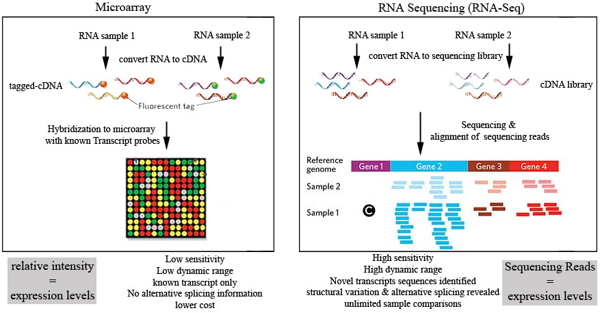
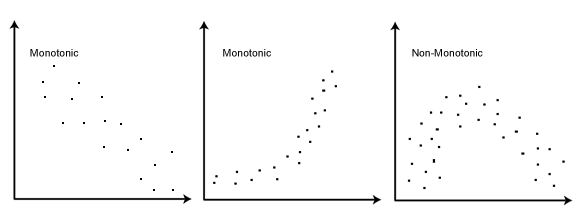
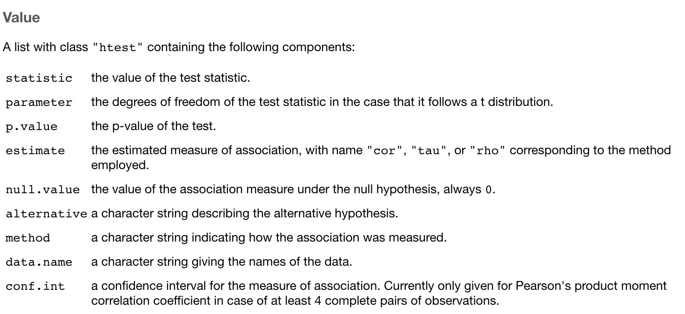
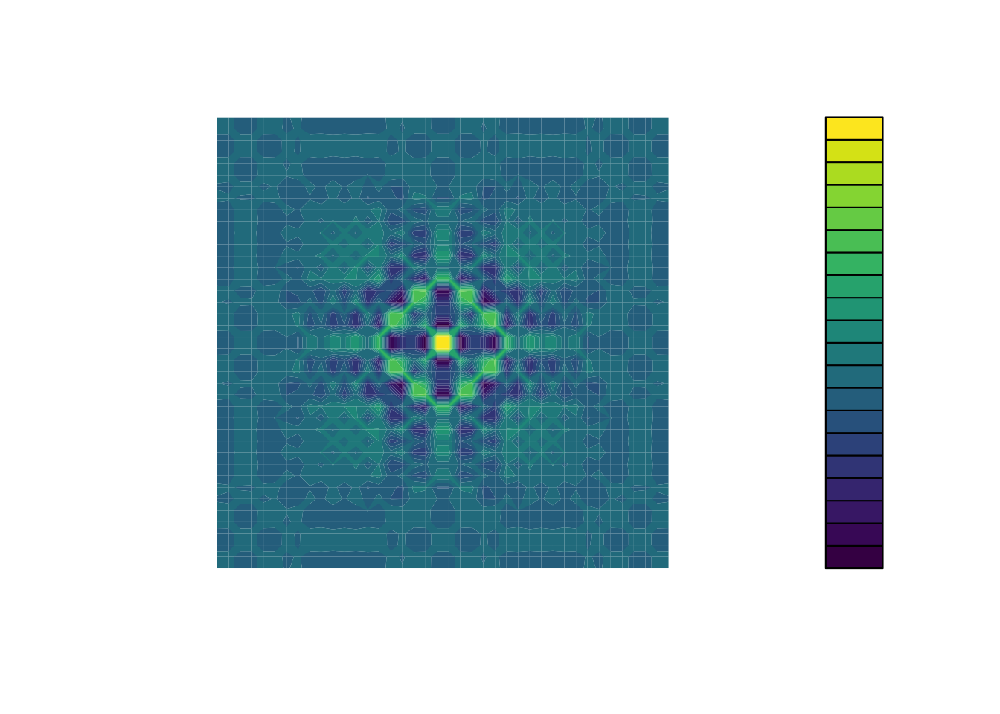

```{r setup, include=FALSE}
library(tidyverse)
library(ggbeeswarm)
library(ggmosaic)
library(ggthemes)
library(GGally)
library(ggcor)
library(cowplot)
Sys.setenv(RETICULATE_PYTHON = "~/miniconda3/bin/python")
covid <- read_csv("data/covid19_cases_worldwide_monthly.csv")

require(reticulate)
#knitr::opts_chunk$set(echo = FALSE)
knitr::opts_chunk$set(
 fig.width = 6,
 fig.asp = 0.8,
 out.width = "80%"
)
# if necessary, use this command to install required non-standard command-line tools:
# conda install -c bioconda samtools seqtk

```

# Learning goals for the week

- More plotting with ggplot and add-on packages
- Become more acquainted with gene expression data and methods for visualizing genomic data
- Perform parametric (Pearson) and non-parametric (Spearman) correlation in R
- Apply some basic methods for statistical tests with categorical and continuous variables


```{r,warning=F,message=F,echo=F}
library(readr)

metadata <- read_csv("data/pannets_metadata.csv")
meta = metadata
```

```{r,echo=F,warning=F,message=F}
rnaseq <- read_csv("data/pannets_expr_rnaseq.csv.gz")

rnaseq_long <- pivot_longer(rnaseq, cols = -Gene, 
                            names_to = "Tumour",
                            values_to = "Expr")

rnaseq_wide <- pivot_wider(rnaseq_long, id_cols = Tumour,
                           names_from = Gene, 
                           values_from = Expr)


```

```{r,echo=F,warning=F,message=F}
array <- read_csv("data/pannets_expr_array.csv.gz")

array_long <- pivot_longer(array, cols = -Gene, 
                           names_to = "Tumour",
                           values_to = "Expr")

array_wide <- pivot_wider(array_long, id_cols = Tumour,
                          names_from = Gene, 
                          values_from = Expr)

```

# RNA-seq vs Arrays




# How comparable are they?

- Originally, comprehensive gene expression measurements could only be accomplished by hybridizing cDNA to arrays and quantifying fluorescence (an analog approach)
  - Only possible to measure the abundance of genes with complementary probes on the array
- RNA-seq has become widely popular as an alternative quantification approach and it has several theoretical advantages
  - Able to quantify newly identified genes/transcripts
  - Measure abundance of alternative isoforms
  - Higher dynamic range of measurements

# Dynamic range?

- The ratio between the largest and smallest possible values of a quantity (or measurements)
- Digital techniques can theoretically measure values as low as zero although the meaning of zero depends on context
  - Actual limits of RNA-seq depends on how much sequencing data was produced (sampling)
- Dynamic range of microarrays is relatively fixed due to the analog nature
  - No distinction in measurements of true zero vs values near zero

# Data sets

```{r,eval=T,echo=T,warning=F,message=F}
head(array[,c(1:3)],4)
head(rnaseq[,c(1:3)],4)
```

# Convenient long format version

```{r}
head(array_long,4)
head(rnaseq_long,4)
```

# Aside: Excel thinks these are dates

```{r}
group_by(array_long,Gene) %>%
  filter(Gene %in% c("SEPT9","MARCH1")) %>% 
  slice_head()
```

# Easy fix, right?


# Signal range: RNA-seq vs Arrays

- Measurements for genes in the same sample
  - Where does the trend become less linear?
  - Which technology appears to have better resolution among points near the bottom of either scale?
- How similar are the measurements as a whole? 

```{r,echo=T,eval=T,message=F,warning=F}
compare_meth = left_join(array,rnaseq,by="Gene",suffix=c(".array",".rnaseq")) %>% 
  filter(!is.na(M1_LS1.rnaseq))
ggplot(compare_meth,aes(x=M1_LS1.rnaseq,M1_LS1.array)) + 
  geom_point(alpha=0.2) + geom_smooth() + theme_cowplot()
```

# Correlation

- When one variable changes in magnitude, another changes in magnitude
  - Positive correlation (one increases, the other increases)
  - Negative correlation (one increases, the other decreases)
- Correlation coefficients are a statistical measure of the strength and sign (+/-) of a _linear_ relationship
  - Measured by Pearson (parametric) or Spearman (non-parametric)
  - Pearson doesn't work for non-linear relationships whereas Spearman does not require a specific relationship

# Positive correlation

```{r,eval=T,echo=F,message=F,warning=F}
pearson_cor = cor(mpg$cty,mpg$hwy) %>% round(digits=4) # calculate the correlation with the `cor` function
ggplot(mpg) + geom_point(aes(x=cty,y=hwy)) + labs(caption=paste("Pearson:",pearson_cor))
```

# Negative correlation

```{r,eval=T,echo=F,message=F,warning=F}
pearson_cor = cor(mpg$cty,mpg$displ) %>% round(digits=4) # calculate the correlation with the `cor` function
ggplot(mpg) + geom_point(aes(x=cty,y=displ)) + labs(caption=paste("Pearson:",pearson_cor))
```

# Quick and dirty correlation

- The base R `cor` function is tried, tested and true for calculation the correlation between two variables
- Various packages exist for looking at possible correlations across multiple variables in a tidy data frame
  - There is a ggcorr **and** a ggcor, for some reason

```{r,echo=T,eval=T,message=F,warning=F}
#drop year because there are only two values
ggcorr(mpg%>% select(-year)) 
```

# More flexible: ggcor's Quickcor

```{r}
quickcor(mpg[,c("displ","cyl","cty","hwy")],type="upper") + geom_colour()
```

# Quickcor

```{r}
#[, 1]	mpg	Miles/(US) gallon
#[, 2]	cyl	Number of cylinders
#[, 3]	disp	Displacement (cu.in.)
#[, 4]	hp	Gross horsepower
#[, 5]	drat	Rear axle ratio
#[, 6]	wt	Weight (1000 lbs)
#[, 7]	qsec	1/4 mile time
#[, 8]	vs	Engine (0 = V-shaped, 1 = straight)
#[, 9]	am	Transmission (0 = automatic, 1 = manual)
#[,10]	gear	Number of forward gears
#[,11]	carb	Number of carburetors
quickcor(mtcars, type = "upper") + geom_circle2()
```

# More Quickcor

- We can embed the actual correlation coefficients along with the coloured representations
- Note the cor.test option is used here (to be revisited)

```{r}
quickcor(mtcars, cor.test = TRUE) +
  geom_square(data = get_data(type = "lower", show.diag = FALSE)) +
  geom_mark(data = get_data(type = "upper", show.diag = FALSE), size = 2.5) +
  geom_abline(slope = -1, intercept = 12)
```

# Correlations aren't always meaningful

- Some seemingly strong correlations in the mtcars example are between a categorical and a numeric variable
  - e.g. v-shaped engine vs the number of cylinders
- These may still be meaningful but imagine if you compared two variables that are supposed to be continuous and one (or both) is instead behaving like a categorical variable due to low variability

```{r}
 ggplot(mtcars,aes(x=vs,y=cyl)) + geom_point()
```

# Associations between other types of variables

- We often want to know if a categorical variable is associated with another categorical variable
  - e.g. Do the values of two categorical variables occur together more/less than we expect by chance?
- For this scenario, the appropriate test depends on the number of categories we have. Fisher's test is used for a 2x2 table such as this example
- e.g. does the frequency of metastasis in this cancer vary by subtype?

```{r}
ggplot(metadata, aes(x = Subtype, y = Metastasis)) + geom_count()
```

# Another plotting option: geom_mosaic

```{r}
ggplot(metadata) + geom_mosaic(aes(x = product(Metastasis, Subtype), fill = Metastasis))
```

# Testing the hypothesis

```{r}
table(meta$Subtype,meta$Metastasis)
fisher.test(table(meta$Subtype,meta$Metastasis))

```

# How NOT to interpret P values
:::::::::::::: {.columns}
::: {.column}

- P value < 0.05 is a standard threshold
- Beyond this, P values have little meaning in isolation
- Sometimes ordering (e.g ranking) on P values is useful when many tests were done
- In the lab we will cover how to properly deal with P values when testing many hypotheses

:::
::: {.column}


:::
::::::::::::::

# Correlation across platforms

- Lets see how correlated the expression is for one gene across all the samples in the two technologies
- i.e. all RNA-seq vs all array measurements for ACTB

```{r,message=F,warning=F,message=F}
actb <- data.frame(
  tumour = rnaseq_wide$Tumour,
  rnaseq = rnaseq_wide$ACTB,
  array = array_wide$ACTB
)
actb
```


```{r,message=F,warning=F,message=F}
ggplot(actb, aes(y = rnaseq, x = array)) +
  geom_point() +
  labs(title = "ACTB expression")+ geom_smooth(method="lm")  + theme_cowplot()
```

# What is the correlation coefficient?

- Note both Pearson and Spearman give positive correlation coefficients
- Where are the outliers and can we improve our data based on this information?

```{r,echo=T,eval=T}
cor(actb$rnaseq, actb$array, method = "pearson")
cor(actb$rnaseq, actb$array, method = "spearman")
```


# Same comparison without outliers

```{r,message=F,warning=F}
actb_nolow <- filter(actb, rnaseq >= 10.25)

cor(actb_nolow$rnaseq, actb_nolow$array, method = "pearson")
cor(actb_nolow$rnaseq, actb_nolow$array, method = "spearman")
ggplot(actb_nolow, aes(y = rnaseq, x = array)) +
  geom_point() +
  labs(title = "ACTB expression") + geom_smooth(method="lm") +theme_cowplot()
```

# Is Spearman ever better?

:::::::::::::: {.columns}
::: {.column}

- Because it's non-parametric, it can be useful when the relationship between your variables is non-linear
- Spearman correlation is more fair to use if you believe the relationship is *monotonic* but not linear whereas Pearson is appropriate if you think there is a linear relationship

:::
::: {.column}
```{r,eval=T,echo=F,message=F,warning=F}
df = data.frame(xvals= sample(1000,200))
df$jitter = sample(100,200,replace = T)
df = mutate(df,yvals=log(xvals+jitter))

ggplot(df,aes(x=xvals,y=yvals)) + geom_point() + geom_smooth(method="lm")

```
:::
::::::::::::::

# Better quantified by Spearman

```{r,echo=T,eval=T}
cor(df$xvals,df$yvals,method="pearson")
cor(df$xvals,df$yvals,method="spearman")
```

# How does it work?

- A non-linear monotonic relationship can appear linear when ranks are used instead of the actual values
- Spearman correlation involves converting continuous values to ranks based on the relative order of the values


```{r}
df = arrange(df,xvals)
df$xrank = c(1:length(df$xvals))
df = arrange(df,yvals)
df$yrank = c(1:length(df$xvals))
# rank each variable individually 
head(df,4)
ggplot(df,aes(x=xrank,y=yrank)) + geom_point()
```

# More extreme example

```{r,eval=T,echo=F}
df = data.frame(xvals= sample(1000,200)-500)
df$jitter = sample(100,200,replace = T)
df = mutate(df,yvals=(xvals+jitter)^2 + jitter)
ggplot(df,aes(x=xvals,y=yvals)) + geom_point()

```

```{r,echo=T,eval=T}
cor(df$xvals,df$yvals,method="pearson")
cor(df$xvals,df$yvals,method="spearman")

# EPIC FAIL!
```

# Correlation only works for monotonic relationships



# Is a coefficient enough?

- When is a correlation "good"?
  - coefficients are difficult to interpret in isolation
  - The same correlation coefficient can be obtained with different data distributions


```{r}
cor_coef <- 
  inner_join(rnaseq_long, array_long, by = c("Gene", "Tumour"),
             suffix = c("_R", "_A")) %>% 
  group_by(Gene) %>% 
  filter(sd(Expr_R) > 0, sd(Expr_A) > 0) %>% 
  summarize(cor_coeff = cor(Expr_R, Expr_A, method = "pearson"))
# Drop genes with low standard deviation
cor_coef
```

# Is good/bad correlation enough?

```{r}
bot_cor = cor_coef %>% arrange(cor_coeff) %>% head(1) %>% pull(Gene)
top_cor = cor_coef %>% arrange(-cor_coeff) %>% head(1) %>% pull(Gene)
# get the gene with the lowest and highest correlation coefficient
```

```{r}
long_exp = inner_join(rnaseq_long, array_long, by = c("Gene", "Tumour"))
filter(long_exp,Gene==bot_cor) %>% ggplot(aes(x=Expr.x,y=Expr.y)) + geom_point()
# plot to compare
filter(long_exp,Gene==top_cor) %>% ggplot(aes(x=Expr.x,y=Expr.y)) + geom_point() + labs(title=paste(top_cor,": Best correlated gene"))
```

# Testing for significant correlation



# Testing for significant correlation

- ACTB correlation is significant based on the small P value returned by cor.test 

```{r}

cor.test(actb_nolow$rnaseq, actb_nolow$array, method = "pearson")
cor.test(actb_nolow$rnaseq, actb_nolow$array, method = "spearman")

```

# Tidying the output of tests

- Many R functions annoyingly (or conveniently) return an object with the result you need stored internally
- For cor.test, we can get the P value using `cor.test(x,y)$p.value` but this doesn't play nicely with Tidyverse
- The `broom` library has functions to automatically tidy these results into data frames

# Making it tidy with broom

```{r,warning=F,message=F}
library(broom)
cor.test(actb_nolow$rnaseq, actb_nolow$array, method = "pearson") %>% tidy()
```

# Apply a test to tidy data

- Here we'll combine the tidy function with a call to summarize such that the tidied test result creates new columns in our result
- Each test result is assigned to the corresponding row for our group (Gene)
- The "estimate" column is our correlation coefficient

```{r,echo=T,eval=T,message=F,warning=F}
 cor_sig = long_exp %>% group_by(Gene) %>% summarize(
  tidy(cor.test(Expr.x,Expr.y)))
```


# These correlations are significant?

```{r,echo=F}
cor_sig %>% filter(Gene %in% c(top_cor,bot_cor)) %>% select(-method,-alternative,-parameter,-conf.low,-conf.high)
```

- Significant correlations can be misleading for various reasons
  - e.g. low variance in one or both variables
  - beware correlation coefficients of exactly 1 or P values of exactly zero because if something seems too good to be true, you should know what that means!

# More exploration

```{r,echo=T,eval=T,message=F,warning=F}
means = long_exp %>% group_by(Gene) %>% summarize(
  mean_rnaseq=mean(Expr.x),
  mean_array=mean(Expr.y))
ggplot(means,aes(x=mean_rnaseq,y=mean_array)) + geom_point()
```


# Colouring by correlation

```{r,message=F,warning=F}
all_summarized=inner_join(cor_sig,means,by="Gene") %>%
  filter(!is.na(estimate))
ggplot(all_summarized,aes(x=mean_rnaseq,y=mean_array,colour=estimate))+geom_point(alpha=0.2) + theme_cowplot()
```

# Continuous colorblind-friendly colours



```{r}

ggplot(all_summarized,aes(x=mean_rnaseq,y=mean_array,colour=estimate))+geom_point(alpha=0.2) + theme_cowplot() + scale_colour_viridis_c()
```

# Significant points only

```{r}
filter(all_summarized,p.value<0.05) %>% 
ggplot(aes(x=mean_rnaseq,y=mean_array,colour=estimate))+geom_point(alpha=0.2) + theme_cowplot()+ scale_colour_viridis_c()
```

# Restrict to moderate to high positive values

```{r}
filter(all_summarized,p.value<0.05,estimate>0.5) %>% 
ggplot(aes(x=mean_rnaseq,y=mean_array,colour=estimate))+geom_point(alpha=0.2) + theme_cowplot()+ scale_colour_viridis_c()
```

# Interpretation

- Some of the highest correlation coefficients among genes with low expression in both the array and RNA-seq
- Are these outliers that we can justify removing?

```{r,message=F,warning=F}
ggplot(all_summarized,aes(x=mean_rnaseq)) + geom_histogram(colour = "white", boundary = 0) + labs(title="RNA-seq mean expression")
```

```{r,message=F,warning=F}
ggplot(all_summarized,aes(x=mean_array)) + geom_histogram(colour = "white", boundary = 0) + labs(title="array mean expression")
```

# We should have removed outliers first!

```{r,message=F,warning=F}
kept_summarized = filter(all_summarized,
                         p.value<0.05,estimate>0.5) %>% 
  filter(mean_array>3.5,mean_rnaseq>2.5)

#plot it again with the outliers removed
ggplot(kept_summarized,aes(x=mean_rnaseq,
                           y=mean_array,
                           colour=estimate))+
  geom_point(alpha=0.2) + theme_cowplot()+ scale_colour_viridis_c()

```

# Sanity check a remaining gene

```{r}
kept_summarized %>% arrange(mean_rnaseq) %>% select(Gene,estimate,p.value) %>% head()
filter(long_exp,Gene=="PDP1") %>% ggplot(aes(x=Expr.x,y=Expr.y)) + geom_point() + labs(title=paste("PDP1",": Best correlated gene"))
```

# Recap

- Extremely high/low correlation coefficients with significant P values may still be misleading
  - Values with very low variability or near the bottom of the dynamic range of either technique can't be trusted
- Removing outliers from our data leaves us with a data set with more meaningful correlations

# More hypothesis testing

- Thus far we've focused on tests of linear or monotonic relationships between continuous variables
- Our hypothesis with these tests is that the two variables being compared are related
  - Array and RNA-seq are meant to give the same information so this is a sensible hypothesis
- Another more common hypothesis is that variables have different averages (means) between two or more groups

# Simple gene expression experiment

- These data are from tumour samples from 33 patients (17 female, 16 male)
- It's reasonable to hypothesize that some genes (e.g. those on the sex chromosomes) will differ in their expression between M and F tumours

# Single gene: ATRX

- Arbitrarily picking a gene on chromosome X: DDX3X shows a possible difference

```{r}
ddx3x_expr <- 
  rnaseq_wide %>% 
  select(Tumour, DDX3X) %>% 
  left_join(metadata, by = "Tumour")

ggplot(ddx3x_expr, aes(x = Sex, y = DDX3X)) +
  geom_boxplot(outlier.shape=NA) + geom_quasirandom()

```

# Wilcoxon test

```{r,echo=T,eval=T}
wt_out = wilcox.test(ddx3x_expr$DDX3X ~ ddx3x_expr$Sex)
tidy(wt_out)
```


# Statistical test for differences

- Wilcoxon rank sum test is a nonparametric test for different means
- Sudent's T test is a paramteric test for different means
- Parametric tests make certain assumptions about the distribution whereas non-parametric tests don't
- This means that the result of a test (P value, coefficient) is not meaningful if those assumptions are not met
- When in doubt: use a non-parametric test


