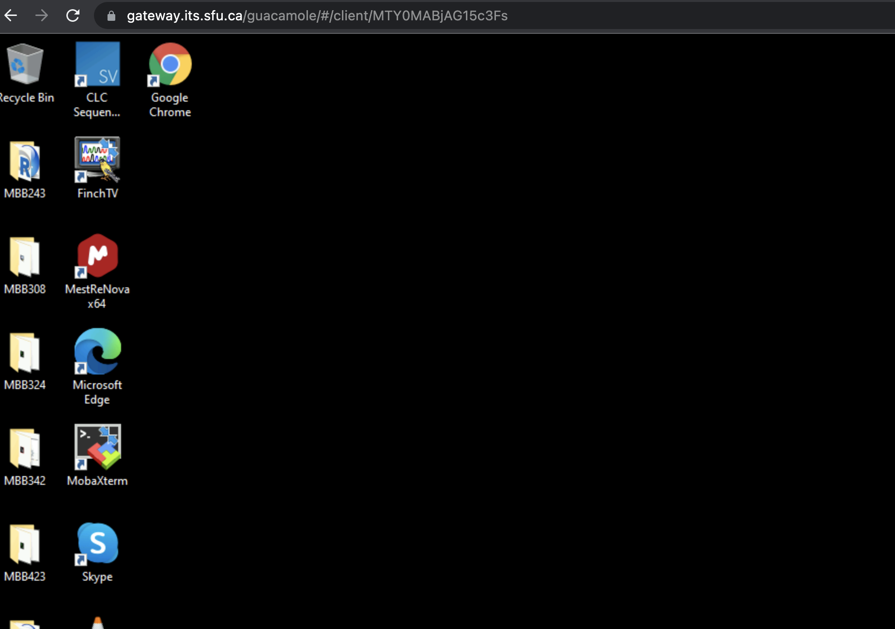
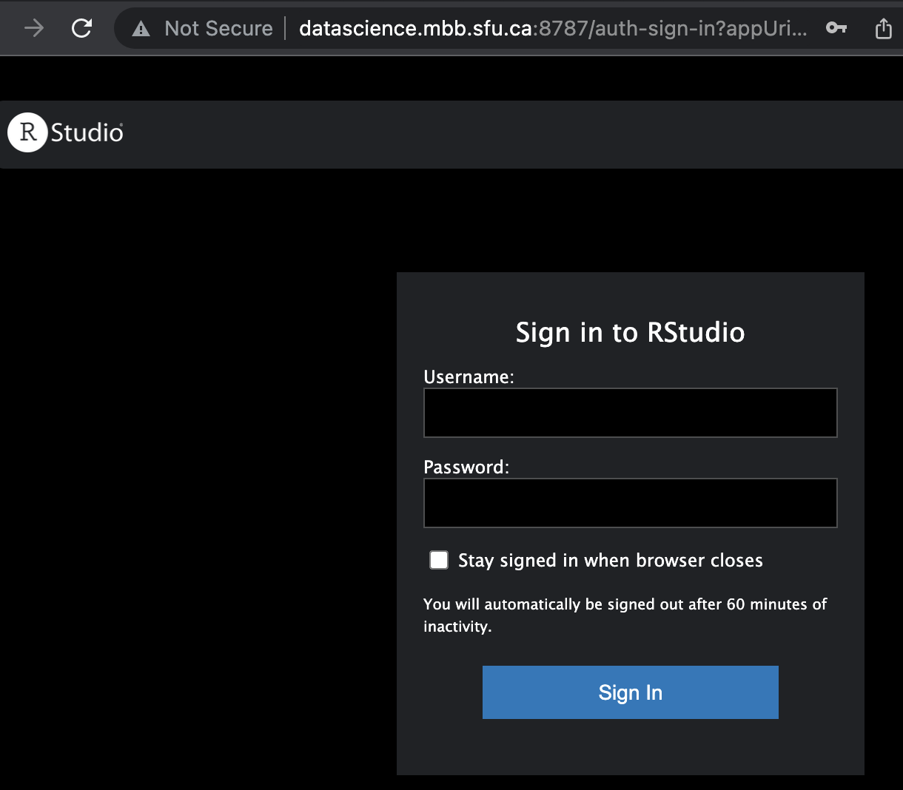
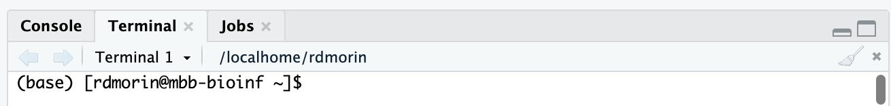

# MBB243 
# Data Analysis for Molecular Biology and Biochemistry

## TL;DR

* This is the course landing page that will host all course materials (instead of Canvas)
* Lecture slides will be posted here after class
* New lab materials will be made available here before each lab
* The structure of the course is summarized below
* Instructions for how to use this repository for your labs are at the [bottom of this page](#Lab-materials-and-server)


## Introduction

The purpose of this introductory data analysis course is to teach students in molecular biology or any students who will analyze molecular data, basic knowledge of molecular biology data types, data analysis methods including basic programming skills using Python, and basic statistics skills using R.

## Location

* Zoom link for class is https://us02web.zoom.us/j/85725104049 and the passcode can be found in our Slack workspace (Attend in person unless you are self-isolating due to illness. And yes, we will notice if you self-isolate the whole semester!)
* Lectures will be held in AQ 4130 (once we resume in-person teaching)
* Labs will be in SSB 6178 (once we resume in-person teaching)

## Other links

- [Zoom for Dr. Morin's office hours](https://us02web.zoom.us/j/85725104049)
- [TA office hours](https://sfu.zoom.us/j/8109061879) Thursdays 4-5 PM
- [Link for remote lab workstation connections](https://gateway.its.sfu.ca/guacamole/#/) This is only needed to connect to the lab server from *off campus*

## Grading

* 20% In each lab, there is a list of tasks that should be accomplished in class. Results are submitted by the end of each lab. 
* 35% Lab assignments: For some labs, additional short assignments will be made available in lab sessions and will be due at the start of your lab one week later (unless indicated otherwise). There is a 10% per day late penalty for assignments received after the due date time. 
* 10% In-class midterm exam
* 25% cumulative final exam mixture of multiple choice, short answer and written questions
* 10% Attendance and participation in lecture and lab 

## Schedule

|Week|Date| Lecture topic     | Date| Lab topic | Lab Due Date |
|--|------| ----------- | ------|----------- | ---|
|1|12-01-2022 | Molecular biology data flavours  | 14-01-2022 | Setting up a bash environment, installing software | Feb 27 | 
|2|19-01-2022 | Genomic data types  | 21-01-2022 | Manipulating and searching text files | Feb 27 |
|3|26-01-2022 | Fundamentals of R and Python | 28-01-2022| Basic data types and operations | Feb 27 |
|4|02-02-2022 | Obtaining and manipulating sequence data | 04-02-2022 | Conditionals and control flow | Feb 27 |
|5|09-02-2022 | Regular expressions and patterns | 11-02-2022 | Regular expressions (bash, Python and R) | Feb 27 |
|6|16-02-2022 | Quantitative DNA/RNA sequence analysis | 18-02-2022 | Hypothesis testing and summarization | Mar 11 |
|-|23-02-2022 | Reading Week| 23-02-2022| Reading Week | NA |
|7|02-03-2022 | Midterm exam | 04-03-2022 | No lab | NA |
|8|09-03-2022 | Exploratory data analysis in molecular biology | 11-03-2022 | Tidy data, data frames and data tables | Mar 18 |
|9|16-03-2022 | Common visualization methods | 18-03-2022 | Cleaning and combining and reformatting data | Apr 1 |
|10|23-03-2022 | Basic modeling | 25-03-2022 | Creating, utilizing, and visualizing models | Apr 1 |
|11|30-03-2022 | Methods for enhancing reproducibility | 01-04-2022 | Introduction to Snakemake | Apr 15 |
|12|06-04-2022 | Data analysis pipelines | 08-04-2022 | open lab | Apr 15 |

## Lab materials and server

### Connecting to Rstudio server

Our labs will ideally be run on the MBB RStudio server. This is a new server that, due to SFU security policies, cannot be accessed directly. If you are off campus (as you will be for at least the first two weeks), you will need to connect remotely to one of the computers in our MBB computer lab using Guacamole. This is done by following [this link](https://gateway.its.sfu.ca/guacamole/#/). This should bring you to a generic SFU login page where you will have to enter your credentials and probably the MFA token. After that you should see a list of lab computers that are available. Workstations with active sessions should be avoided. Select any workstation that doesn't have a session and you should then see a dialog box that looks like this:


Enter your SFU user ID and password into the first two boxes. In the third box (Domain) enter `ad.sfu.ca`. If you succeed, you should see a computer desktop in your browser window, similar to the image below. You will need to open Google Chrome to connect to the server you will use for the labs. 



Unfortunately, you won't be able to pass your clipboard from your local (home) computer to the remote desktop. Type this address into the browser on the Google Chrome running on the remote computer (not in the address bar on your home computer!). `http://datascience.mbb.sfu.ca:8787`
If you succeed, you should see a page like the one below, probably with white instead of black background. 



### Accessing/refreshing lab tutorial and activity materials

Most lab materials will be hosted in this GitHub repository. At the start of every lab you will need to "pull" the content from GitHub. Although the approach is likely new to most of you, the process should be straightforward. Learning the basics is a useful skill as you will likely encounter tools in GitHub or other similar version-control systems throughout this course and your studies. 

**In the command line Terminal in Rstudio:**



* One-time setup
```
git clone https://github.com/morinlab/MBB243.git
```
* Every week afterward
```
cd ~/MBB243
git pull --ff-only
```
### Accessing and submitting lab assignments

We plan to use GitHub Classroom to distribute and collect assignments. Some labs will be graded only for completion. In the first week we'll test this out. Similar to how you get the lab materials above, you'll have to clone your assignment using the Terminal on the lab server:

*IMPORTANT*: Note the syntax is using ssh instead of https here. 

```
git clone git@github.com:morinlab/assignment-1-rdmorin.git
```
If you experience an error when running this you have one of a few common issues:

Do you get an error about the permissions on id_rsa? If so, run this command:

```
chmod 700 ~/.ssh/id_rsa
```

Do you get an error about the repository not existing or not having permissions? If so, did you replace the `rdmorin` in the example above with your git user ID? Did you accidentally specify git clone using the https instead of git@github.com syntax? 

## More Resources

* [Free R textbook](https://r4ds.had.co.nz/)
* [What is Git and GitHub all about?](https://www.educative.io/blog/git-github-tutorial-beginners)
