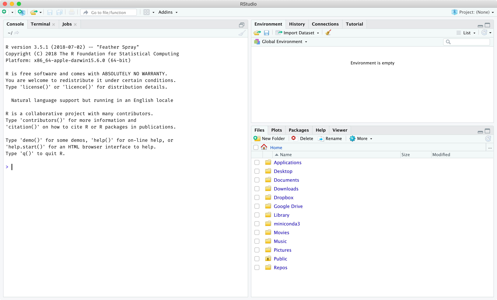
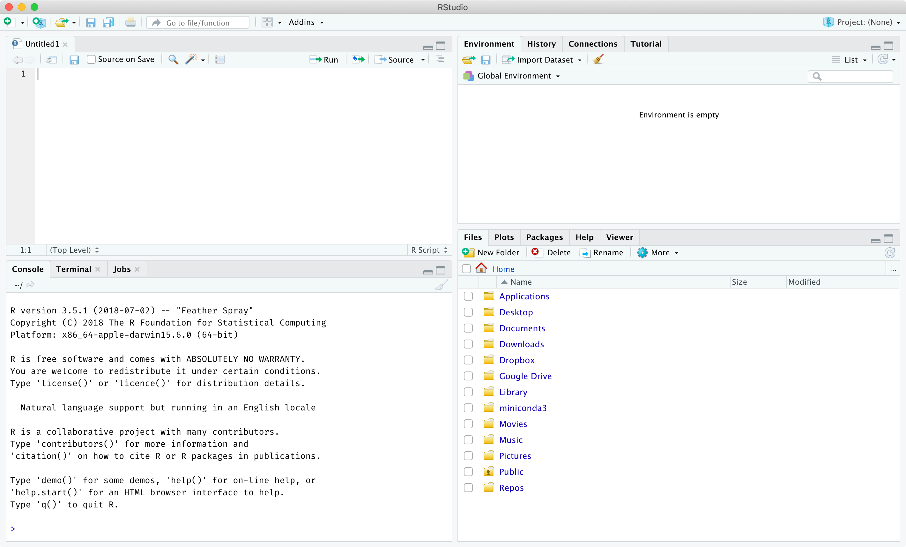
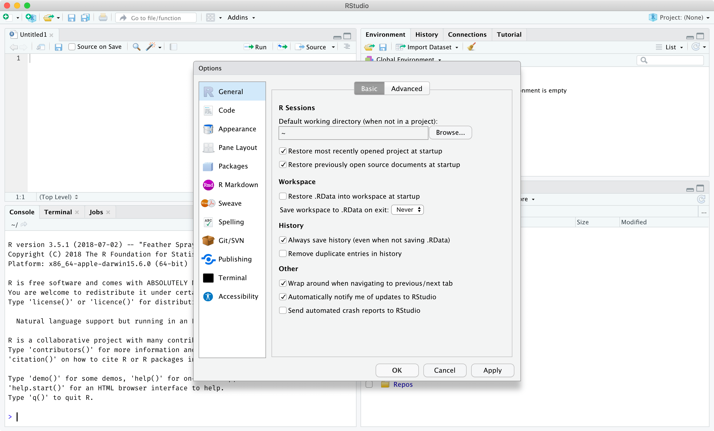
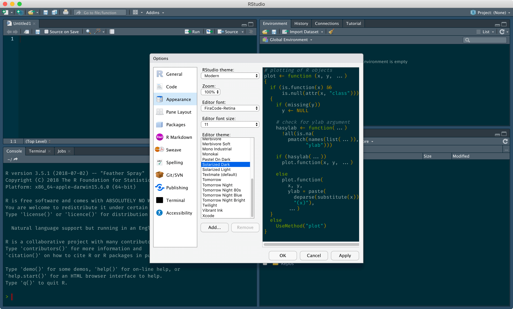
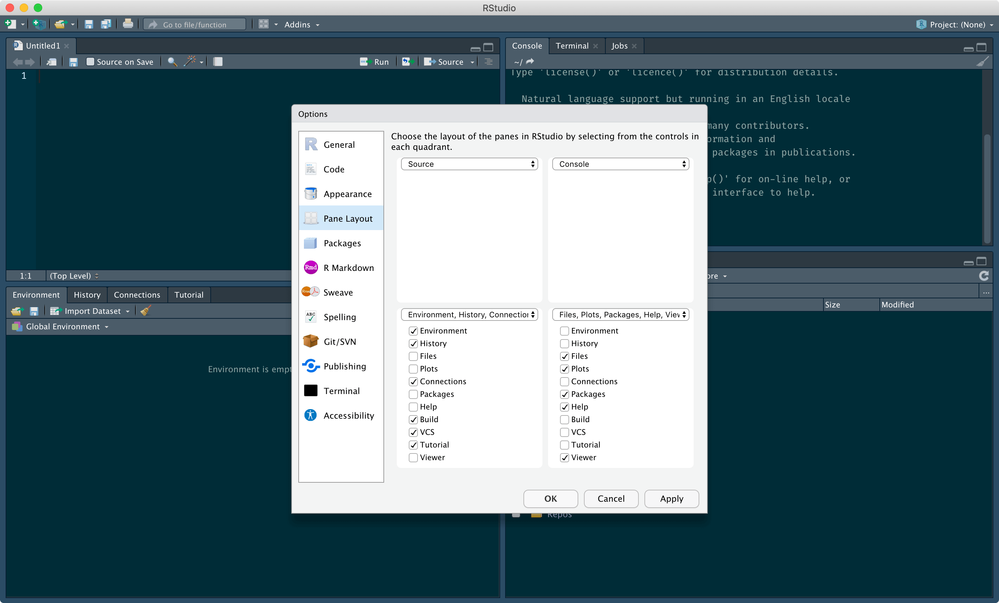
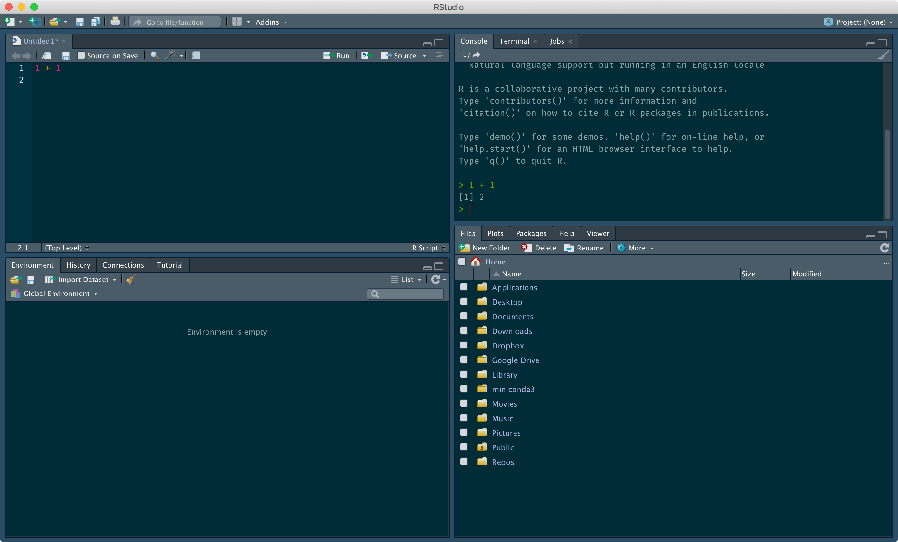
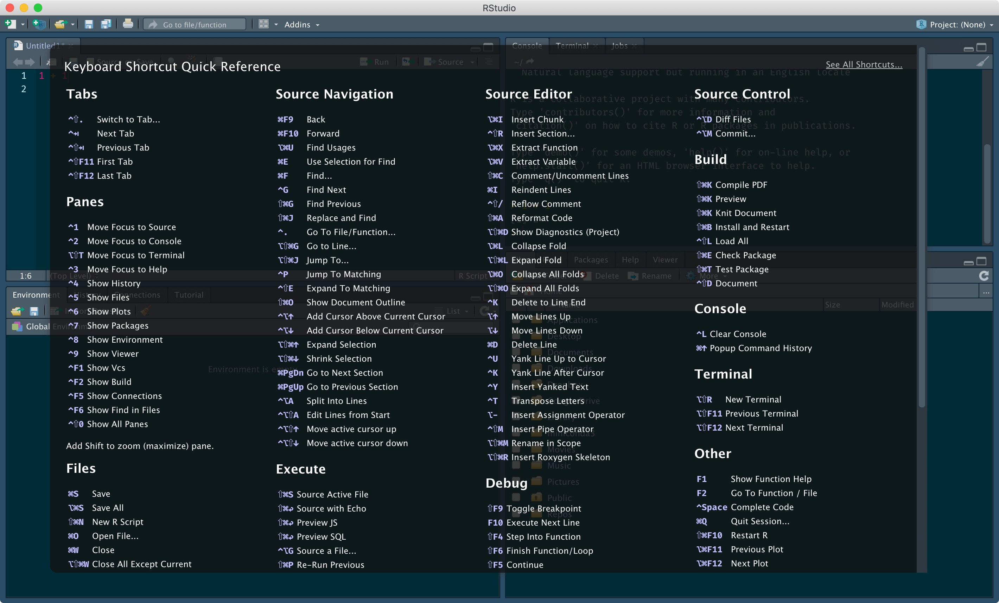

## Quick start

*Click the Knit button in the panel above to convert this file to human-friendly HTML.* 

### Learning Objectives

- Set up the R programming language and the RStudio IDE
- Navigate the RStudio interface
  - Customize RStudio options for reproducibility and convenience
  - Describe the purpose of the main panes in RStudio (Source, Console, Environment, History, Files, Plots, Packages, Help)
  - Locate important buttons in RStudio (Projects, Open/Save, Run/Source)
  - Differentiate between writing R code in the console versus scripts
  - Discover, edit, and create keyboard shortcuts in RStudio
- Identify where to look when seeking for help
  - Locate the help page for functions and special operators
  - Resolve an error message using a web search tool
  - Formulate effective questions for their peers
  - Learn and apply some basic Markdown syntax

### Context

There are a lot of moving parts in data science, but what better place to start than with the tools. While basic data science can be accomplished using programs with graphical user interfaces like Excel, programming languages are readily scalable and can open up a world of possibilities. They also tend to bring together a community of like-minded individuals. In this series of tutorials, we choose R over other languages such as Python and Julia because it was designed with data at its heart and is surrounded by a thriving, inclusive, and helpful community. 

Another reason we choose R is its tight integration with the RStudio integrated development environment (IDE). IDEs serve to streamline programming, which has many moving parts. One key benefit of RStudio compared to other IDEs is that it shares the same free and open-source philosophy as the R programming language. We believe in the democratization of data science. Over the coming tutorials, you will come to appreciate the many features offered by RStudio. For today, we will focus on its integrated text editor and R console. 

In this tutorial, you will become familiar with the RStudio interface and start writing your first R code. If this is your first time programming, then you're in for a rewarding journey! You will be introduced to fundamental programming concepts like operators and variables. You will also see functions in actions and why they're so useful in programming. Finally, you will already start practising how to seek for help using online resources. This skill is critical for any data scientist.

### The RStudio Interface

*Optional*
Warning: there is no guarantee all labs will work on your computer, which is why we provide access to the lab server. If you do choose to run the labs on a personal computer, you will first need to [install R](https://cran.r-project.org/) and [RStudio](https://www.rstudio.com/). Alternatively, you can use [RStudio Cloud](https://rstudio.cloud/) to avoid the hassle of installing software on a local computer but you will still have to install any missing dependencies. 

Once R and RStudio are installed, you should be able to open RStudio and see the following interface. The following screenshots were taken on macOS. The frame will look slightly different if you're using a different operating system (_e.g._ Windows) or RStudio Cloud, but the general layout should be identical. By default, you are greeted by the following three panes. The tabs in bold are the ones you will be using in these tutorials the most. 

- The **Console**/Terminal/Jobs pane (left)
- The **Environment**/History/Connections/Tutorial pane (top-right)
- The **Files**/**Plots**/**Packages**/**Help**/Viewer pane (bottom-right)



The fourth and final Source pane appears when files are opened (top-left). Here, a new Untitled R script was created via the top menu under File > New File > R script. (On macOS, the top menu is at the top of the screen outside of the RStudio window.) The Console pane moves to the bottom-left when the Source pane is open.



Before doing anything else, you should update two RStudio settings. These changes will help ensure that you don't run into any unexpected behaviour. You can access the RStudio settings via the top menu under Tools > Global Options. You will want to disable the following two options, which should appear in the General (Basic tab) section under Workspace:

- Uncheck "Restore .RData into workspace at startup"
- Set "Save workspace to .RData on exit" to Never

The end result should look like this:



There is a wide range of additional options that you can configure in RStudio based on your personal preference. For example, under the Appearance section, you can change the zoom level (how big visual elements like icons appear in RStudio), the font and font size, and the colour scheme. 



You can also change the pane locations under the Pane Layout section. Many RStudio users prefer having their Console pane at the top-right next to the Source pane because these two panes tend to be the most important and thus the largest. Again, there is no "correct" approach. Tweak based on what you prefer.



Take some time to explore the available settings in the Global Options. What else did you tweak?

Obviously, another important aspect of RStudio is running R code. There are two general approaches to running code in RStudio:

1. Run code directly in the Console pane
    - This option is convenient for small tasks, but it doesn't scale to larger analyses.
    - Relying on the R History for keeping track of past commands is tedious and error-prone.
2. Write code in the Source pane and selectively run code in the Console
    - This is the recommended approach to running R code in RStudio.
    - By storing code in files, you can easily re-run previously used code.
    - Button and keyboard shortcuts in RStudio make it easy to run bits of code in the console.

When you want to selectively run R code in the Console, you can click the "Run" button at the top-right of the Source pane. If you have code selected, this will run the selected code. Otherwise, it will run the line of code where your flashing text cursor is located. If you hover over the "Run" button for a few seconds, you should see an associated keyboard shortcut. By default, it should be Cmd-Enter on macOS or Ctrl-Enter on Windows. Commit this to memory, because you will use this shortcut a lot in this course. 



You can open a keyboard shortcut summary via the top menu under Tools > Keyboard Shortcuts Help. You can also edit keyboard shortcuts under Tools > Modify Keyboard Shortcuts. These shortcuts can minimize the time you spend using your mouse/trackpad, which in turn increases your productivity. It's worthwhile looking up or setting keyboard shortcuts for anything you do repeatedly.



## Syntax of these documents (Markdown and RMarkdown)

All lab materials are derived from [R Markdown](https://rmarkdown.rstudio.com/lesson-1.html) documents. These are based on the [Markdown](https://www.markdownguide.org/getting-started/) syntax, which in it's purest form is a lightweight markup language for producing web content with flexible formatting from plaintext documents.  but allow embedded code (with specific formatting) to be used to dynamically generate content. R Markdown allows the underlying code used for any analysis to be encapsulated alongside the result (output) of that code. 

## R code in RStudio using R Markdown

As is customary, the first code you see from any programming language is known as Hello World and is somewhat self-explanatory. If you look immediately below this text in the Rmd file you will see three lines. The first line has three "backtick" characters, i.e. these: 

**`**  

The backtick is found to the left of the 1 key and is not to be confused with a single quotation mark. In R Markdown, anything surrounded by either a pair of backticks or two triplets of backticks is considered code that should be executed. 

```{r}
to_print <- "Hello World"
#this is a comment and will be ignored by the compiler
print(to_print)  # everything to the right of any # will also be ignored but the code to the left of it is not ignored

# print(nonexistent_variable)
# The line above is code that has been converted to a comment. This is what is typically referred to as "commented out". You may encounter code in this form that you will need to "uncomment" by deleting the first #. If you do that to the comment line above, what happens?
```

Most of the code you will see in labs will be in the format above. Inline R code is less readable but allows the output of R to be inserted directly into paragraphs such as this `r to_print` example, which re-uses the variable we created above. In the next lab you will learn more about variables and their uses.

## What to do when you get stuck

One of the most important skills in programming (and life maybe?) is framing a question with sufficient context and detail such that others can answer it. The basic Markdown syntax we use here is available in Slack, GitHub, StackOverflow (to name a few) and many other web-based resources for programmers. Below are two examples of questions with the first a "bad" example, which is unlikely to be answer-able and the second a "good" example. This is all using pure Markdown without any code meant for interpretation by R.  

### Example Question 1

**Posting Title: R is broken**

I'm getting this error message from R and I don't know what it means. Can u plz help my assignment is due tomorrow!?!

Error: unexpected symbol in "print hello"

### Example Question 2

**Posting Title: Issue with printing a variable in R**

When I run the following R code I keep getting the error message shown below. I'm attempting to reproduce a simple example from a class. My intention is to set the variable `hello` with the character string "hello world" and then print that variable to the screen. I get the same result in a fresh/new R session. Can someone please help me find the error? 

```
hello <- "hello world"
print hello
```

> Error: unexpected symbol in "print hello"

**Task**

At some point during the semester, every student must post at least one good question to the course StackOverflow page. Ideally this will happen naturally when each of you inevitably get stuck. If you don't get stuck you can still mock up a question and post it. *This will be counted towards the participation component of your mark.*

## More Resources

- https://wordpress.com/support/markdown-quick-reference/
- https://stackoverflow.com/help/how-to-ask
- https://stackoverflow.com/c/mbb243/questions
- http://swcarpentry.github.io/r-novice-gapminder/01-rstudio-intro
- http://swcarpentry.github.io/r-novice-gapminder/03-seeking-help
- https://ariel.rbind.io/workshop/rbasics/#interactive-tutorials
